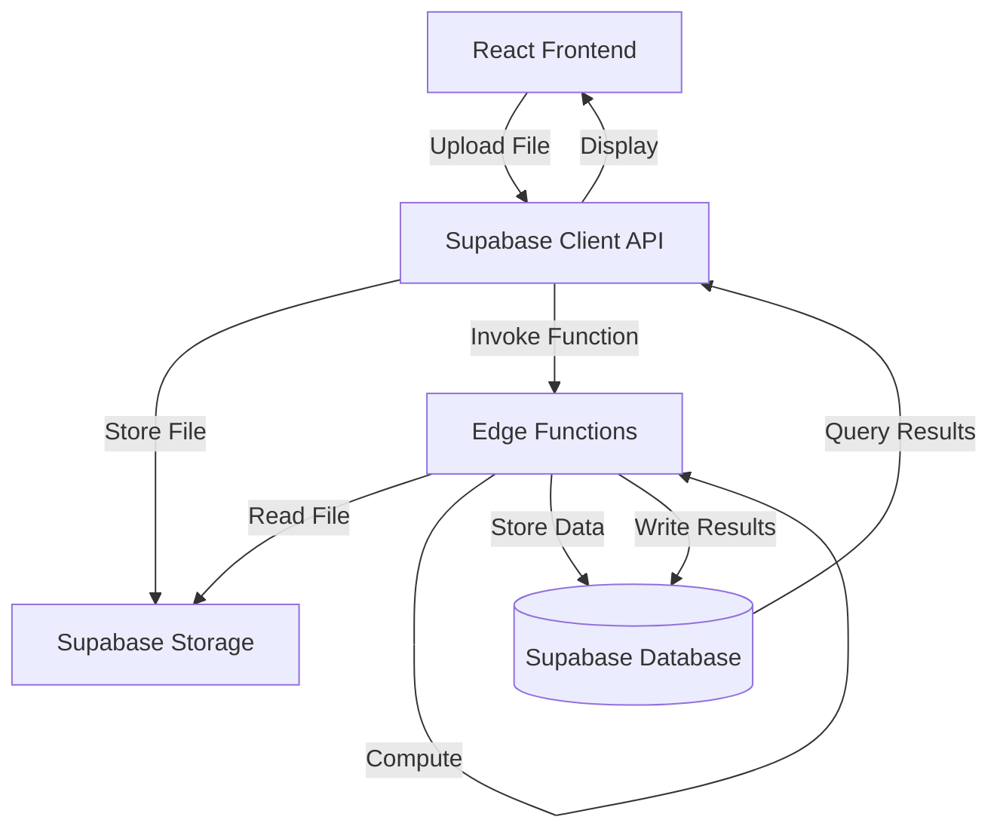
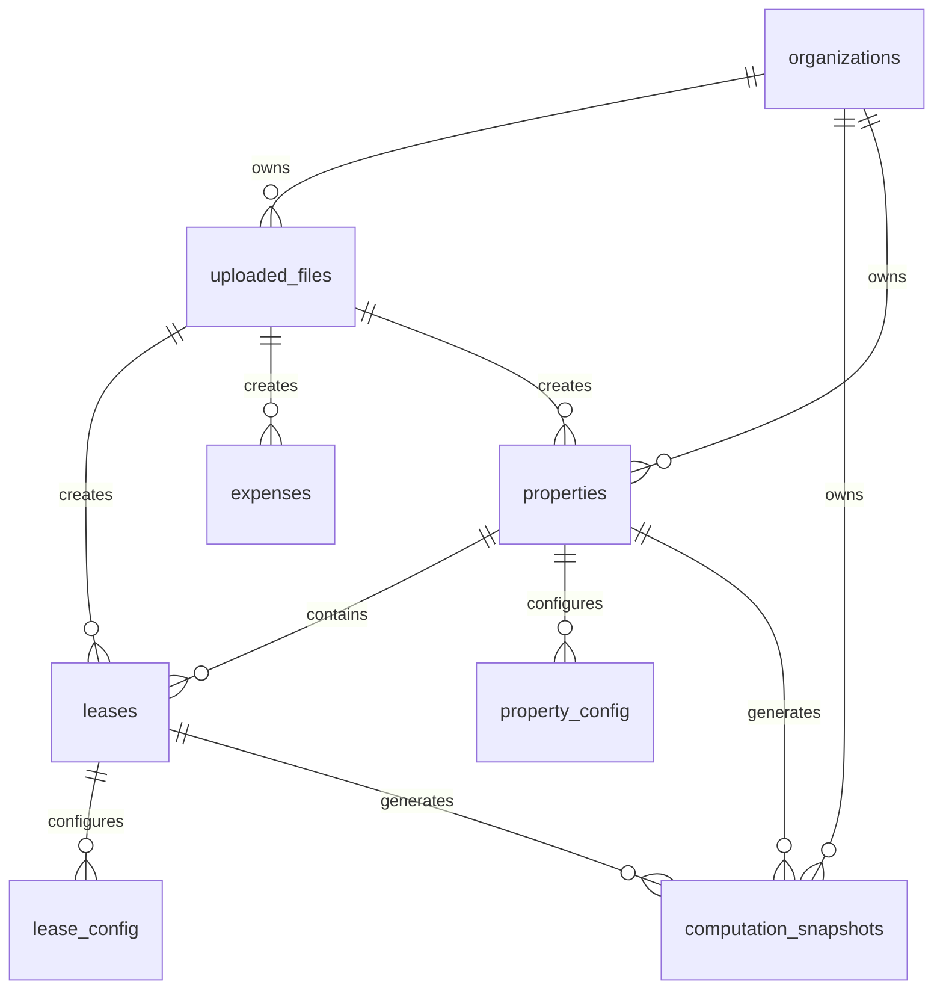

# Design Document: Backend-Driven Pipeline

## Overview

This design transforms the CRE Financial Platform from a frontend-heavy architecture into a backend-driven financial computation system. The transformation establishes a unified data pipeline that processes financial data through Supabase Edge Functions and Storage, ensuring data integrity, multi-tenant isolation, and audit compliance.

### Current State

The existing system performs financial calculations in the frontend (leaseEngine.js, camEngine.js, budgetEngine.js) and uses a generic CRUD API layer (api.js) for data persistence. While this works for small datasets, it creates several issues:

- Computation logic is duplicated across frontend and any future integrations
- Large file processing blocks the UI thread
- No centralized audit trail for computations
- Difficult to enforce business rules consistently
- Limited ability to schedule background jobs

### Target State

The new architecture moves all computation to Supabase Edge Functions, establishing a clear separation:

- **Frontend**: Upload files, display results, trigger operations
- **Backend**: Parse files, validate data, store records, compute financials, generate outputs
- **Storage**: Supabase Storage for files, Supabase Database for structured data

### Key Design Principles

1. **Unified Pipeline**: All data flows through Upload → Parse → Validate → Store → Compute → Output
2. **Modular Engines**: Separate computation modules (Lease, Expense, CAM, Revenue, Budget, Reconciliation) that can be composed
3. **Multi-Tenant Isolation**: org_id enforced at every layer (RLS policies, function parameters, API filters)
4. **Audit Trail**: Every data change and computation logged with user, timestamp, and before/after values
5. **Idempotency**: Operations can be safely retried without side effects
6. **Testability**: Round-trip properties for parsers, property-based tests for computations

## Architecture

### System Components



### Edge Functions Architecture

Each Edge Function is a Deno-based serverless function deployed to Supabase. Functions are organized by responsibility:

- **upload-handler**: Receives file uploads, stores to Supabase Storage, creates uploaded_files record
- **parse-file**: Extracts file from storage, parses to JSON, updates processing_status
- **validate-data**: Validates parsed JSON against schema, returns errors or marks valid
- **store-data**: Inserts validated records into appropriate tables with org_id
- **compute-lease**: Calculates rent schedules, escalations, CAM charges per lease
- **compute-expense**: Classifies and allocates expenses across tenants
- **compute-cam**: Applies CAM calculation methods per property
- **compute-revenue**: Projects revenue based on lease terms and occupancy
- **compute-budget**: Generates budgets from properties, leases, expenses
- **compute-reconciliation**: Performs variance analysis between budget and actuals
- **export-data**: Generates CSV/Excel from computed results using pretty-printer

### Data Flow

1. **Upload Phase**
   - User selects file in UI
   - Frontend calls `upload-handler` function
   - Function stores file in Supabase Storage bucket `financial-uploads/{org_id}/{file_id}`
   - Function creates `uploaded_files` record with status='uploaded'

2. **Parse Phase**
   - Frontend polls status or receives webhook
   - Frontend invokes `parse-file` function with file_id
   - Function reads file from storage
   - Function applies appropriate parser (leases, expenses, properties, revenue)
   - Function stores parsed JSON in `uploaded_files.parsed_data`
   - Function updates status='parsed' or status='failed' with error

3. **Validate Phase**
   - Frontend invokes `validate-data` function with file_id
   - Function reads parsed_data
   - Function validates required fields, data types, referential integrity
   - Function returns validation errors or marks status='validated'

4. **Store Phase**
   - Frontend invokes `store-data` function with file_id
   - Function reads validated parsed_data
   - Function inserts records into appropriate tables (leases, expenses, properties, revenue_lines)
   - Function enforces org_id isolation
   - Function logs audit trail
   - Function updates status='stored'

5. **Compute Phase**
   - Frontend invokes appropriate compute function (compute-lease, compute-expense, etc.)
   - Function reads data from database
   - Function applies business rules and calculations
   - Function stores results in computation_snapshots table
   - Function updates status='computed'

6. **Output Phase**
   - Frontend queries computed results from database
   - Frontend displays results in UI
   - User can invoke `export-data` function to generate downloadable files

### Multi-Tenant Isolation Strategy

Every layer enforces org_id isolation:

1. **Database Layer**: Row Level Security (RLS) policies on all tables
   ```sql
   CREATE POLICY "org_isolation" ON leases
   FOR ALL USING (org_id = auth.jwt() ->> 'org_id');
   ```

2. **Function Layer**: Every function validates org_id from JWT
   ```typescript
   const orgId = req.headers.get('x-org-id');
   if (!orgId || orgId !== user.org_id) {
     return new Response('Unauthorized', { status: 403 });
   }
   ```

3. **Storage Layer**: Files stored in org-specific paths
   ```
   financial-uploads/{org_id}/{file_id}
   ```

4. **API Layer**: Existing api.js already enforces org_id via getCurrentOrgId()

## Components and Interfaces

### Edge Function Interfaces

#### upload-handler

**Input**:
```typescript
{
  file: File,
  file_type: 'leases' | 'expenses' | 'properties' | 'revenue',
  org_id: string
}
```

**Output**:
```typescript
{
  file_id: string,
  storage_path: string,
  processing_status: 'uploaded',
  created_at: string
}
```

#### parse-file

**Input**:
```typescript
{
  file_id: string,
  org_id: string
}
```

**Output**:
```typescript
{
  file_id: string,
  processing_status: 'parsed' | 'failed',
  parsed_data?: object[],
  error_message?: string,
  row_count?: number
}
```

#### validate-data

**Input**:
```typescript
{
  file_id: string,
  org_id: string
}
```

**Output**:
```typescript
{
  file_id: string,
  processing_status: 'validated' | 'failed',
  validation_errors?: Array<{
    row: number,
    field: string,
    message: string
  }>
}
```

#### store-data

**Input**:
```typescript
{
  file_id: string,
  org_id: string
}
```

**Output**:
```typescript
{
  file_id: string,
  processing_status: 'stored' | 'failed',
  inserted_ids: string[],
  error_message?: string
}
```

#### compute-lease

**Input**:
```typescript
{
  lease_id: string,
  org_id: string,
  options?: {
    projection_months?: number,
    include_cam?: boolean
  }
}
```

**Output**:
```typescript
{
  lease_id: string,
  computation_id: string,
  rent_schedule: Array<{
    month: string,
    base_rent: number,
    cam_charge: number,
    total: number
  }>,
  total_projected: number,
  computed_at: string
}
```

#### compute-expense

**Input**:
```typescript
{
  property_id: string,
  org_id: string,
  period: { start: string, end: string }
}
```

**Output**:
```typescript
{
  property_id: string,
  computation_id: string,
  total_expenses: number,
  recoverable_amount: number,
  tenant_allocations: Array<{
    tenant_id: string,
    allocated_amount: number,
    pro_rata_share: number
  }>,
  computed_at: string
}
```

#### compute-cam

**Input**:
```typescript
{
  property_id: string,
  org_id: string,
  fiscal_year: number
}
```

**Output**:
```typescript
{
  property_id: string,
  computation_id: string,
  cam_pool: number,
  rate_per_sqft: number,
  tenant_charges: Array<{
    tenant_id: string,
    annual_charge: number,
    monthly_charge: number
  }>,
  computed_at: string
}
```

#### compute-revenue

**Input**:
```typescript
{
  property_id: string,
  org_id: string,
  projection_months: number
}
```

**Output**:
```typescript
{
  property_id: string,
  computation_id: string,
  projections: Array<{
    month: string,
    base_rent: number,
    cam_recovery: number,
    other_income: number,
    total: number
  }>,
  total_projected: number,
  computed_at: string
}
```

#### compute-budget

**Input**:
```typescript
{
  property_id: string,
  org_id: string,
  fiscal_year: number,
  adjustments?: {
    inflation_pct?: number,
    vacancy_pct?: number
  }
}
```

**Output**:
```typescript
{
  budget_id: string,
  property_id: string,
  fiscal_year: number,
  gross_rental_income: number,
  vacancy_allowance: number,
  effective_gross_income: number,
  total_expenses: number,
  noi: number,
  line_items: Array<{
    category: string,
    budgeted: number
  }>,
  computed_at: string
}
```

#### compute-reconciliation

**Input**:
```typescript
{
  property_id: string,
  org_id: string,
  period: { start: string, end: string }
}
```

**Output**:
```typescript
{
  reconciliation_id: string,
  property_id: string,
  period: { start: string, end: string },
  budgeted_total: number,
  actual_total: number,
  variance: number,
  variance_pct: number,
  line_variances: Array<{
    category: string,
    budgeted: number,
    actual: number,
    variance: number,
    variance_pct: number
  }>,
  computed_at: string
}
```

#### export-data

**Input**:
```typescript
{
  entity_type: 'rent_schedule' | 'cam_calculation' | 'budget' | 'reconciliation',
  entity_id: string,
  org_id: string,
  format: 'csv' | 'xlsx'
}
```

**Output**:
```typescript
{
  download_url: string,
  expires_at: string
}
```

### Frontend Integration Points

The existing React frontend will integrate with the new backend through minimal changes:

1. **File Upload Component** (new)
   - Location: `src/components/upload/FileUploader.jsx`
   - Calls: `upload-handler` function
   - Displays: Upload progress, processing status

2. **Status Polling Hook** (new)
   - Location: `src/hooks/useFileStatus.js`
   - Polls: `uploaded_files` table for status changes
   - Returns: Current status, progress percentage, errors

3. **Computation Trigger Buttons** (modify existing)
   - Location: Various pages (Leases.jsx, Expenses.jsx, etc.)
   - Calls: Appropriate compute-* functions
   - Displays: Computation results

4. **Export Buttons** (modify existing)
   - Location: Various pages
   - Calls: `export-data` function
   - Downloads: Generated files

### Parser Module Design

Parsers are implemented in Edge Functions using the existing parsingEngine.js logic:

```typescript
// supabase/functions/parse-file/parsers/lease-parser.ts
export function parseLeases(text: string): ParseResult {
  const { headers, rows } = parseCSV(text);
  const mapped = rows.map(raw => {
    // Column mapping and type conversion
    return {
      tenant_name: raw.tenant_name || raw.tenant,
      start_date: toDate(raw.start_date),
      end_date: toDate(raw.end_date),
      monthly_rent: toNumber(raw.monthly_rent),
      square_footage: toNumber(raw.square_footage),
      // ... other fields
    };
  });
  return { rows: mapped, headers };
}
```

Each parser module:
- Handles column name variations (tenant_name, tenant, lessee → tenant_name)
- Converts data types (strings to numbers, dates to ISO format)
- Preserves row numbers for error reporting
- Returns structured JSON

### Pretty Printer Design

The pretty printer formats structured data back to CSV:

```typescript
// supabase/functions/export-data/printers/csv-printer.ts
export function printCSV(data: object[], headers: string[]): string {
  const lines = [headers.join(',')];
  for (const row of data) {
    const values = headers.map(h => {
      const val = row[h];
      if (val == null) return '';
      if (typeof val === 'string' && val.includes(',')) {
        return `"${val.replace(/"/g, '""')}"`;
      }
      return String(val);
    });
    lines.push(values.join(','));
  }
  return lines.join('\n');
}
```

## Data Models

### Database Schema Changes

#### uploaded_files (new table)

```sql
CREATE TABLE uploaded_files (
  id UUID PRIMARY KEY DEFAULT gen_random_uuid(),
  org_id UUID NOT NULL REFERENCES organizations(id),
  filename TEXT NOT NULL,
  file_type TEXT NOT NULL CHECK (file_type IN ('leases', 'expenses', 'properties', 'revenue')),
  file_size INTEGER NOT NULL,
  storage_path TEXT NOT NULL,
  processing_status TEXT NOT NULL DEFAULT 'uploaded' 
    CHECK (processing_status IN ('uploaded', 'parsing', 'parsed', 'validating', 'validated', 'storing', 'stored', 'computing', 'computed', 'failed')),
  parsed_data JSONB,
  validation_errors JSONB,
  error_message TEXT,
  failed_step TEXT,
  progress_percentage INTEGER DEFAULT 0,
  created_at TIMESTAMPTZ NOT NULL DEFAULT NOW(),
  updated_at TIMESTAMPTZ NOT NULL DEFAULT NOW(),
  created_by UUID REFERENCES auth.users(id)
);

CREATE INDEX idx_uploaded_files_org_status ON uploaded_files(org_id, processing_status);
CREATE INDEX idx_uploaded_files_created ON uploaded_files(created_at DESC);
```

#### computation_snapshots (new table)

```sql
CREATE TABLE computation_snapshots (
  id UUID PRIMARY KEY DEFAULT gen_random_uuid(),
  org_id UUID NOT NULL REFERENCES organizations(id),
  computation_type TEXT NOT NULL CHECK (computation_type IN ('lease', 'expense', 'cam', 'revenue', 'budget', 'reconciliation')),
  entity_type TEXT NOT NULL,
  entity_id UUID NOT NULL,
  computed_values JSONB NOT NULL,
  computation_date TIMESTAMPTZ NOT NULL DEFAULT NOW(),
  created_by UUID REFERENCES auth.users(id),
  created_at TIMESTAMPTZ NOT NULL DEFAULT NOW()
);

CREATE INDEX idx_computation_snapshots_entity ON computation_snapshots(entity_type, entity_id);
CREATE INDEX idx_computation_snapshots_org_type ON computation_snapshots(org_id, computation_type);
CREATE INDEX idx_computation_snapshots_date ON computation_snapshots(computation_date DESC);
```

#### property_config (new table)

```sql
CREATE TABLE property_config (
  id UUID PRIMARY KEY DEFAULT gen_random_uuid(),
  property_id UUID NOT NULL REFERENCES properties(id) ON DELETE CASCADE,
  org_id UUID NOT NULL REFERENCES organizations(id),
  cam_calculation_method TEXT DEFAULT 'pro_rata' CHECK (cam_calculation_method IN ('pro_rata', 'fixed', 'capped')),
  expense_recovery_method TEXT DEFAULT 'base_year' CHECK (expense_recovery_method IN ('base_year', 'full', 'none')),
  fiscal_year_start INTEGER DEFAULT 1 CHECK (fiscal_year_start BETWEEN 1 AND 12),
  config_values JSONB DEFAULT '{}',
  created_at TIMESTAMPTZ NOT NULL DEFAULT NOW(),
  updated_at TIMESTAMPTZ NOT NULL DEFAULT NOW(),
  UNIQUE(property_id)
);

CREATE INDEX idx_property_config_org ON property_config(org_id);
```

#### lease_config (new table)

```sql
CREATE TABLE lease_config (
  id UUID PRIMARY KEY DEFAULT gen_random_uuid(),
  lease_id UUID NOT NULL REFERENCES leases(id) ON DELETE CASCADE,
  org_id UUID NOT NULL REFERENCES organizations(id),
  cam_cap NUMERIC(12,2),
  base_year INTEGER,
  excluded_expenses TEXT[],
  config_values JSONB DEFAULT '{}',
  created_at TIMESTAMPTZ NOT NULL DEFAULT NOW(),
  updated_at TIMESTAMPTZ NOT NULL DEFAULT NOW(),
  UNIQUE(lease_id)
);

CREATE INDEX idx_lease_config_org ON lease_config(org_id);
```

### Existing Table Modifications

No structural changes to existing tables (leases, expenses, properties, revenue_lines, budgets, actuals, reconciliations). The pipeline stores data using the existing schema.

### Data Relationships




## Correctness Properties

A property is a characteristic or behavior that should hold true across all valid executions of a system—essentially, a formal statement about what the system should do. Properties serve as the bridge between human-readable specifications and machine-verifiable correctness guarantees.

### Property Reflection

After analyzing all acceptance criteria, I identified several areas of redundancy:

1. **Org_id isolation properties**: Requirements 1.3, 4.2, 17.1-17.4, and 18.6 all test org_id isolation at different layers. These can be consolidated into comprehensive properties that test isolation across all operations.

2. **Status update properties**: Requirements 2.3, 2.4, 3.3, 4.4, 6.6, 11.1, 11.2 all test status updates. These can be combined into properties about status transitions.

3. **Storage properties**: Requirements 4.1, 4.4, 4.6 all test basic storage behavior. These can be combined into comprehensive storage properties.

4. **Computation storage properties**: Requirements 5.7, 6.6, 7.6, 8.6, 9.6, 10.6 all test that computations are stored. These can be combined into a single property about computation persistence.

5. **Error handling properties**: Requirements 1.4, 2.4, 3.4, 4.5, 15.1-15.4 all test error handling. These can be consolidated into comprehensive error handling properties.

6. **CAM cap properties**: Requirements 5.4 and 7.3 both test CAM caps. These are redundant and can be combined.

The following properties represent the unique, non-redundant validation requirements.

### Property 1: File Upload Creates Storage Record

For any valid CSV or Excel file uploaded by an authenticated user, the system shall store the file in Supabase Storage with a unique identifier and create an uploaded_files record containing filename, file_size, upload_timestamp, the user's org_id, and processing_status='uploaded'.

**Validates: Requirements 1.1, 1.2, 17.1**

### Property 2: Org_id Isolation Across All Operations

For any user and any data entity (uploaded files, leases, expenses, properties, computations, exports), the system shall enforce that users can only access, modify, or delete entities belonging to their org_id, and any attempt to access entities from a different org_id shall return an authorization error.

**Validates: Requirements 1.3, 4.2, 17.1, 17.2, 17.3, 17.4, 18.6**

### Property 3: Upload Error Handling

For any file upload that fails (due to invalid format, size limit, or storage error), the system shall return a descriptive error message indicating the specific failure reason.

**Validates: Requirements 1.4**

### Property 4: Parser Round-Trip Preservation

For any valid structured data (leases, expenses, properties, revenue), parsing to CSV, then printing back to structured format, then parsing again shall produce equivalent data structures.

**Validates: Requirements 2.8**

### Property 5: Parsing Status Transitions

For any uploaded file with processing_status='uploaded', when parsing is invoked, the system shall either update status to 'parsed' and store the parsed JSON, or update status to 'failed' and store an error message.

**Validates: Requirements 2.1, 2.3, 2.4**

### Property 6: Column and Type Preservation

For any CSV file parsed by the system, all column headers from the source file shall be preserved in the parsed JSON, and missing values shall be represented as null.

**Validates: Requirements 2.5, 2.6**

### Property 7: Required Field Validation

For any parsed JSON data, the validation layer shall reject data where required fields are missing or empty, and shall return validation errors containing field name, row number, and error description.

**Validates: Requirements 3.1, 3.4**

### Property 8: Type Validation

For any parsed JSON data, the validation layer shall reject data where field types do not match the expected schema (dates must be ISO strings, numbers must be numeric, text must be strings).

**Validates: Requirements 3.2, 3.4**

### Property 9: Date Normalization

For any date value in any format (MM/DD/YYYY, M/D/YYYY, YYYY-MM-DD), the validation layer shall normalize it to ISO 8601 format (YYYY-MM-DD).

**Validates: Requirements 3.5**

### Property 10: Currency Normalization

For any currency value with symbols ($, commas, spaces), the validation layer shall remove symbols and convert to numeric format.

**Validates: Requirements 3.6**

### Property 11: Referential Integrity Validation

For any lease record being validated, the system shall verify that the property_id references an existing property in the same org_id, and shall reject the lease if the reference is invalid.

**Validates: Requirements 3.8**

### Property 12: Validation Completeness

For any parsed data with multiple validation errors, the validation layer shall return all errors at once (not fail on first error) so all issues can be fixed in one iteration.

**Validates: Requirements 15.2**

### Property 13: Valid Data Storage

For any valid data that has passed validation, the storage layer shall insert records into the appropriate table (properties, units, leases, expenses, revenue_lines) and return the inserted record IDs.

**Validates: Requirements 4.1, 4.4**

### Property 14: Referential Integrity Enforcement

For any data insertion that violates referential integrity (invalid foreign keys between properties, buildings, units, leases), the storage layer shall reject the insertion and return a descriptive error.

**Validates: Requirements 4.3, 4.5**

### Property 15: Transaction Rollback on Error

For any storage operation that fails due to constraint violation or database error, the storage layer shall rollback the entire transaction so no partial data is committed.

**Validates: Requirements 4.5, 15.3**

### Property 16: Automatic Timestamp Population

For any record inserted into the database, the storage layer shall automatically populate created_at and updated_at timestamps.

**Validates: Requirements 4.6**

### Property 17: Lease Rent Calculation by Type

For any lease record with a specified lease_type (gross, modified_gross, triple_net, percentage), the lease engine shall calculate monthly rent according to the rules for that lease type.

**Validates: Requirements 5.1**

### Property 18: Fixed Escalation Application

For any lease with escalation_type='fixed' and an escalation_rate, the lease engine shall apply the escalation_rate annually on the escalation_date.

**Validates: Requirements 5.2**

### Property 19: CPI Escalation Application

For any lease with escalation_type='cpi' and a specified CPI index, the lease engine shall apply CPI-based escalation using that index.

**Validates: Requirements 5.3**

### Property 20: CAM Cap Enforcement

For any lease with a CAM cap amount, the lease engine and CAM engine shall limit CAM charges to the cap amount per lease terms.

**Validates: Requirements 5.4, 7.3**

### Property 21: Base Year Expense Recovery

For any lease with a base_year clause, the lease engine shall calculate expense recovery based only on expenses exceeding the base year amount.

**Validates: Requirements 5.5**

### Property 22: Rent Schedule Completeness

For any lease, the lease engine shall generate a rent schedule covering the entire lease term from start_date to end_date with monthly breakdowns.

**Validates: Requirements 5.6**

### Property 23: Expense Classification

For any expense record stored in the system, the expense engine shall classify it as recoverable or non_recoverable based on the expense_category.

**Validates: Requirements 6.1**

### Property 24: Expense Allocation Totals

For any set of recoverable expenses allocated across tenants, the sum of all tenant allocations shall equal the total recoverable expenses.

**Validates: Requirements 6.2**

### Property 25: Lease-Specific Recovery Rules

For any expense allocation where a lease has specific recovery rules (base year, caps, exclusions), the expense engine shall respect those rules when calculating the tenant's allocated amount.

**Validates: Requirements 6.3**

### Property 26: CAM Calculation Method Application

For any property with CAM expenses and active leases, the CAM engine shall apply the CAM calculation method (pro_rata, fixed, percentage) as specified in each lease's configuration.

**Validates: Requirements 7.1, 7.2**

### Property 27: CAM Exclusion Enforcement

For any lease with CAM exclusions specified, the CAM engine shall exclude those expense categories from the CAM calculation for that tenant.

**Validates: Requirements 7.4**

### Property 28: Revenue Projection Completeness

For any lease with valid start_date and end_date, the revenue engine shall project monthly revenue including base rent, percentage rent, CAM recovery, and other income for each month of the lease term.

**Validates: Requirements 8.1, 8.2**

### Property 29: Vacancy Revenue Handling

For any unit marked as vacant during a specific period, the revenue engine shall project zero revenue for that unit during the vacancy period.

**Validates: Requirements 8.3**

### Property 30: Revenue Aggregation Hierarchy

For any organization with portfolios, properties, and leases, the revenue engine shall correctly aggregate revenue projections at the property level, portfolio level, and organization level.

**Validates: Requirements 8.4**

### Property 31: Budget Line Item Completeness

For any budget generated by the budget engine, the budget shall include line items for base rent, CAM recovery, operating expenses, capital expenses, and net operating income.

**Validates: Requirements 9.2**

### Property 32: Budget Approval Locking

For any budget that transitions to status='approved', the budget engine shall lock the budget (prevent modifications) and create a baseline for variance analysis.

**Validates: Requirements 9.4**

### Property 33: Variance Calculation Formula

For any reconciliation comparing budget to actuals, the reconciliation engine shall calculate variance as (actual - budget) and variance_percentage as (variance / budget) * 100 for each line item.

**Validates: Requirements 10.2**

### Property 34: High Variance Flagging

For any reconciliation line item where the absolute variance_percentage exceeds 10%, the reconciliation engine shall flag that line item as requiring review.

**Validates: Requirements 10.3**

### Property 35: Status Transition Timestamp Updates

For any uploaded file where processing_status changes, the system shall update the updated_at timestamp to reflect the time of the status change.

**Validates: Requirements 11.2**

### Property 36: Failed Status Error Information

For any uploaded file with processing_status='failed', the system shall include error_message and failed_step in the file record.

**Validates: Requirements 11.4**

### Property 37: Computation Persistence

For any computation performed by any engine (lease, expense, CAM, revenue, budget, reconciliation), the system shall store the computation results in the computation_snapshots table with computation_type, entity_type, entity_id, computed_values, and computation_date.

**Validates: Requirements 5.7, 6.6, 7.6, 8.6, 9.6, 10.6**

### Property 38: Audit Log Creation

For any record created, updated, or deleted in the system, the storage layer shall create an audit_logs entry containing user_id, entity_type, entity_id, action, timestamp, and org_id.

**Validates: Requirements 12.1**

### Property 39: Audit Log Before/After Capture

For any update operation, the audit log entry shall capture both the before and after values of the modified record.

**Validates: Requirements 12.2**

### Property 40: Audit Log Immutability

For any audit log entry, the system shall prevent modification or deletion of that entry.

**Validates: Requirements 12.4**

### Property 41: Configuration Default Fallback

For any computation where property_config or lease_config is missing, the computation engine shall use system-wide default values for configuration parameters.

**Validates: Requirements 13.3**

### Property 42: Configuration Temporal Isolation

For any configuration update, the computation engine shall apply the new configuration only to future calculations, and historical computation results shall remain unchanged.

**Validates: Requirements 13.4**

### Property 43: Configuration Value Validation

For any configuration value being set, the computation engine shall validate that the value is within acceptable ranges before applying it, and shall reject invalid values.

**Validates: Requirements 13.5**

### Property 44: Parse Error Recovery

For any parsing error, the parsing engine shall log the error, update processing_status to 'failed', and allow the user to re-upload the file without data corruption.

**Validates: Requirements 15.1**

### Property 45: Computation Error Handling

For any computation error, the computation engine shall log the error, mark the computation as failed in computation_snapshots, and return an error response to the caller.

**Validates: Requirements 15.4**

### Property 46: Export File Generation

For any computed result (rent schedule, CAM calculation, budget, reconciliation), the export endpoint shall generate a valid CSV or Excel file with human-readable column headers and proper data types.

**Validates: Requirements 18.1, 18.2**

### Property 47: Export Metadata Inclusion

For any exported file, the system shall include metadata (export_date, org_name, property_name, period) in the file or filename.

**Validates: Requirements 18.5**

## Error Handling

### Error Categories

1. **Upload Errors**
   - File size exceeds 50MB: Return 413 Payload Too Large
   - Unsupported file format: Return 400 Bad Request with supported formats
   - Storage failure: Return 500 Internal Server Error, log to error tracking

2. **Parsing Errors**
   - Malformed CSV: Return structured error with line number
   - Missing required columns: Return error listing missing columns
   - Encoding issues: Attempt UTF-8, fallback to Latin-1, return error if both fail

3. **Validation Errors**
   - Missing required fields: Return all missing fields with row numbers
   - Type mismatches: Return all type errors with expected vs actual types
   - Referential integrity violations: Return specific foreign key errors
   - Org_id mismatches: Return 403 Forbidden

4. **Storage Errors**
   - Constraint violations: Rollback transaction, return specific constraint name
   - Duplicate keys: Return 409 Conflict with existing record ID
   - Database connection failures: Retry with exponential backoff (1s, 2s, 4s), then fail

5. **Computation Errors**
   - Missing configuration: Use defaults, log warning
   - Division by zero: Return error with context (e.g., "total_area is zero")
   - Invalid date ranges: Return error with specific date issue

### Error Response Format

All Edge Functions return errors in a consistent format:

```typescript
{
  error: true,
  error_code: 'VALIDATION_FAILED',
  message: 'Data validation failed',
  details: [
    { row: 5, field: 'start_date', message: 'Invalid date format' },
    { row: 7, field: 'monthly_rent', message: 'Must be a positive number' }
  ],
  timestamp: '2024-01-15T10:30:00Z'
}
```

### Retry Strategy

- **Transient errors** (network timeouts, database locks): Automatic retry with exponential backoff
- **Permanent errors** (validation failures, constraint violations): No retry, return error immediately
- **User-triggered retry**: Frontend provides "Retry" button for failed operations

### Error Logging

All errors are logged to Supabase with:
- Error type and code
- User ID and org_id
- Request parameters
- Stack trace (for 500 errors)
- Timestamp

## Testing Strategy

### Dual Testing Approach

This feature requires both unit tests and property-based tests for comprehensive coverage:

- **Unit tests**: Verify specific examples, edge cases, and error conditions
- **Property tests**: Verify universal properties across all inputs

Unit tests are helpful for specific examples and edge cases, but we should avoid writing too many unit tests since property-based tests handle covering lots of inputs. Unit tests should focus on:
- Specific examples that demonstrate correct behavior
- Integration points between components
- Edge cases and error conditions

Property tests should focus on:
- Universal properties that hold for all inputs
- Comprehensive input coverage through randomization

### Property-Based Testing Configuration

We will use **fast-check** (for TypeScript/Deno Edge Functions) as the property-based testing library.

Each property test must:
- Run a minimum of 100 iterations (due to randomization)
- Reference its design document property in a comment
- Use the tag format: `// Feature: backend-driven-pipeline, Property {number}: {property_text}`

Example property test structure:

```typescript
// Feature: backend-driven-pipeline, Property 4: Parser Round-Trip Preservation
test('parsing then printing then parsing preserves data', () => {
  fc.assert(
    fc.property(
      fc.array(fc.record({
        tenant_name: fc.string(),
        start_date: fc.date(),
        monthly_rent: fc.float({ min: 0, max: 100000 })
      })),
      (leases) => {
        const csv1 = printCSV(leases);
        const parsed = parseLeases(csv1);
        const csv2 = printCSV(parsed.rows);
        const reparsed = parseLeases(csv2);
        
        assertEquals(parsed.rows, reparsed.rows);
      }
    ),
    { numRuns: 100 }
  );
});
```

### Unit Test Coverage

Unit tests should cover:

1. **Parser Examples**
   - Parse a valid lease CSV with all columns
   - Parse an expense CSV with missing optional fields
   - Parse a property CSV with various date formats

2. **Validation Edge Cases**
   - Empty file (0 rows)
   - File with only headers
   - File with 50MB size (boundary)
   - Dates on leap years
   - Currency with international formats (€, £)

3. **Computation Examples**
   - Lease with no escalation
   - Lease with fixed 3% escalation
   - CAM calculation with 3 tenants, pro-rata method
   - Budget with zero expenses
   - Reconciliation with 100% variance

4. **Error Conditions**
   - Upload file exceeding 50MB
   - Parse CSV with mismatched column count
   - Validate data with wrong org_id
   - Store data violating foreign key constraint
   - Compute lease with missing property_config

5. **Integration Points**
   - Upload → Parse → Validate → Store full flow
   - Store → Compute → Export full flow
   - Multi-tenant isolation across all operations

### Test Data Generation

For property-based tests, we need generators for:

- **Valid leases**: Random tenant names, dates within reasonable ranges, positive rents
- **Valid expenses**: Random categories, amounts, dates
- **Valid properties**: Random addresses, square footage
- **Invalid data**: Missing required fields, wrong types, invalid references
- **Edge cases**: Empty strings, zero values, boundary dates

### Continuous Integration

All tests run on:
- Every commit to feature branch
- Every pull request
- Nightly full test suite including performance tests

Test failures block merges to main branch.

