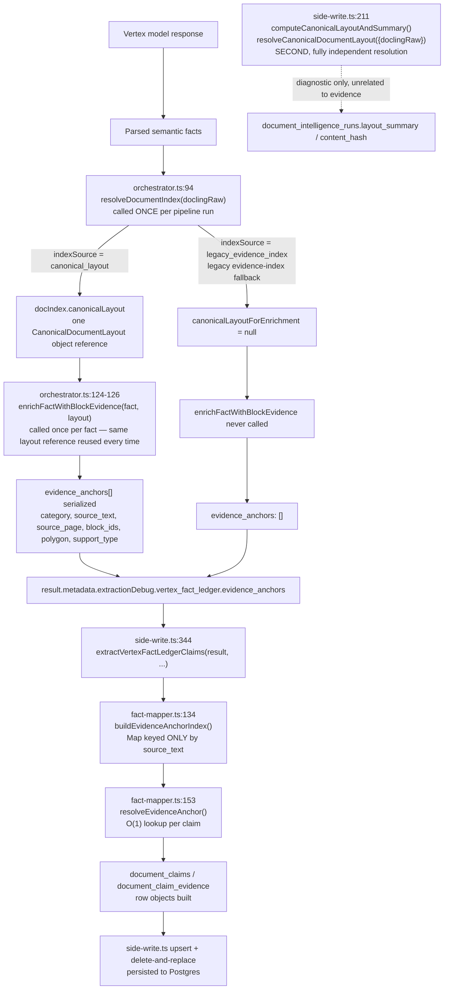

# Azure + Vertex Canonical Pipeline Migration — Phase 4C: Evidence-Enrichment Review

Date: 2026-07-16
Branch: `feature/document-intelligence-v3`. Phase 1 `62678ec`, Phase 2 `f6c9674`, Phase 3 `2c5c544`, Phase 3A `991fed7`, Phase 3B `479b121`, Phase 4a `cb77efb`, Phase 4b `23ba755`, consolidated audit `3c13c50`.
Scope: determine whether evidence enrichment independently builds, resolves, or transforms a canonical document layout. **No deployment. No remote reads/writes. No live Azure/Vertex call. No schema change. No parser/worker/normalize/Lease Review change.**

## 1. Executive result

```text
NOT APPLICABLE — NO PRODUCTION CODE CHANGE REQUIRED
```

Evidence enrichment does not independently construct or resolve a `CanonicalDocumentLayout`. It is a pure reuse of the single layout `document-index-v3.ts` (Phase 4A) resolves once per pipeline run — proven by tracing the actual runtime call graph and object identity, not inferred from architecture intent. One narrowly-scoped test file was added (structural + one behavioral regression documenting a real, pre-existing risk this review surfaced) — no production source file was modified.

## 2. Repository baseline

| Item | Value |
|---|---|
| Branch | `feature/document-intelligence-v3` |
| HEAD before Phase 4C | `3c13c50` (consolidated audit report, committed separately per explicit approval before this phase began) |
| Working tree | Clean before Phase 4C's own work; clean after except the one new test file |
| Phase 4A verification | Confirmed present: `document-index-v3.ts:202` — `await resolveCanonicalDocumentLayout({ doclingRaw })` |
| Phase 4B verification | Confirmed present: `side-write.ts:211` — `await resolveCanonicalDocumentLayout({ doclingRaw })` |
| Other production call sites of `resolveCanonicalDocumentLayout`/`legacyDoclingToCanonicalLayout`/`buildCanonicalLayoutFromAzureLikeOutput` | Zero, confirmed by repo-wide grep excluding `_tests/` |

## 3. Evidence-enrichment runtime call graph



| Item | File | Symbol | Caller | Input | Output | Layout access | Construction? | Legacy dependency | Provider leakage | Failure behavior | Persistence impact |
|---|---|---|---|---|---|---|---|---|---|---|---|
| 1 | `vertex-fact-ledger/orchestrator.ts:94` | `resolveDocumentIndex` | `runVertexFactLedgerPipeline` | `doclingRaw` | `{ index, indexSource, fallbackReason }` | Constructs/resolves | Yes — the *only* construction point in this whole graph | Reads `docling_raw` via the resolver | None (resolver boundary) | Falls back to legacy evidence-index on failure, never throws | None directly; feeds everything downstream |
| 2 | `vertex-fact-ledger/document-index-v3.ts:236` | `enrichFactWithBlockEvidence` | `orchestrator.ts:125`, once per fact | `(fact, layout \| null)` | Fact + `blockIds`/`polygon`/`supportType` | **Consumes** a passed-in layout, never constructs one | No | None | None | Degrades to empty `blockIds`/`polygon`, `supportType: null` — never throws, never fabricates | None directly (feeds `evidence_anchors`) |
| 3 | `vertex-fact-ledger/orchestrator.ts:198-207` | inline serialization | `runVertexFactLedgerPipeline` | Enriched facts | `evidence_anchors[]` (plain JSON) | None — reads plain fields off enriched facts | No | None | None | Empty array when layout unavailable | Populates `result.metadata...vertex_fact_ledger.evidence_anchors` |
| 4 | `document-intelligence-v3/fact-mapper.ts:134` | `buildEvidenceAnchorIndex` | `extractVertexFactLedgerClaims` | `evidence_anchors[]` | `Map<source_text, anchor>` | None — indexes plain JSON, no layout object ever seen | No | None | None | Empty/absent array → empty map, no error | Feeds the evidence rows below |
| 5 | `document-intelligence-v3/fact-mapper.ts:189-293` | `extractVertexFactLedgerClaims` | `side-write.ts:344` | `result`, org/file/lease ids | `{ claims, evidence }` | None | No | None | None | Missing `source_text` → claim with zero evidence rows (no fabrication) | Builds `document_claims`/`document_claim_evidence` row objects |
| 6 | `document-intelligence-v3/side-write.ts:344-372` | `runDocumentIntelligenceV3SideWrite` (insert section) | `normalize-pdf-output/index.ts` | Claim/evidence row arrays | Insert results | None | No | None | None | Any insert error throws into the outer catch → whole side-write reports `status: "failed"`, never escapes to the caller | Writes `document_claims`, `document_claim_evidence` |
| 7 | `document-intelligence-v3/side-write.ts:211` | `computeCanonicalLayoutAndSummary` (unrelated to evidence) | `runDocumentIntelligenceV3SideWrite` | `doclingRaw` | `{ summary, contentHash }` | Constructs/resolves — **a second, independent resolution** | Yes, but for `layout_summary`/`content_hash` only | Reads `docling_raw` via the resolver | None | Degrades to `{ warnings: [...] }`, never throws | Writes `document_intelligence_runs.layout_summary` |

## 4. Layout ownership

- **Constructed / resolved**: exclusively at `orchestrator.ts:94` (`resolveDocumentIndex`) for the evidence-enrichment path, and independently a second time at `side-write.ts:211` for the unrelated diagnostic summary/hash path. Evidence enrichment itself never constructs or resolves anything.
- **Validated**: inside `resolveCanonicalDocumentLayout()` itself (Phase 3), before it ever returns to either caller above.
- **Indexed**: `buildCanonicalDocumentIndexFromLayout()` (`document-index-v3.ts`), called once, immediately after the one resolution in item 1.
- **Consumed by evidence enrichment**: `enrichFactWithBlockEvidence()` receives the already-resolved, already-indexed layout as a plain function parameter — the same in-memory object reference, reused across every fact in the enrichment loop, never rebuilt.

**Terminology used precisely, per explicit correction**: "legacy evidence-index fallback" (`resolveDocumentIndex()`'s own fallback to `buildCanonicalDocumentIndex()` from `document-index.ts`, reported as `indexSource: "legacy_evidence_index"`) and "legacy canonical-layout builder" (`legacyDoclingToCanonicalLayout()`, used *inside* the resolver when only `docling_raw` is supplied) are two distinct mechanisms at two different levels of the call graph and are not used interchangeably anywhere in this report.

## 5. Applicability decision

All five conditions in the governing decision contract are met:

| Condition | Result | Evidence |
|---|---|---|
| Evidence enrichment does not independently construct a layout | ✅ | `enrichFactWithBlockEvidence` accepts a layout parameter; zero construction calls in its own body (§3 table, guard test in §10) |
| Evidence enrichment reuses the Phase 4A index/layout path | ✅ | Same object reference (`docIndex.canonicalLayout`) passed from `orchestrator.ts`'s one `resolveDocumentIndex()` call |
| No direct legacy-builder import exists in evidence enrichment | ✅ | Zero references anywhere in `fact-mapper.ts`; confirmed by source-scan test |
| No active parallel evidence-layout construction exists | ✅ | `document-index.ts` vs. `document-index-v3.ts` is an additive-superset/fallback relationship, not duplication (§6 has the real duplication finding, which is in unrelated evidence *logic*, not layout construction) |
| Null/fatal canonical failures are already handled upstream | ✅ | `orchestrator.ts` checks `indexSource === "canonical_layout"` *before* ever calling `enrichFactWithBlockEvidence`; the legacy evidence-index fallback produces `evidence_anchors: []` honestly |

**Why no code change is required**: the architectural boundary this phase was asked to verify already holds, and holds correctly, by construction of Phases 1–4B. Introducing a resolver call anywhere in `fact-mapper.ts` or `enrichFactWithBlockEvidence` would be pure scope creep — there is nothing there to migrate.

## 6. Evidence contract matrix

| Evidence property | Canonical producer | Index representation | Mapper preservation | Durable persistence | UI availability | Status |
|---|---|---|---|---|---|---|
| Page number | `LayoutBlock.page_number` | Present (`layout.pages[].page_number`) | Preserved (`source_page`) | `document_claim_evidence.page` | Not read from this table (UI resolves page via a separate mechanism — `evidenceResolver.js`) | complete (persisted), not consumed by UI from this path |
| Block IDs | `LayoutBlock.block_id` | Present (`blockIds[]` on the index) | Preserved (`block_ids`) | `document_claim_evidence.block_ids TEXT[]` | Not consumed (only aggregate counts shown in `ExtractionDebugPanel.jsx`) | partial |
| Source text | `LayoutBlock.text` | Present | Preserved, and used as the **Map key** for anchor resolution (see §7's risk) | `document_claim_evidence.source_text` | Not read from this table (UI's field-evidence display uses a separate resolver) | complete (persisted), not consumed by UI from this path |
| Text spans | `LayoutBlock.spans` (Phase 1) | Not represented on the index/evidence-anchor shape | **Dropped** — `enrichFactWithBlockEvidence` never returns spans | No column exists | not applicable | dropped by mapper |
| Bounding regions | `LayoutBlock.bounding_regions` (Phase 1) | Not represented | **Dropped**, same as spans | No column exists | not applicable | dropped by mapper |
| Polygon | `LayoutBlock.polygon` | Present | Preserved (`polygon`) | `document_claim_evidence.polygon NUMERIC[]` | Not consumed (only aggregate counts) | partial; also **unavailable by legacy-lossy design** today, since the current runtime path (`legacyDoclingToCanonicalLayout`) always produces empty polygons regardless of mapper fidelity (Phase 1 finding, still true) |
| Table ID | `CanonicalTable.table_id` | Present only as page-level `tablePlaceholders`, never per-evidence | **Never populated** — `enrichFactWithBlockEvidence` only searches `page.blocks`, never `page.tables` | No column exists | not applicable | not applicable — structurally unreachable, not a bug |
| Cell IDs | `CanonicalTableCell.cell_id` | Same as Table ID | Never populated, same reason | No column exists | not applicable | not applicable |
| Provider metadata (`provider`/`provider_model_id`/`provider_api_version`) | `CanonicalDocumentLayout.provider*` — only populated by the Azure-native adapter; the always-current legacy path only sets `provider: "legacy_docling_compatibility"`, never `provider_model_id`/`provider_api_version` | Present on the embedded `canonicalLayout`, never extracted into `evidence_anchors` | Dropped — `DocumentIntelligenceV3ClaimEvidenceRow` has no such fields | No per-evidence-row column; a *different*, run-level provider concept lives on `document_intelligence_runs.version_metadata` | not applicable | unavailable by legacy-lossy design (current runtime) / dropped by mapper |

This is a legacy-lossy fidelity limitation compounded by a narrow mapping function and a narrow schema, all three consistent with each other — not a bug, and explicitly not fixed in this review-only phase.

## 7. Fidelity behavior

- **Current reachable source**: `legacy_docling_raw` — every real resolution in this pipeline goes through `docling_raw`, per Phase 2's durable-input finding, unchanged as of this phase.
- **Current reachable fidelity**: `legacy_lossy`.
- **Unavailable under `legacy_lossy`**: real polygons, spans, and bounding regions are structurally empty regardless of what the evidence-enrichment code preserves, because the legacy canonical-layout builder never populates real geometry (Phase 1 finding).
- **Is the lossless Azure-native path active?** No — **not claimed here, and not proven anywhere in this codebase as of this phase.** Nothing evidence-enrichment-related changes that; it was already true before Phase 4C and remains true after it.

## 8. Files inspected

`fact-mapper.ts`, `vertex-fact-ledger/document-index-v3.ts`, `vertex-fact-ledger/orchestrator.ts`, `document-intelligence-v3/side-write.ts`, `document-intelligence-v3/canonical-layout.ts`, `document-intelligence-v3/canonical-layout-resolver.ts`, `_shared/extraction/evidence-index.ts`, `vertex-fact-ledger/document-index.ts`, `_shared/extraction/lease-workflow.ts`, `src/components/lease-review/utils/evidenceResolver.js`, `src/components/lease-review/ExtractionDebugPanel.jsx`, `src/components/lease-review/FieldDetailDrawer.jsx`, `src/pages/LeaseReview.jsx`, `src/services/leaseService.js`, `_shared/supabase.ts`, `supabase/migrations/20260819000000_document_intelligence_v3_scaffold.sql`, `supabase/migrations/20260821000000_document_intelligence_v3_run_profile_columns.sql`, `pipeline-status/index.ts`, plus the existing test files listed in §10.

## 9. Files changed

Created: `supabase/functions/_tests/evidence-enrichment-layout-ownership.test.ts` (3 tests). Also created, as a separate, independently-approved commit before this phase's own work: `docs/azure-vertex-migration-consolidated-audit-report.md` (documentation only, not part of the Phase 4C change set).

```text
No production source code changed.
```

Confirmed by `git status --short` showing exactly one untracked file (the new test) throughout this phase, and `git diff --check` clean.

## 10. Tests

**Existing coverage cataloged first, per the required process — nothing duplicated:**

| Scenario | Existing test(s) | Level |
|---|---|---|
| Canonical path (valid layout → enrichment → expected evidence → anchor serialized) | `vertex-fact-ledger.test.ts`: *"ENABLE_DOCUMENT_INTELLIGENCE_V3=true resolves via canonical_layout and reports evidence_anchors (Phase 6 Task H.1/H.3)"*; `document-intelligence-v3-fact-mapper.test.ts`: *"a mapped field with a matching evidence anchor persists real block_ids (Task G.1)"*, *"a matching evidence anchor persists real polygon data (Task G.2)"* | Orchestrator (mocked Vertex) + fact-mapper unit |
| Fallback path (canonical unavailable → no enrichment call → empty `block_ids`/`polygon` → deterministic persistence) | `vertex-fact-ledger.test.ts`: *"ENABLE_DOCUMENT_INTELLIGENCE_V3 unset uses legacy_evidence_index by default (Task H.7)"* — asserts `vfl.evidence_anchors === []` explicitly at the orchestrator level; `document-intelligence-v3-fact-mapper.test.ts`: *"missing evidence_anchors ... preserves exact Phase 2 behavior (Task G.3)"* | Orchestrator + fact-mapper unit |
| Multiple-anchor / deterministic selection | **No existing coverage found** — genuine gap, directly connected to the risk found in §11 | — |

Both the canonical and fallback scenarios were **already fully covered end-to-end** — cited above, nothing new added for them. The multiple-anchor scenario was a real gap; closed with one new behavioral test that documents (not fixes) the collision risk it surfaces.

**New tests added** (`evidence-enrichment-layout-ownership.test.ts`, 3 tests):
1. Structural — `fact-mapper.ts` contains no functional reference to any layout-construction symbol (source-scan, comment-stripped to avoid false positives from doc comments).
2. Structural — `enrichFactWithBlockEvidence`'s own isolated function body contains no such call.
3. Behavioral — two facts with identical `source_text` but different `source_page`/`block_ids` in `evidence_anchors`: proves the second claim incorrectly inherits the first claim's evidence (deterministic, not random — `Map.has()` short-circuit, first-seen wins). Documents §11's finding with a passing test, not an assertion that the current behavior is correct.

| Command | Result | Count | Baseline vs. post-change |
|---|---|---|---|
| `deno test azure-to-canonical-layout.test.ts` | ✅ | 30/30 | Unchanged |
| `deno test document-intelligence-v3-canonical-layout.test.ts` | ✅ | 30/30 | Unchanged |
| `deno test canonical-layout-resolver.test.ts` | ✅ | 19/19 | Unchanged |
| `deno test canonical-warning-vocabulary.test.ts` | ✅ | 8/8 | Unchanged |
| `deno test document-intelligence-v3-document-index.test.ts` | ✅ | 13/13 | Unchanged |
| `deno test document-index-v3-resolver-adoption.test.ts` | ✅ | 12/12 | Unchanged |
| `deno test document-intelligence-v3-fact-mapper.test.ts` | ✅ | 20/20 | Unchanged |
| `deno test side-write-resolver-adoption.test.ts` | ✅ | 11/11 | Unchanged |
| `deno test evidence-enrichment-layout-ownership.test.ts` (new) | ✅ | 3/3 | New |
| Combined pure-function total | ✅ | **146/146** | 143 baseline + 3 new |
| `deno test document-intelligence-v3-side-write.property.test.ts` (DB-backed, local Postgres) | ✅ | 21/21 | Unchanged |
| `deno test vertex-fact-ledger.test.ts` (mocked Vertex) | ✅ | 13/13 | Unchanged |
| `npm run lint` | ✅ | clean | Unchanged |
| `npm run typecheck` | ✅ | clean | Unchanged |
| `npm run test` (vitest) | ✅ | 657/657 | Unchanged |
| `npm run build` | ✅ | succeeds (pre-existing chunk-size warning only) | Unchanged |
| `git diff --check` | ✅ | clean | — |
| Secret scan of new file | ✅ | none found | — |

No skipped or unavailable dependencies — local Supabase (`127.0.0.1:54321`) was reachable for the DB-backed suite throughout.

## 11. Security and tenancy

**Static findings (confirmed by reading code):**
- `orgId` passed into `side-write.ts` is server-derived via `getUserOrgId()` (authenticated membership lookup in `_shared/supabase.ts`), not raw request input; the paired `uploadedFile` row is independently fetched org-scoped before reaching side-write.
- No secrets/credentials found in any evidence table or `layout_summary`. `document_claim_evidence.source_text` does persist real lease text (business content, not a credential).

**Static policy inspection only — not verified against a running database:**
- `document_intelligence_runs`/`document_claims`/`document_claim_evidence`/`document_validation_drops`/`document_canonical_field_projections` each have a single SELECT-only RLS policy scoped by `is_member_of_org(org_id)`; no INSERT/UPDATE/DELETE policy exists for `authenticated` — writes only happen via `service_role`, which bypasses RLS. This is a reading of the migration SQL, not a tested runtime authorization claim.

**Assumed, not actively re-verified in code — flagged as a risk:**
- Cross-tenant reference (does `uploadedFileId`/`leaseId` actually belong to `orgId`?) is not independently re-checked inside `side-write.ts`/`fact-mapper.ts` — assumed from caller context. Currently unexploitable (`leaseId` is hardcoded `null` at the only production call site), but there is no defense-in-depth check. See risk register.

## 12. Performance

Evidence enrichment does not rebuild or copy layout/index data: the canonical layout is resolved once per pipeline run (`orchestrator.ts:94`) and the same in-memory object reference is passed into `enrichFactWithBlockEvidence` once per fact — confirmed by reading the loop, not measured (no O(facts × blocks) unbounded scan, no per-fact deep clone, no repeated JSON parsing of `docling_raw` inside the loop). The only repeated computation anywhere in the request is `side-write.ts`'s already-known, already-Phase-2-accepted second, independent resolver call for its own unrelated diagnostic purpose (`layout_summary`/`content_hash`) — not a Phase 4C finding, a restatement of existing, previously-accepted behavior.

## 13. Findings outside scope

- **Azure staging compute-resource exhaustion, parser response/persistence memory issue, worker durable-state reconciliation issue** — the governing P0 issue described in the task context. Not touched, not investigated further; explicitly out of scope for Phase 4C.
- **`pipeline-status` 400s** — a plausible mechanism was found while investigating adjacent code: `getUserOrgId()` throws for a multi-org user missing the `x-acting-org-id` header, and `pipeline-status/index.ts`'s outer catch maps any thrown error generically to HTTP 400. **Labeled a probable root cause requiring request/header reproduction — not the confirmed root cause**, since no actual failing request was captured and compared against `getUserOrgId()`'s requirements.
- **`persistLeaseExtractionMerge` — corrected finding.** An initial backend-only search (`supabase/functions/`) found zero matches and was reported as "does not exist." A follow-up frontend-inclusive search corrects this: **the function exists and is fully wired** — defined and exported at `src/services/leaseService.js:191`, imported and called in `src/pages/LeaseReview.jsx:20,2075,2508` and `src/components/lease-review/ExtractionDebugPanel.jsx:12,748`, with dedicated tests in `src/services/__tests__/leaseServiceHard3b3aWorkflow.test.js`. The "not found" framing is retracted. If a production "undefined" error was genuinely observed, the most likely explanations given this evidence are a stale/out-of-date deployed frontend bundle (a build predating this function, or excluding it) or an environment-specific import/runtime failure — not a missing source definition. Diagnosing which requires reproducing against the actual failing environment; out of scope for Phase 4C either way.
- **`evidence-index.ts` WeakMap issue** (found in Phase 4a): confirmed still present, unchanged, at `evidence-index.ts:54,57,103` — `_indexCache.set(doclingRaw, index)` throws if `doclingRaw` is ever a non-null, non-object primitive. Still open, not fixed here.

## 14. Risks

| Risk | Severity | Likelihood | Impact | Recommended owner/phase |
|---|---|---|---|---|
| Evidence anchors indexed only by `source_text` can collide when identical text appears in multiple locations (repeated headers/footers, duplicate defined terms, boilerplate clauses, amendments repeating original language, identical table-cell text) | Medium | Medium | A claim may receive the wrong page/block anchor — empirically demonstrated by the new test in §10, not speculative | A future evidence-contract or Vertex-extraction-hardening phase. A more durable key would incorporate `category` + `source_text` + `source_page` + a fact identifier + an occurrence index |
| `support_type: "direct_quote"` is a schema-required `NOT NULL`/`CHECK`-constrained default, not proof a canonical anchor was actually resolved | Medium | Occurs on every fallback-path or no-match evidence row | A reviewer or downstream consumer could misread "direct_quote" as verified structural support when it is really a compatibility placeholder | Evidence-contract hardening phase; would require a schema change (out of scope here) to represent "no anchor resolved" distinctly from "resolved as a direct quote" |
| No defense-in-depth cross-tenant check inside `side-write.ts`/`fact-mapper.ts` itself | Low | Low (currently unexploitable — `leaseId` hardcoded `null` at the only call site) | If a future caller ever passes a mismatched `uploadedFileId`/`leaseId`/`orgId` triple, cross-tenant-referencing rows could be written silently | Security-hardening phase, if/when a second caller of `runDocumentIntelligenceV3SideWrite` is introduced |
| Three independent evidence-construction systems exist in this codebase (V3 canonical-layout-based enrichment; the default `legacy_hybrid` path's own hand-rolled evidence logic in `lease-workflow.ts`; a third, near-identical reimplementation of the same snippet/sentence-boundary algorithm in the frontend's `evidenceResolver.js`) | Medium (strategic, not a bug) | Certain — already true today | Vertex-primary and legacy-fallback results may produce materially different source-evidence behavior even when both populate the same UI fields, undermining the intended one-contract architecture | **Explicit forward requirement for Phase 4E or later**: document how Vertex-primary and legacy-fallback results converge on a provider-neutral evidence contract, without requiring both extraction engines to share the same internal matching implementation immediately |
| RLS policy claims are static-only, not runtime-verified | Low (process risk, not a known vulnerability) | N/A | A future migration could alter/drop these policies without the change being caught by this review | Any future security review with database access should re-verify against a live `pg_policies` query |

## 15. Rollback

```text
No runtime rollback required.
```

No production source code changed. If the one new test file is ever judged unwanted, it is a file-scoped revert (delete `supabase/functions/_tests/evidence-enrichment-layout-ownership.test.ts`); no other file references it, and no schema rollback is required.

## 16. Recommendation

Phase 4D (or whichever unit is approved next) may proceed on top of this review's findings. Per Phase 3A's roadmap, the next candidate is diagnostics/readiness (Phase 4d in that numbering), expected to also conclude "not applicable" since it reads only durable claim/evidence tables and never a layout — to be confirmed the same way this phase was, not assumed. This phase does not authorize that or any other unit to start automatically.

Recommendation remains **No Gate**. V3 remains diagnostic/advisory.

---

## Execution-status table

| Requirement | Status |
|---|---|
| Call graph traced | Complete |
| Consolidated-report approval/handling resolved | Complete — approved and committed separately (`3c13c50`), before Phase 4C's own work |
| Working tree clean before Phase 4C's own commit | Complete |
| Baseline tests run | Complete |
| Existing test coverage cataloged against the 3 behavioral scenarios | Complete — 2 of 3 already fully covered (cited, not duplicated), 1 real gap closed |
| Protective/behavioral tests added (only for real gaps) | Complete — 3 tests in 1 new file |
| Full relevant regression run | Complete — 146 pure-function + 21 DB-backed + 13 mocked-Vertex + 657 vitest, all green |
| Production source changed | No |
| Phase 4C report written and committed | Complete (this document; commit pending your go-ahead, matching the pattern of every prior phase) |
| Phase 4D started | No — not authorized by this phase |

**`PHASE 4C COMPLETE`** as of this report — every row above is resolved.
