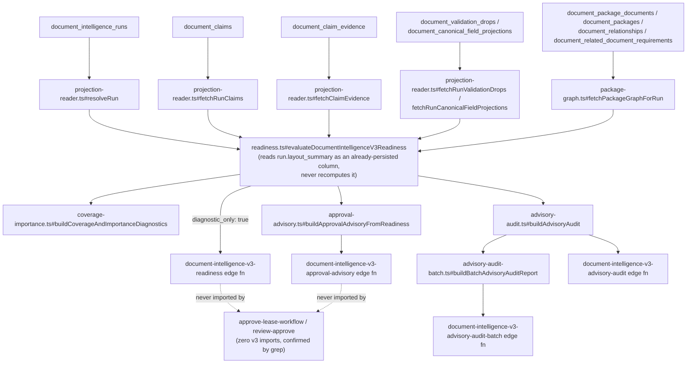
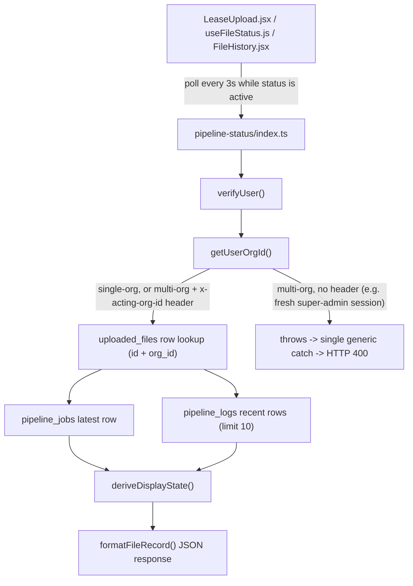
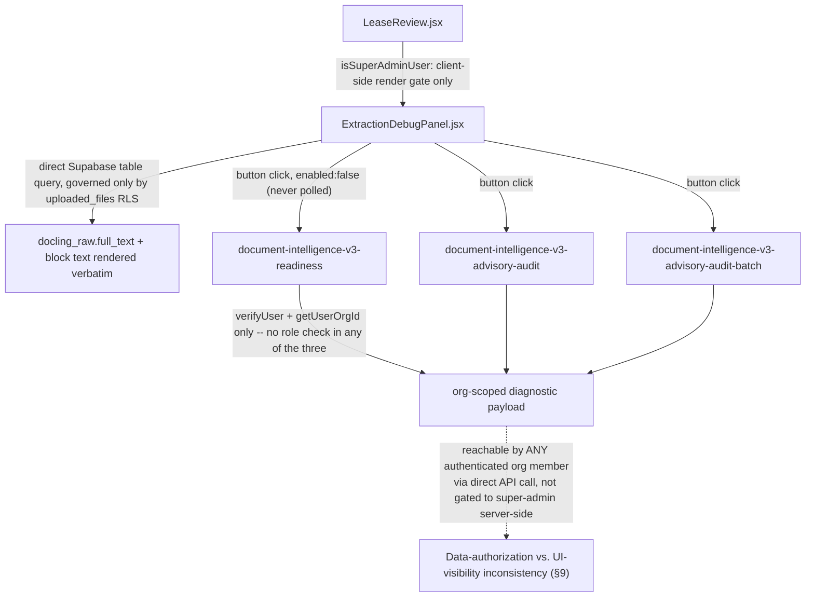

# Azure + Vertex Canonical Pipeline Migration — Phase 4D: Diagnostics/Readiness Review

Date: 2026-07-16
Branch: `feature/document-intelligence-v3`. Phase 1 `62678ec`, Phase 2 `f6c9674`, Phase 3 `2c5c544`, Phase 3A `991fed7`, Phase 3B `479b121`, Phase 4a `cb77efb`, Phase 4b `23ba755`, Phase 4C `f2043af`, consolidated audit `3c13c50`.
Scope: determine whether diagnostics, readiness, status, admin debug, and V3 observability paths independently consume, construct, or resolve canonical document layout. **No deployment. No remote reads/writes. No live Azure/Vertex call. No schema change. No parser/worker/normalize/Azure-adapter/Vertex-orchestrator/Lease-Review-business change.**

## 1. Executive result

```text
NOT APPLICABLE — NO LAYOUT MIGRATION REQUIRED
```

No diagnostic, readiness, status, or admin-debug path anywhere in this codebase constructs, resolves, or reads `docling_raw` for the purpose of building a `CanonicalDocumentLayout`. Every such path reads durable, already-persisted rows — `document_intelligence_runs`, `document_claims`, `document_claim_evidence`, `document_validation_drops`, `document_canonical_field_projections`, the package-graph tables, or Phase 4B's `layout_summary` column — never a fresh layout resolution. Confirmed advisory-only, confirmed structurally incapable of gating approval. No production runtime code was modified. Two real findings outside the core layout question were surfaced and are recorded, not fixed, per scope: an authorization-contract inconsistency on three diagnostic edge functions, and a data-model gap that explains the known P0 Azure staging status-contradiction symptom.

## 2. Repository baseline

| Item | Value |
|---|---|
| Branch | `feature/document-intelligence-v3` |
| HEAD before Phase 4D | `f2043af` (Phase 4C) |
| Working tree | Clean before Phase 4D's own work; only the one new test file present after |
| Phase 4A confirmation | `document-index-v3.ts:40` imports `resolveCanonicalDocumentLayout`, called at line 202 |
| Phase 4B confirmation | `side-write.ts:41` imports `resolveCanonicalDocumentLayout`, called at line 211 |
| Phase 4C confirmation | `docs/azure-vertex-migration-phase4c-evidence-enrichment-review.md` and `_tests/evidence-enrichment-layout-ownership.test.ts` both present on disk |
| All production call sites of the 4 layout-construction symbols (excluding `_tests/`) | Exactly 5 files: the two function-definition files (`canonical-layout.ts`, `azure-to-canonical-layout.ts`), the resolver's own internals (`canonical-layout-resolver.ts`), and the two Phase 4A/4B consumers (`document-index-v3.ts`, `side-write.ts`). **No 6th caller found.** |

## 3. Diagnostic/readiness runtime call graph

### 3a. V3 diagnostic/readiness flow



### 3b. User-facing pipeline-status flow



### 3c. Admin/debug frontend flow



### 3d. Per-stage table

| # | File | Symbol | Caller | Input | Output | Layout access | Resolver call? | Raw parser access | Authority | User role | Failure behavior | Security |
|---|---|---|---|---|---|---|---|---|---|---|---|---|
| 1 | `document-intelligence-v3/readiness.ts` | `evaluateDocumentIntelligenceV3Readiness` | 4 standalone edge functions | `{supabaseAdmin, orgId, runId, uploadedFileId}` | Readiness object, `diagnostic_only: true` | Durable rows + `run.layout_summary` only | No | No | Advisory | Any org member (server) / super-admin (UI) | Missing run → `available: false`, HTTP 200, never throws | `orgId` server-resolved; every query `.eq("org_id", orgId)` |
| 2 | `coverage-importance.ts` | `buildCoverageAndImportanceDiagnostics` | `readiness.ts` | Plain args (claims, evidence, drops, `layoutSummary`) | Coverage %, importance scores | None — pure function | No | No | Advisory | — | Never throws | N/A |
| 3 | `package-graph.ts` | `fetchPackageGraphForRun` / `upsertPackageGraphForRun` | `readiness.ts` (read) / `side-write.ts` (write) | Durable package tables | Package graph object | None | No | No | Advisory | Service-role (write), org-scoped (read) | Read failure → empty graph, degrades gracefully | Org-scoped queries |
| 4 | `approval-advisory.ts` | `buildApprovalAdvisoryFromReadiness` | `document-intelligence-v3-approval-advisory` | `readiness` object | Simulation labels (`would_block_approval` etc.) | None | No | No | **Advisory, explicitly never wired to real approval** | Any org member (server) | Never throws | Same as #1 |
| 5 | `advisory-audit.ts` / `-batch.ts` | `buildAdvisoryAudit` / `buildBatchAdvisoryAuditReport` | Their edge functions | `readiness`, `uploadedFile` (non-`docling_raw` columns), `lease` | Audit report | None | No | No | Advisory | Any org member (server) | Never throws | Same as #1 |
| 6 | `pipeline-status/index.ts` | `Deno.serve` handler | `LeaseUpload.jsx` (polling) | `file_id`, headers | Status JSON | None (fetches `docling_raw` column but never returns it) | No | No (fetched, discarded) | Operational, user-facing | Any authenticated org member | Any auth/org error → generic HTTP 400 (§7) | Same auth pattern as #1 |
| 7 | `ExtractionDebugPanel.jsx` | React component | `LeaseReview.jsx` | `lease` prop | Rendered debug UI | Full `docling_raw` via direct table query | No | Yes, directly, client-side | Admin-visible only in UI | `isSuperAdminUser` (client-side only) | N/A | Governed by `uploaded_files` RLS only |

## 4. Layout ownership

- **Constructed/resolved**: nowhere in this entire surface. Every readiness/diagnostic/status/debug path either reads durable database rows or, for the one frontend exception (`ExtractionDebugPanel.jsx`), reads `docling_raw` directly for **display**, never to build a `CanonicalDocumentLayout`.
- **`layout_summary`**: read as an already-persisted column, produced exclusively by Phase 4B's `side-write.ts`, never recomputed anywhere in the diagnostics surface — `readiness.ts`'s own comment states this explicitly.
- **Durable evidence/projections**: `document_claim_evidence`, `document_canonical_field_projections` read directly by `projection-reader.ts`, never re-derived.
- **No layout data at all**: `pipeline-status`, `approve-lease-workflow`, `review-approve`.

## 5. Applicability decision

All conditions for `NOT APPLICABLE` are met: diagnostics/readiness do not construct layout independently (§3, §4); they consume durable records or Phase 4B's summary; no direct legacy-builder import exists anywhere in this surface (confirmed by per-file grep, §3a's diagram); no resolver adoption is required; diagnostics remain advisory (§9's `diagnostic_only: true` and header-comment evidence); diagnostics do not affect approval (§3a: zero v3 imports in `approve-lease-workflow`/`review-approve`, confirmed by grep, not by policy alone); diagnostic failure cannot break current business output (every diagnostic path is read-only, or, for `side-write.ts`'s own diagnostic writes, already covered by Phase 4B's non-throwing degrade-in-place design).

## 6. Readiness matrix

| Readiness signal | Producer | Inputs | Consumer | Advisory or gate | Risk |
|---|---|---|---|---|---|
| Per-field status (`missing`/`source_backed`/`needs_review`) | `readiness.ts#evaluateField` | `document_canonical_field_projections`, `document_claim_evidence.source_text` | `readiness.ts` blockers list | Advisory | Low — purely diagnostic |
| Blockers list | `readiness.ts` | Required fields not `source_backed`, per `getProfilePolicy` | Top-level status | Advisory | Low |
| Top-level status (`not_applicable`/`needs_review`/`ready`) | `readiness.ts` | Count-of-blockers (no numeric weighting) | `document-intelligence-v3-readiness` response, `approval-advisory.ts` | **Advisory — confirmed never wired to real approval** | Low, given §3a's import-graph proof |
| Coverage % | `coverage-importance.ts#buildCoverageAndImportanceDiagnostics` | Unweighted mean of 5 components, hardcoded thresholds (≥90/≥70/≥35) | `document_intelligence_runs.coverage`, debug UI | Advisory | Low — hardcoded thresholds are a design choice, not a bug |
| Field importance score | `coverage-importance.ts#scoreFieldImportance` | Additive hardcoded points, hardcoded level thresholds (≥85/≥65/≥35) | Advisory audit reports | Advisory | Low |
| `would_block_approval` (simulation label) | `approval-advisory.ts` | `readiness` object | `document-intelligence-v3-approval-advisory` response only | **Explicitly labeled advisory, never enforced** | Low — the field name itself could be misread out of context; confirmed not load-bearing |
| Package graph status | `package-graph.ts` | Durable package/relationship tables | `readiness.ts`, coverage diagnostics | Advisory | Low |

`ENABLE_DOCUMENT_INTELLIGENCE_V3=true` was verified to **not** imply V3 findings block approval — this is a structural fact (zero imports), not an inference from the flag's documented intent.

## 7. Status-authority matrix

| Status field | Owner (writer) | Written by | Read by | Meaning | Can conflict with another field? |
|---|---|---|---|---|---|
| `uploaded_files.status` | Pipeline stages via `setStatus()` | `ingest-file`, `parse-pdf-docling`, `normalize-pdf-output`, `lease-extraction-worker`, `store-data`, `validate-data` | `pipeline-status`, `LeaseUpload.jsx` | Coarse lifecycle enum, transition-validated | Yes — see below |
| `uploaded_files.processing_status` | Same call sites, passed as free-text `extra` alongside `status` | Same | `pipeline-status`, debug panels | Detailed sub-state (e.g. `parse_completed_empty_text`) | **Yes — independent column, no cross-validation against `status`** |
| `uploaded_files.failed_step` | Failure paths only, via `setFailed()` | Same, failure branches only | `LeaseUpload.jsx` Advanced diagnostics panel (unconditionally) | Stage label at time of last failure | **Yes — cleared only by `ingest-file` at initial upload; never cleared by a later successful stage** |
| `uploaded_files.error_message` | Same as `failed_step` | Same | Debug panels | Last failure's message | Same staleness pattern as `failed_step` |
| `pipeline_jobs.status` | Per-attempt job rows | Worker/parse/normalize stages | `pipeline-status#fetchLatestJob`, `status-utils.ts#deriveDisplayState` (manual reconciliation) | Per-stage-attempt status (`queued`/`running`/`completed`/`failed`/`cancelled`) | **Yes — a separate, independent status source with no FK-level sync to `uploaded_files.status`; `status-utils.ts` has to reconcile them manually** |
| `document_intelligence_runs.status` | v3 side-write scaffold | **No runtime writer found** | Nothing yet reads it operationally | Schema exists for `pending`/`running`/`completed`/`failed` | **Classify precisely as schema-defined, currently-dormant diagnostic status — not a current operational authority. Do not treat it as representing the latest extraction state; nothing writes to it as of this phase.** |

**The data model structurally permits exactly the contradiction seen in the known P0 report**: `uploaded_files.status`, `.processing_status`, and `.failed_step` are independent `TEXT`/`BOOLEAN` columns with no CHECK constraint, trigger, or application-level invariant tying them together — only `status`'s own transition graph (`_shared/pipeline-status.ts#isAllowedTransition`) is validated. A row with `status="review_required"` while `processing_status` still reflects a parse-failure code and `failed_step="parse"` is stale from an earlier attempt is structurally possible, not a data-corruption anomaly. **Not fixed here** — this is precisely the class of issue the separately-scoped Azure worker durable-state reconciliation patch exists to address.

`LeaseUpload.jsx`'s **primary** failure banner is correctly gated on `status === "failed"` (authoritative, confirmed by reading the code) — the risk is confined to the "Advanced" diagnostics panel, which displays `failed_step` unconditionally regardless of current `status`, and can therefore show a stale value from a prior failed attempt even after the file has since succeeded.

## 8. Observability gap matrix

| Stage | Existing telemetry | Durable? | User-visible? | Admin-visible? | Gap | Priority |
|---|---|---|---|---|---|---|
| Upload created / confirmed | `uploaded_files` row creation, `ingest-file`'s `logger.event("queued", ...)` | Yes (`pipeline_logs`) | Indirectly (status) | Yes | None significant | — |
| Parser started/completed | `logger.event` in `parse-pdf-docling` (`started`/`blocked`/`completed`) | Yes, but **fire-and-forget — insert failures silently swallowed to `console.warn`** | Indirectly | Yes | Logging itself is not guaranteed durable | Medium |
| Canonical layout resolved | No dedicated event | No | No | No | **No first-class event exists**; only inferable from parse/normalize span metadata | Low (diagnostic-only concern, per this phase's own scope) |
| Vertex extraction started/completed | No dedicated event; happens inline inside `normalize`'s span | Partially (`normalized_output.metadata.pipeline`, JSONB, not SQL-queryable) | No | Partially, via debug panel raw JSON | Same as above | Low |
| Normalization started/completed | `logger.event` in `normalize-pdf-output`; `uploaded_files.processing_started_at`/`processing_completed_at` (whole-run only, not per-stage) | Yes | Indirectly | Yes | Per-stage timing not available at this granularity | Medium |
| Review payload created | Implicit via `status` transition | Indirectly | Yes | Yes | None significant | — |
| Pipeline failure | `failed_step`, `error_message`, `logger.event(..., "failed", ...)` | Yes | Yes (primary banner) / stale in Advanced panel (§7) | Yes | Staleness, per §7 | Medium |

The closest thing to real per-stage timing that exists today is `pipeline_jobs.started_at`/`completed_at` (one row per stage attempt). No new telemetry design is proposed in this phase, per instruction — this is an inventory only.

## 9. Admin and tenant security

**Static inspection (confirmed by reading code):**
- `document-intelligence-v3-readiness`/`-advisory-audit`/`-advisory-audit-batch` each authorize with `verifyUser()` + `getUserOrgId()` only. **No role/admin check exists in any of the three `index.ts` files** — confirmed by reading all three auth blocks directly.
- `orgId` is always server-resolved from the caller's own JWT (`getUserOrgId`), never client-supplied; every downstream query is additionally `.eq("org_id", orgId)`-filtered as defense-in-depth on top of RLS.
- RLS on `document_packages`/`document_package_documents`/`document_related_document_requirements`/`document_relationships` follows the same SELECT-only, `is_member_of_org(org_id)` pattern already confirmed for the other v3 tables in Phase 4C — no difference found.
- A cross-org ID guess against the readiness endpoint returns the identical HTTP 200 / `available: false` shape as a genuinely nonexistent ID — **no existence-signal leak** via status code or payload shape.

**The finding, framed as two distinct, conflicting access contracts (not one vague "gap"):**

| | Data authorization (server-side, actually enforced) | UI visibility (client-side, promised) |
|---|---|---|
| Contract | Any authenticated member of the caller's own organization | Super-admin only |
| Enforced by | `verifyUser()` + `getUserOrgId()` in each edge function | `isSuperAdminUser` check in `LeaseReview.jsx`, gating whether `ExtractionDebugPanel` even mounts |
| Consequence | Any org member calling the edge function's HTTP endpoint directly (curl/devtools) receives the identical diagnostic payload the UI hides | The button/tab is simply invisible to non-super-admins in the normal UI flow |

**The defect is the inconsistency between these two contracts**, not either one in isolation. This is org-scoped correctly (no cross-tenant leak) and the endpoints are read-only/advisory, so it is not a critical vulnerability — but for an enterprise product, server-side authorization should match the UI's promised access level. **Recommended future resolution, both options recorded, decision explicitly deferred**: (a) enforce an admin/super-admin role check server-side in the three edge functions, to match what the UI already promises; or (b) intentionally declare the endpoints available to all authorized organization members and remove the misleading super-admin-only UI framing. Not fixed in Phase 4D.

**Runtime local authorization test**: none performed — would require invoking the live edge functions with JWTs of differing privilege, which is out of this phase's "no remote database reads or writes" constraint. **Browser verification**: not performed. This finding rests entirely on static code inspection of the authorization logic, clearly labeled as such.

## 10. Data-exposure review

`ExtractionDebugPanel.jsx` renders `docling_raw.full_text` and per-block text **verbatim**, fetched via a **direct client-side Supabase table query** on `uploaded_files` — not through any of the three edge functions in §9 — governed solely by `uploaded_files`' own RLS, the same policy that gates all lease content elsewhere in the app. This is not a new cross-tenant leak, but it may expose an entire lease document's full text to any organization role permitted to select the upload row — which, combined with §9's finding, may be broader than "super-admin" in practice even though the UI implies otherwise. **Recorded as an open decision, not resolved here, per explicit instruction**: is full text intended for every authorized organization user? Should it require a reviewer/admin role specifically? Should production debug panels display excerpts rather than the complete lease? Not fixed in Phase 4D.

No raw provider responses (`raw_response` is confirmed never populated on the legacy path, per `canonical-layout.ts`'s own comment), no credentials/`service_role`/`SERVICE_ACCOUNT` tokens, no Azure operation-location URLs, no provider request payloads/prompts/model responses, no internal stack traces (`error?.message` only in every error path checked), and no signed storage URLs were found exposed anywhere in this diagnostics surface.

## 11. Performance

`pipeline-status` performs a simple indexed row lookup (`uploaded_files` by id+org, `pipeline_jobs`/`pipeline_logs` limited/filtered) — no layout resolution, no provider call anywhere in the handler. `docling_raw` is included in the `uploaded_files` select but never placed in the JSON response (`formatFileRecord` discards it) — a minor, not-worth-fixing payload inefficiency, not a correctness or security issue. Polling cadence is 3 seconds, only while the file is in an active/processing status (per `LeaseUpload.jsx`'s interval logic), stopping once the file leaves that state. The three v3 diagnostic edge functions are **never polled** — all three frontend hooks are declared `enabled: false`, fired only by explicit user button clicks, single-shot, so their heavier multi-table reads (still simple filtered SELECTs, no provider calls) do not compound the way a poll loop could.

## 12. Files inspected

`readiness.ts`, `coverage-importance.ts`, `package-graph.ts`, `related-documents.ts`, `approval-advisory.ts`, `advisory-audit.ts`, `advisory-audit-batch.ts`, `temporal-supersession.ts`, `profile-planner.ts`, `profile-policy.ts`, `contract.ts`, `adapter.ts`, `feature-flag.ts`, `projection-reader.ts`, `document-intelligence-v3-readiness/index.ts`, `document-intelligence-v3-advisory-audit/index.ts`, `document-intelligence-v3-advisory-audit-batch/index.ts`, `document-intelligence-v3-approval-advisory/index.ts`, `approve-lease-workflow/index.ts`, `review-approve/index.ts`, `pipeline-status/index.ts`, `pipeline-status/status-utils.ts`, `_shared/supabase.ts`, `_shared/pipeline-status.ts`, `_shared/logger.ts`, `_shared/extraction/pipeline-contract.ts`, `src/hooks/useFileStatus.js`, `src/pages/LeaseUpload.jsx`, `src/components/FileHistory.jsx`, `src/lib/actingOrg.js`, `src/lib/orgUtils.js`, `src/lib/rbac.js`, `src/components/lease-review/ExtractionDebugPanel.jsx`, `src/pages/LeaseReview.jsx`, `supabase/migrations/202604070146112_pipeline_status_columns.sql`, `supabase/migrations/20260610123000_uploaded_files_processing_status.sql`, `supabase/migrations/20260610120000_pipeline_jobs.sql`, `supabase/migrations/20260819000000_document_intelligence_v3_scaffold.sql`, `supabase/migrations/20260823000000_document_intelligence_v3_package_graph.sql`.

## 13. Files changed

```text
No production source code changed.
```

Created: `supabase/functions/_tests/diagnostics-readiness-layout-ownership.test.ts` (2 tests). Confirmed by `git status --short` showing exactly this one untracked file throughout the phase, and `git diff --check` clean.

## 14. Tests

**Actual executed results — every command and its literal result, per explicit instruction not to summarize this as "confirmed unaffected":**

| Command | Result |
|---|---|
| `deno check --allow-import _tests/diagnostics-readiness-layout-ownership.test.ts` | Clean |
| `deno test --allow-env --allow-read --no-lock _tests/diagnostics-readiness-layout-ownership.test.ts` (new) | **2/2 passed** — `D4 architecture guard: readiness diagnostics do not construct layout` ok; `D4 architecture guard: V3 advisory modules do not gate approval` ok |
| `deno test` combined pure-function run (`azure-to-canonical-layout.test.ts` + `document-intelligence-v3-canonical-layout.test.ts` + `canonical-layout-resolver.test.ts` + `canonical-warning-vocabulary.test.ts` + `document-intelligence-v3-document-index.test.ts` + `document-index-v3-resolver-adoption.test.ts` + `document-intelligence-v3-fact-mapper.test.ts` + `side-write-resolver-adoption.test.ts` + `evidence-enrichment-layout-ownership.test.ts` + `diagnostics-readiness-layout-ownership.test.ts` + `pipeline-status-transitions.test.ts`) | **150 passed, 0 failed** (925ms) |
| `deno test --allow-env --allow-read --no-lock _tests/pipeline-status-edge.test.ts` (baseline, run separately — see below) | **3 passed, 1 failed** — pre-existing, unrelated |
| `deno test --allow-env --allow-read --allow-net --no-lock _tests/document-intelligence-v3-side-write.property.test.ts _tests/vertex-fact-ledger.test.ts` (DB-backed local Postgres + mocked Vertex) | **34 passed, 0 failed** |
| `npm run lint` | Clean, no output |
| `npm run typecheck` | Clean, no output |
| `npm run test` (vitest) | **657/657 passed**, 56/56 test files |
| `npm run build` | Succeeds (pre-existing chunk-size warning only) |
| `git diff --check` | Clean, exit 0 |
| Secret scan (`AZURE_DOCUMENT_INTELLIGENCE_KEY`/`GOOGLE_SERVICE_ACCOUNT_KEY`/`GOOGLE_PRIVATE_KEY`/PEM headers/`sk-...`) on the new test file | No matches |

**Baseline vs. post-change**: identical for every suite except the new file itself — no suite's pass/fail count changed as a result of Phase 4D's own work. `pipeline-status-edge.test.ts` was run both before writing the new test file and again afterward; the same 1 failure occurred both times, confirming it predates and is unaffected by this phase.

**Pre-existing, unrelated test failure found and diagnosed (not fixed, per scope) — full detail in §15.**

## 15. External findings

Recorded, not fixed, per instruction:

- **Azure staging compute-resource exhaustion, worker durable-state reconciliation, parser response/persistence memory duplication, Azure adapter paragraph/line duplication** — the governing P0 issue. Not touched, not further investigated; explicitly out of scope.
- **Evidence-anchor `source_text` collision** (Phase 4C finding): confirmed still present, unchanged, still not fixed.
- **Evidence-system duplication** (Phase 4C finding: three independent evidence-construction implementations — V3 canonical, `lease-workflow.ts`, `evidenceResolver.js`): confirmed still present, unchanged.
- **`persistLeaseExtractionMerge` frontend runtime error**: per Phase 4C's correction, the function is confirmed to exist and be fully wired (`src/services/leaseService.js:191`, used in `LeaseReview.jsx` and `ExtractionDebugPanel.jsx`, with its own tests). Not re-investigated in Phase 4D; if a production error was genuinely observed, it remains most likely a deploy/bundle-staleness or environment-specific issue, requiring live reproduction to diagnose further — unchanged conclusion from Phase 4C.
- **`evidence-index.ts` WeakMap issue** (Phase 4a finding): confirmed still present, unchanged.
- **New this phase — `pipeline-status-edge.test.ts` pre-existing test bug**: `sanitizeJob()`'s `metadata_summary.source_text` for a string input correctly returns `{ type: "string", chars: ... }` (per `status-utils.ts#summarizePipelineJson`'s documented behavior for text/source-like keys), but the test at `pipeline-status-edge.test.ts:65` asserts `.type === "object"` — a stale/incorrect test expectation, not a code defect. Confirmed pre-existing (present before any Phase 4D change) and unrelated to this migration. Not fixed, per "do not fix unrelated failures."
- **Source-file linkage, reviewer-state authority concerns**: not independently re-investigated in Phase 4D beyond what earlier phase reports already recorded; no new finding to add.

## 16. Pipeline-status 400 diagnosis

**Classification, exactly three parts, per explicit instruction not to collapse this into one label:**
1. **Confirmed code mechanism**: `pipeline-status/index.ts` wraps its entire handler in a single generic `try`/`catch` that maps every thrown error — including `getUserOrgId()`'s "multiple organizations, provide `x-acting-org-id`" throw — to `HTTP 400` with no distinguishing status code. This is a direct read of the code, not hedged.
2. **Probable explanation of an observed 400**: this exact failure mode already has an applied, explicitly-commented mitigation at all three known frontend call sites (`useFileStatus.js`, `LeaseUpload.jsx`, `FileHistory.jsx`), each resolving and attaching an acting-org header via a fallback, with comments describing this precise bug. The mitigation is incomplete: a super-admin with no previously-stored acting org (fresh session, cleared local storage) still resolves to `{scope: 'platform', orgId: null}` via `getDataScope`, sends no header, and hits the unmitigated throw.
3. **Not production-reproduced**: no test, log, or captured request/response in this repository demonstrates an actual production 400 tied to this mechanism.

**Exact call path**: `LeaseUpload.jsx`/`useFileStatus.js`/`FileHistory.jsx` → `supabase.functions.invoke("pipeline-status", { headers: actingOrgId ? {...} : {} })` → `pipeline-status/index.ts`'s `Deno.serve` handler → `verifyUser(req)` → `getUserOrgId(user.id, supabaseAdmin, req)` → (throw path) → single outer `catch` → `jsonResponse({ok:false, error:true, message}, 400)`.

**Request/header behavior verified for all 5 cases** (single-org; multi-org+header; multi-org, no header; invalid/non-member header; unauthenticated) — all four error-producing cases collapse to the identical generic 400 shape; only success and file-not-found (404) diverge.

**Smallest separate patch proposal (not included in this phase's changes):** either (a) have `pipeline-status/index.ts` catch the specific "multiple organizations" error message and return a distinguishable status/error code (e.g. HTTP 409 or a body field like `code: "ACTING_ORG_REQUIRED"`) so the frontend can prompt for org selection distinctly from a genuine auth failure, or (b) extend the existing super-admin acting-org fallback pattern (already applied for regular multi-org users via `resolveWritableOrgId`) to also resolve/prompt/default a super-admin's acting org on first load, closing the one residual gap identified above. Files such a patch would touch: `supabase/functions/pipeline-status/index.ts` (option a) and/or `src/lib/actingOrg.js`/`src/hooks/useFileStatus.js` (option b). **Why this is separate from Phase 4D**: it is a code change to a live, user-facing status-polling endpoint and/or session-state resolution logic — outside this phase's "diagnostics/readiness layout-ownership review, no production code changes" scope, and explicitly listed as a file requiring separate justification before modification.

## 17. Risks

| Risk | Severity | Likelihood | Impact | Mitigation | Recommended owner/phase |
|---|---|---|---|---|---|
| Diagnostic-endpoint authorization contract inconsistency (§9) | Medium | N/A (existing state, not a triggered event) | Any org member can access data the UI implies is admin-only; read-only, org-scoped, not a cross-tenant issue | Either enforce role check server-side or relax the UI's implied promise | Future security-hardening phase |
| Full lease text exposed via direct table query in debug panel (§10) | Medium | N/A (existing state) | Broader-than-intended visibility of complete lease text to any role that can read the upload row | Decide and enforce an explicit role/excerpt policy | Future security-hardening phase, same as above |
| `uploaded_files.status`/`processing_status`/`failed_step` can independently disagree (§7) | High (explains a real observed P0 symptom) | Confirmed structurally possible; already observed once in the known P0 report | Misleading status display, confusing operational state | Add cross-column validation or a single-source-of-truth derived status | Separately-scoped Azure worker reconciliation patch (not Phase 4D/4E) |
| `pipeline-status` 400 residual gap for a super-admin with no stored acting org (§16) | Medium | Low-to-medium (only affects super-admins on a fresh session) | A confusing generic error instead of an acting-org prompt | Smallest patch proposal in §16 | A small, separately-approved follow-up patch |
| `document_intelligence_runs.status` dormant, could be mistaken for live state by a future engineer | Low | Low | Confusion, not a runtime defect today | Document its dormancy clearly (done, this report) | Whichever future phase first writes to it |
| Evidence-anchor `source_text` collision (carried from Phase 4C) | Medium | Medium | Wrong evidence anchor on a claim | Not fixed here | Future evidence-contract hardening phase |
| Evidence-system duplication (carried from Phase 4C) | Medium (strategic) | Certain — already true | Vertex-primary and legacy-fallback evidence may diverge | Not fixed here | Phase 4E or later, per Phase 4C's explicit requirement |
| `evidence-index.ts` WeakMap bug (carried from Phase 4a) | Low | Low | Crash on a non-object `doclingRaw` in the legacy fallback path | Not fixed here | Unassigned |
| `pipeline-status-edge.test.ts` stale test assertion (new this phase) | Low | Certain (currently failing) | A CI/local-test-suite false-negative signal, no runtime impact | Correct the test's `.type` expectation to `"string"` | Unassigned, trivial test-only fix |

## 18. Rollback

```text
No runtime rollback required.
```

No production source code changed. If the one new test file is ever judged unwanted, it is a file-scoped revert (delete `supabase/functions/_tests/diagnostics-readiness-layout-ownership.test.ts`); no other file references it, and no schema rollback is required.

## 19. Recommendation

Phase 4E design may proceed on top of this review's findings — this phase does not authorize it to start automatically. Per Phase 3A's original roadmap, the diagnostics/readiness surface (Phase 4d in that numbering) was the last of the individually-inventoried consumers expected to be "not applicable," and that expectation is now confirmed with evidence rather than assumed. The remaining, higher-blast-radius candidate (the normalize pipeline) was never in scope for this phase and remains untouched.

Recommendation remains **No Gate**. V3 remains diagnostic/advisory — confirmed structurally in this phase, not just by policy.
