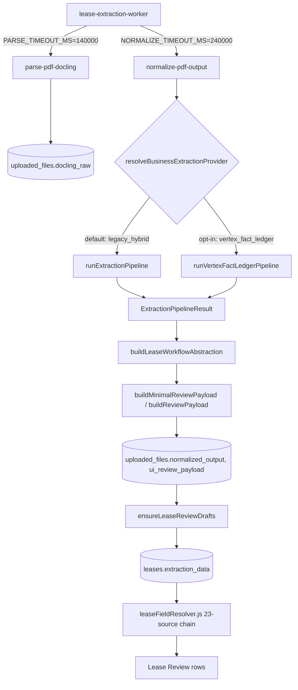

# Azure + Vertex Canonical Pipeline Migration — Phase 4E: Vertex-Primary / Legacy-Fallback Normalize Contract (Design Only)

**Phase type:** Design only. No runtime code was modified. No deploys occurred. No Azure or Vertex calls were made. No secrets were read or printed.
**Branch:** `feature/document-intelligence-v3`
**Predecessor phases:** Phases 1–4D (canonical layout contract, resolver, resolver adoption, evidence-enrichment review, diagnostics/readiness review) — all `NOT APPLICABLE` or completed with no production regressions.

This report went through one review cycle before being finalized: a first draft was rejected with 10 detailed conditions. Every condition is incorporated directly into the sections below (not appended as an afterthought) and is cross-referenced by number (**C1–C10**) at each point it drives a design decision.

---

## 1. Executive summary

Today, `legacy_hybrid` (rule + table + LLM) and `vertex_fact_ledger` (Gemini fact-ledger) are two independently-selectable business-extraction providers behind a single-shot, non-retrying dispatch (`normalize-pdf-output/index.ts:2291-2299`). There is no fallback, no acceptance gate beyond "is at least one field non-empty," no formal provenance, and no concurrency protection on the business-extraction write path. Separately, a real and serious pre-existing gap was found: re-running lease-draft preparation can silently erase human reviewer decisions.

The central finding that reframes this whole design task: **`ExtractionPipelineResult` is already a shared, enforced contract between both providers, and `buildLeaseWorkflowAbstraction()` already builds `clauses`/`expense_rules`/`cam_profile`/`budget_preview` identically for both** — only the seed row differs. The "provider-neutral semantic contract" the task asks for substantially already exists. What's missing is narrower: a real fallback mechanism, a profile-aware two-sided acceptance function, formal dual-location provenance, an honest (not overstated) concurrency mitigation, and a fix for the reviewer-edit-wipe gap.

**Recommendation: `APPROVE WITH CONDITIONS`** (10 conditions, listed in full in §25 and restated at the end of this report). Azure P0 patch and real-document testing are ordered *after* this design and *before* production rollout, not before design work. No production file was touched to produce this report.

---

## 2. Repository baseline

- Branch: `feature/document-intelligence-v3`. Working tree clean at the start and end of this phase (`git status --short` empty both times, confirmed below in §26-equivalent final verification).
- Commit log at start of Phase 4E: `c17f7b2` (Phase 4D report) → `f456e90` → `f2043af` (Phase 4C) → `3c13c50` (consolidated audit, Phases 1–4B) → `23ba755` (Phase 4B) → `cb77efb` (Phase 4A) → `479b121` (Phase 3B) → `991fed7` (Phase 3A) → `2c5c544` (Phase 3) → `f6c9674` (Phase 2).
- Phase 4A adoption confirmed present: `_shared/extraction/vertex-fact-ledger/document-index-v3.ts` imports and calls `resolveCanonicalDocumentLayout`.
- Phase 4B adoption confirmed present: `_shared/extraction/document-intelligence-v3/side-write.ts` imports and calls the same resolver.
- Phase 4C report (`docs/azure-vertex-migration-phase4c-evidence-enrichment-review.md`) and its test file (`_tests/evidence-enrichment-layout-ownership.test.ts`, 3 tests) confirmed present.
- Phase 4D report (`docs/azure-vertex-migration-phase4d-diagnostics-readiness-review.md`) and its test file (`_tests/diagnostics-readiness-layout-ownership.test.ts`, 2 tests) confirmed present.
- Baseline test execution — run in full before this report was finalized (results are literal, not planned; see §20 for the complete breakdown):
  - 115/115 pure-function architecture/resolver tests passed.
  - 13/13 `vertex-fact-ledger.test.ts` passed.
  - 20/20 `document-intelligence-v3-fact-mapper.test.ts` passed.
  - 5/6 `pipeline-status-edge.test.ts` + `pipeline-status-transitions.test.ts` passed — the one failure is the pre-existing, previously-documented `pipeline-status-edge.test.ts` case, reproduced identically, not re-fixed here.
  - 657/657 frontend Vitest tests passed (56 files).
  - `npm run lint`, `npm run typecheck`, `npm run build` all passed with exit 0.

No unexplained baseline failure exists. The one known failure is exactly the one Phase 4D already recorded and attributed precisely (see Phase 4D's report, "External Findings").

---

## 3. Current upload-to-normalize call graph



| # | File / symbol | Caller | Input | Output | Provider-specific? | Durable write? | Authority | Error behavior | Retry behavior | Human-edit risk |
|---|---|---|---|---|---|---|---|---|---|---|
| 1 | `lease-extraction-worker/index.ts` | pipeline_jobs poller | job row | dispatches parse/normalize | No | `pipeline_jobs`, `uploaded_files.status` | Job lifecycle owner | `STAGE_TIMEOUT`/`NETWORK_ERROR` on transport failure; reconciles durable state before retrying | `max_attempts` guard, stage-claim optimistic update | None directly |
| 2 | `parse-pdf-docling/index.ts` | worker | file URL | `docling_raw` | Azure vs legacy (orthogonal flag) | `uploaded_files.docling_raw` | Physical layout | Sets `failed`/`parse` on hard failure | Worker-level, `PARSE_TIMEOUT_MS=140s` | None |
| 3 | `normalize-pdf-output/index.ts:126-135` `resolveBusinessExtractionProvider()` | `normalize-pdf-output` entry | env `BUSINESS_EXTRACTION_PROVIDER` (+ internal debug override) | `"legacy_hybrid"` \| `"vertex_fact_ledger"` | This IS the selector | No | Provider selection | N/A (pure function) | N/A | None |
| 4 | `_shared/extraction/pipeline.ts` `runExtractionPipeline()` | dispatch ternary (`:2299`) | canonical/docling row | `ExtractionPipelineResult` | legacy | No (in-memory) | Legacy business extraction | Internal per-field try/catch, never throws to caller | None today | None |
| 5 | `_shared/extraction/vertex-fact-ledger/orchestrator.ts` `runVertexFactLedgerPipeline()` | dispatch ternary (`:2292`) | canonical/docling row | `ExtractionPipelineResult` | Vertex | No (in-memory) | Vertex business extraction | Whole-body try/catch → `fallbackResult()`, **never throws** | None today (32-combo sweep is internal to a single call) | None |
| 6 | `lease-workflow.ts:4287` `buildLeaseWorkflowAbstraction()` | `normalize-pdf-output:1031-1044` | `row`/`fieldMap` (+ optional Vertex profile override) | `workflow_output` (clauses, expense_rules, cam_profile, budget_preview) | **No — shared for both** | No (in-memory) | Sole `workflow_output` builder | N/A | N/A | None |
| 7 | `buildMinimalReviewPayload()`/`buildReviewPayload()` (`normalize-pdf-output/index.ts:831-1044`) | normalize flow | result + workflow_output | `ui_review_payload` | No | No (in-memory) | UI payload shape | Empty-extraction gate (`:2348-2463`) | N/A | None |
| 8 | `setStatus()` final persist (`normalize-pdf-output/index.ts:2485-2500`) | normalize flow | payload | `uploaded_files.normalized_output`, `.ui_review_payload` | No | **Yes** | Durable business-extraction output | Unconditional `.update().eq("id",fileId)` — no CAS (**C4**) | N/A | Low here, high downstream (row 9) |
| 9 | `review-approve/index.ts` `ensureLeaseReviewDrafts()` | prepare/update action | `uploaded_files` row | `leases.extraction_data` | No | **Yes** | Lease draft authority | Wholesale JSONB overwrite when `allowUpdate=true` and `status='draft'` | Client convention only, not server-enforced | **High — silently wipes `field_reviews` (C3)** |
| 10 | `leaseFieldResolver.js` | Lease Review UI | `leases` row | resolved field values | No — provider-agnostic by construction | No | Frontend read authority | 23-source fallback chain, sticky-authority rule | N/A | None (read-only) |

---

## 4. Current business-provider authority

`resolveBusinessExtractionProvider()` (`normalize-pdf-output/index.ts:126-135`) resolves `BUSINESS_EXTRACTION_PROVIDER` to `"legacy_hybrid"` (default) or `"vertex_fact_ledger"`, with an internal-only debug override (`isInternalCall(req)`-gated) at two call sites (`:1876`, `:2285`). **Confirmed never set in any deployed config** — grepped `.env`, `.env.example`, `.env.phase52.local`, `.env.production`, `supabase/config.toml`: zero matches. Two internal audit docs (`docs/document-intelligence-architecture-readiness-audit.json`, `docs/document-intelligence-v3-batch-audit-qa.json`) explicitly flag it `"must_not_be_globally_set_to_vertex_fact_ledger_without_approval"`. Production today is 100% `legacy_hybrid`.

Both providers can run in one *invocation cycle* only via the debug override, never concurrently in one request, and never as an automatic sequence — there is no code path where a request runs both and picks a winner. This is precisely the gap Phase 4E's orchestrator (§17, §19) is designed to fill.

`runVertexFactLedgerPipeline` **cannot overwrite legacy output today because there is no code path that invokes both providers for the same request.** The only way stale/duplicate writes could occur today is via two *separate* HTTP invocations of `normalize-pdf-output` racing each other — covered in §15.

---

## 5. Current normalization authority

`buildMinimalReviewPayload()`/`buildReviewPayload()` (`normalize-pdf-output/index.ts:831-1044`) are the sole, provider-agnostic builders of `ui_review_payload` — they take a generic `result` object and never branch on which provider produced it, beyond passing through `metadata.extractionDebug.vertex_fact_ledger.*` when present. `buildLeaseWorkflowAbstraction()` (`lease-workflow.ts:4287`) is the sole builder of `workflow_output`, called unconditionally at `normalize-pdf-output/index.ts:1031-1044` regardless of provider.

Precedence between `normalized_output`, `ui_review_payload`, `leases.extraction_data`, and frontend fallbacks is governed entirely by `leaseFieldResolver.js`'s 23-source chain (§7), which is provider-agnostic by construction — both providers write into the same `workflow_output`/`fields`/`standard_fields` shapes, so the frontend requires zero changes to consume either provider's output today.

---

## 6. Current authority matrix

| Data family | Current authority | Alternate producer | Precedence | Target authority (Phase 4E+) |
|---|---|---|---|---|
| Physical text/layout | Azure adapter / legacy docling builder (orthogonal, Phases 1–3) | — | Resolver-decided | Unchanged |
| Canonical layout | `resolveCanonicalDocumentLayout()` | — | Single entry point | Unchanged |
| Document profile | Legacy regex (`detectDocumentProfile`) or Vertex LLM classifier (falls back to legacy on failure) | — | Whichever provider ran | Unchanged; both already share one taxonomy |
| Standard lease fields | `LEASE_SCHEMA`/`field-contract.ts` keys, populated by whichever provider ran | — | Single active provider per request | Orchestrator selects one whole result (**C9**) |
| Rent schedule (preview) | `deriveBudgetPreview()` — shared for both providers | — | N/A (one implementation) | Unchanged |
| Rent schedule (approved, persisted) | `_shared/rent-schedule.ts`, post-approval | Neither extraction provider | Runs after approval only | Unchanged, out of scope |
| CAM rules | `deriveExpenseRules()`/`deriveCamProfile()` — shared for both providers | — | N/A (one implementation) | Unchanged |
| Clauses | `buildClauseRecords()` (legacy keyword scan), runs regardless of provider | Vertex facts feed `dynamic_items`, reconciled into `extracted_document_items`, not `lease_clauses` directly | Legacy structurally owns `lease_clauses` | Unchanged this phase |
| Assignment/amendment fields | Shared machinery, profile-gated | — | Whichever provider ran | Unchanged |
| Related-document references | Package-graph module (V3 diagnostic, orthogonal) | — | Advisory only | Unchanged |
| Evidence anchors | Three independent systems (V3 canonical enrichment, legacy `lease-workflow.ts`, frontend `evidenceResolver.js`) — Phase 4C finding, carried forward | — | Not consolidated | Convergence contract only, not consolidation (§13) |
| Normalized output | `normalize-pdf-output`'s final `setStatus()` write | — | Last writer wins, **no CAS today (C4)** | Conditional-update CAS (interim), explicit winner rule (C5) |
| UI review payload | Same write as above | — | Same | Same, plus dual-location provenance (C10) |
| Reviewer decisions | `save_lease_review_draft` RPC (`field_reviews`, targeted `jsonb_set`) | `ensureLeaseReviewDrafts(allowUpdate=true)` **can wipe it** (C3) | **Duplicated/competing — this is the defect** | Guarded (C3) |
| Review readiness | `payload-guard.ts` binary non-empty check | — | Single, weak gate | Profile-aware acceptance function (C7) |
| Approval readiness | Client-side `leaseReviewSchema.js` `REQUIRED_FIELD_KEYS`, not profile-aware; V3 `approval_blockers` advisory-only, not wired to UI | — | 100% client-side gating (pre-existing, out of scope) | Unchanged — No Gate preserved |

**Duplicated/competing authorities identified**: (a) reviewer-decision authority — `save_lease_review_draft`'s careful merge vs. `ensureLeaseReviewDrafts`'s wholesale overwrite (real defect, C3); (b) four independent field-resolution implementations repo-wide (`leaseFieldResolver.js`, `buildAbstractSnapshot`, dead-code `leaseAbstractService.js`, `dynamicFields.js`) — pre-existing, out of scope, carried forward from `extraction-current-data-contract.md`.

No diagnostic table is described as authoritative here that the UI does not actually consume — V3's `document_claims`/`document_canonical_field_projections` remain excluded from this matrix's "current authority" column precisely because Phase 4D already confirmed they are advisory-only and unconsumed by approval.

---

## 7. Complete field producer matrix

Base table reused directly from this phase's field-producer research agent (all entries independently verified against `field-contract.ts`, `schemas.ts`, `lease-workflow.ts`, `fact-field-mapper.ts`, `profile-classifier.ts`).

| Field family | legacy_hybrid | vertex_fact_ledger | Classification | Notes |
|---|---|---|---|---|
| Landlord/tenant name, property/premises, permitted_use, sqft | Yes (`FIELD_SPECS` regex + `LEASE_SCHEMA` LLM/rule) | Yes (`fact-field-mapper.ts` label-scored) | **Both** | Same `LEASE_SCHEMA`/`field-contract.ts` keys |
| Guarantor | Clause-only (`CLAUSE_DEFINITIONS: guaranty`) | Clause-only (shares vocab) | **Unsupported** as a dedicated field | No dedicated field key found either path |
| Usable square feet | No verified producer | No verified producer | **Unsupported** | Only `square_footage`/`building_rsf` exist |
| Commencement/expiration/rent-commencement dates | Yes | Yes | **Both** | Shared `LEASE_SCHEMA` group |
| Possession date, renewal notice date(s), termination date(s) (plural) | No verified producer | No verified producer | **Unsupported** | Not present as field keys anywhere found |
| Monthly/annual rent, escalation, free rent, late fee | Yes | Yes | **Both** | Shared `LEASE_SCHEMA` |
| Rent schedule (budget-preview array) | Yes (`deriveBudgetPreview`) | Yes (same shared function) | **Both, shared implementation** | Preview-only, not the approved DB table |
| Rent schedule (approved DB rows) | Neither | Neither | **Neither provider** | Separate post-approval module `_shared/rent-schedule.ts` |
| CAM/expense_rules, cam_profile | Yes (`deriveExpenseRules`, `deriveCamProfile`) | Yes — **same function**, Vertex-seeded row | **Both, shared implementation** | Not independently reimplemented by Vertex |
| Audit rights, reconciliation deadline, named controllable_cap | Not confirmed | Not confirmed | **Ambiguous** — flagged unverified, not asserted absent | Requires targeted follow-up grep in a later phase |
| Lease clauses (34-category array) | Yes (`buildClauseRecords`) | Runs too (shared, fed by `doclingRaw` only) | **Legacy-produced structurally**, even for Vertex-routed docs | Vertex facts feed `dynamic_items`, not `lease_clauses` directly |
| Dynamic items / extracted_document_items | Yes (`buildUniversalDocumentItems`) | Yes — Vertex unmapped facts merged via `createDocumentItem()` | **Both, reconciled into one array** | Structurally comparable at this layer |
| Options/assignment/amendment fields | Yes | Yes | **Both** | Shared machinery, profile-gated |
| Document profile classification | Yes (regex) | Yes (LLM, falls back to legacy regex) | **Both, identical taxonomy** | Confirmed non-divergent at the string-value level |

**Explicit statement required by this design (per the field-producer wording condition):** most standard fields are already comparable and producible by both providers against the same schema keys. `lease_clauses` is structurally generated through the shared legacy workflow logic even for Vertex-routed documents. Persisted (approved) `rent_schedule` rows are produced by neither extraction provider — a separate post-approval module. Document-profile taxonomies already align byte-for-byte. Fields marked **Unsupported** or **Ambiguous** above must never be described as guaranteed Lease Review coverage by this or any future implementation phase — they are routed to a later, separately-scoped extraction-coverage phase, not silently promised here.

---

## 8. Existing provider-output contracts

Both `runExtractionPipeline()` and `runVertexFactLedgerPipeline()` return the identical shape today, confirmed by `orchestrator.ts`'s own header comment (lines 5-13) stating this is a requirement, not a coincidence:

```ts
interface ExtractionPipelineResult {
  rows: Record<string, unknown>[];
  method: string;               // "rule_table_llm" | "llm_only" | "fallback" | ...
  warnings: string[];
  validationErrors: unknown[];
  metadata: {
    ruleFieldsExtracted: number;
    tableFieldsExtracted: number;
    llmFieldsExtracted: number;
    totalRecords: number;
    avgConfidence: number;
    chunksProcessed: number;
    processingTimeMs: number;
    extractionDebug?: { vertex_fact_ledger?: {...}, merged_field_sources?: {...}, ... };
  };
}
```

Vertex-specific detail lives inside `metadata.extractionDebug.vertex_fact_ledger` (document_profile, facts_extracted_count, facts_mapped_count, approval_blockers, evidence_anchors, dynamic_items, etc.) — real, substantive data, but not yet shaped as formal provenance (that gap is closed in §12).

---

## 9. Target provider-neutral semantic contract

**Recommendation: extend, do not replace.** `ExtractionPipelineResult` + `workflow_output` already satisfy nearly all of the task's illustrative `LeaseSemanticExtraction`/`ExtractedField` sketch's intent: provider-neutral (confirmed), schema-versioned (`method`/`metadata` already carry version-like fields), deterministic to validate, compatible with both providers (confirmed structurally), able to represent missing facts (`rows` entries can be null/absent), evidence-aware (`evidence_anchors` already exist for Vertex; legacy has its own evidence path).

What genuinely needs to be *added*, as additive wrapper types rather than a parallel type system:

```ts
interface ExtractionAcceptance {
  accepted: boolean;
  acceptanceState: "accepted" | "accepted_needs_review" | "fallback_eligible" | "rejected";
  fallbackEligible: boolean;
  reason: "accepted" | "accepted_needs_review" | "provider_timeout" | "provider_rate_limited"
    | "provider_5xx" | "provider_auth_error" | "malformed_response" | "invalid_schema"
    | "empty_extraction" | "insufficient_evidence" | "invalid_field_keys"
    | "invalid_canonical_layout" | "normalization_incompatible";
}

interface BusinessExtractionProvenance {
  attemptId: string;
  requestedProvider: "legacy_hybrid" | "vertex_fact_ledger";
  effectiveProvider: "legacy_hybrid" | "vertex_fact_ledger";
  acceptanceState: ExtractionAcceptance["acceptanceState"];
  fallbackUsed: boolean;
  fallbackReason: string | null;
  vertexAttemptCount: number;
  vertexModel: string | null;
  legacyPipelineVersion: string;
  semanticSchemaVersion: string;
  canonicalLayoutSchemaVersion: number;
  resultPersistedAt: string;
  correlationId: string;
}
```

Both types wrap/annotate `ExtractionPipelineResult`; neither replaces `rows`/`workflow_output`. **Explicit tension acknowledged**: the task's illustrative sketch (`LeaseSemanticExtraction`, `RentScheduleRow`, `ExpenseRule`, `ClauseRecord`, `FactConflict`, `RelatedDocumentReference`) is a reasonable long-term conceptual target, but adopting it verbatim now would duplicate `ExtractionPipelineResult` + `workflow_output`, which this task's own instruction ("adapt to existing repository types rather than creating a duplicate type system") forbids. This design resolves the tension in favor of non-duplication.

---

## 10. Vertex acceptance criteria

**C7 — profile-aware, not a single global threshold.** `evaluateExtractionAcceptance(result, context): ExtractionAcceptance` must weigh: document profile (assignment/amendment legitimately have fewer relevant fields than a base lease — do not require base-lease coverage from every profile), source text size, expected field families for that profile, fact count, valid field-key count, evidence-backed fact count, critical-field presence (profile-specific), normalization compatibility, duplicate/conflicting facts, impossible dates, invalid currency/numeric values, provider warnings, document size.

Low evidence coverage resolves to **`accepted_needs_review`** — a new, explicit acceptance state distinct from `accepted` and from `fallback_eligible` — not automatic fallback. Reserve fallback-triggering rejection for cases where evidence is completely absent or the result is structurally invalid (malformed schema, invalid field keys, zero meaningful facts from substantial source text). Must NOT fallback merely because some optional fields are absent — this matches both the task's own explicit prohibition and the current reality that `requiredByDocumentProfile` arrays are mostly empty.

**C8 — legacy output must pass the same evaluator, not be assumed valid.** `Vertex result → evaluateAcceptance() → {accepted | accepted_needs_review | fallback_eligible}`. If `fallback_eligible`: `legacy result → evaluateAcceptance() → {accepted | accepted_needs_review | rejected}`. If legacy is also `rejected`: explicit `extraction_failed_manual_review` — never a review-ready payload built from an empty or invalid legacy result. This closes today's implicit-trust gap, where legacy is treated as automatically acceptable purely because it is the incumbent path.

---

## 11. Fallback eligibility matrix

Evidence-backed against `_shared/vertex-ai.ts`'s actual `callVertexAI()` behavior (up to 32 location×model combinations, 30s timeout per combination, confirmed by direct code read):

| Condition | Retry Vertex? | Legacy fallback? | Final status | Evidence |
|---|---|---|---|---|
| Vertex timeout | Within existing internal sweep only | Yes, if orchestrator budget exhausted | `fallback_eligible` | `callVertexAI` catches `TimeoutError`/`AbortError`, continues to next combo (`vertex-ai.ts:429-434`) |
| Vertex 429 | No — **zero resilience today**, confirmed gap | Yes | `fallback_eligible` | Immediate `throw` on non-ok, non-404 response (`vertex-ai.ts:401-409`) |
| Vertex 5xx | No — same gap as 429 | Yes | `fallback_eligible` | Same mechanism |
| Vertex auth/config error | No | **No — NOT fallback-eligible** | `provider_auth_error`, immediate failure | Throws before any attempt if credentials missing (`vertex-ai.ts:347-350`) |
| Malformed JSON (after bounded repair) | No | Yes | `fallback_eligible` | `tryRepairJson()` attempts brace-balancing; on failure returns `null`, caller converts to empty-with-warning, never propagates |
| Schema validation failure | No | Yes | `fallback_eligible` | New check, part of `evaluateExtractionAcceptance` |
| Empty extraction (zero meaningful facts from substantial text) | No | Yes | `fallback_eligible` | New check — today's only gate is binary non-empty, no minimum threshold exists |
| Insufficient evidence (low but non-zero) | No | **No — resolves to `accepted_needs_review`** | `accepted_needs_review` | C7 — do not fallback for partial evidence |
| Missing one optional field | No | **No** | `accepted` | Explicit prohibition, matches current `requiredByDocumentProfile` reality |
| Conflicting facts | No | **No** | `accepted_needs_review` | Review state, not fallback |
| Invalid canonical layout | No | **No — NOT fallback-eligible** | Upstream failure, precedes business extraction | Azure/layout-layer issue, out of Phase 4E's scope |
| Azure parse failure | No | **No — NOT fallback-eligible** | Upstream failure | Same — this is the separately-scoped P0 patch's territory |
| Database failure | No | **No — NOT fallback-eligible** | Explicit failure | Not a provider-quality issue |
| Normalization failure (code bug) | No | **No — NOT fallback-eligible** | Explicit failure | A code defect should not be masked by a silent provider switch |
| Unsupported document | No | **No** | `rejected` | Neither provider can help |
| Password-protected document | No | **No** | Upstream failure | Precedes extraction entirely |
| 2 consecutive network errors (existing circuit breaker) | No — already fails fast | Yes | `fallback_eligible` | `vertex-ai.ts:413-424` |

Explicitly rejected design: `try { return await vertex() } catch { return await legacy() }` — this classification table is the replacement, evidence-backed against real code, not invented from the task's illustrative list alone.

---

## 12. Provider provenance design

**C10 — provenance must be present in both persisted outputs, not one.** The `BusinessExtractionProvenance` object from §9 is written into **both** `normalized_output.metadata` and `ui_review_payload.metadata` (an additive sibling key alongside existing `metadata.extractionDebug`), not only internal debug metadata:

```json
{
  "attempt_id": "...",
  "requested_provider": "vertex_fact_ledger",
  "effective_provider": "legacy_hybrid",
  "acceptance_state": "fallback_used",
  "fallback_used": true,
  "fallback_reason": "vertex_invalid_schema",
  "vertex_attempt_count": 2,
  "vertex_model": "gemini-2.5-flash",
  "legacy_pipeline_version": "legacy-v1",
  "semantic_schema_version": "lease-semantic-v1",
  "canonical_layout_schema_version": 1,
  "result_persisted_at": "2026-07-16T18:00:00Z",
  "correlation_id": "..."
}
```

No schema migration — additive JSONB in both existing locations, matching their current shape. Not necessarily exposed to ordinary reviewers in the UI (left as an open product decision) but must always be available for administrative/diagnostic consumption regardless of that UI decision.

---

## 13. Evidence convergence design

Do not consolidate the three evidence-construction systems in this phase (V3 canonical enrichment, legacy `lease-workflow.ts` evidence, frontend `evidenceResolver.js`) — Phase 4C already found and documented this three-way split; consolidating it is a separately-scoped future phase.

**Minimum evidence contract Lease Review requires**: a field value, a source page/block reference where available, a support type (`direct_quote` default when unresolved), and — going forward — a `provider` tag identifying which system supplied the anchor.

**Which provider supplies which fields**: Vertex supplies `evidence_anchors` (category, source_text, source_page, block_ids, polygon, support_type) when canonical layout is available; legacy supplies page/text-snippet evidence through its own, older mechanism. Missing geometry (legacy-lossy path) degrades to `support_type: "direct_quote"` as a schema-required compatibility default — **this default is a compatibility placeholder, not proof of a resolved anchor**, and must not be described as such in any future implementation.

**Known, carried-forward risk (Phase 4C, not fixed here)**: `fact-mapper.ts`'s evidence-anchor index is keyed only by `source_text` — two facts sharing identical text (repeated headers/footers, boilerplate clauses restated in an amendment) collide; the first anchor wins and a later, correctly-different-page occurrence is silently discarded. Demonstrated by a still-passing test: `evidence-enrichment-layout-ownership.test.ts`'s `"KNOWN LIMITATION"` case (re-run in this phase's baseline, still passing, still demonstrating the same collision deterministically). This must be routed to a later evidence-contract hardening phase — it is not required to be fixed for Phase 4E's provider convergence to proceed, because both providers already degrade to the same compatibility default when geometry is unavailable, so the convergence contract itself is not blocked by this bug, only the *quality* of individual anchors is.

---

## 14. Status transition design

Target transitions, mapped onto **existing** `uploaded_files.status`/`processing_status`/`failed_step` columns — no DB change:

- Success path: `business_extraction_started → vertex_running → vertex_validating → vertex_accepted → normalizing → review_required`.
- Fallback path: `business_extraction_started → vertex_running → vertex_failed_recoverable → legacy_fallback_running → legacy_fallback_validating → legacy_fallback_accepted → normalizing → review_required`.
- Failure path: `vertex_failed → legacy_failed → extraction_failed_manual_review`.

**Confirmed constraint this design must respect (Phase 4D finding, reused not re-derived)**: `uploaded_files.status`, `.processing_status`, and `.failed_step` are independent columns with no CHECK constraint or trigger tying them together; `failed_step` is cleared only by `ingest-file` at initial upload, never by a later successful stage. This design must not add new opportunities for contradictory states beyond what Phase 4D already found — the new transitions above are intended to be represented as values *within* the existing `status`/`processing_status` columns (e.g., new enum values), not as new columns, keeping the same (already-acknowledged) risk surface rather than expanding it. Implementing the Azure P0 status-reconciliation fix itself is explicitly out of scope here (§21).

---

## 15. Idempotency and concurrency design

**C4 — do not overstate the mitigation.** First-implementation mitigation is an explicit conditional update:
```
.update(patch).eq("id", fileId).eq("updated_at", expectedUpdatedAt)
```
with the affected-row count checked (0 rows = lost the race, not success).

**Verified, not assumed**: `uploaded_files` (`202604010146112_pipeline_uploaded_files.sql:7-29`) has **no `BEFORE UPDATE` trigger of any kind** — `updated_at TIMESTAMPTZ DEFAULT now()` is a plain column. A repo-wide grep of every `CREATE TRIGGER` statement confirms the `fn_set_updated_at`/`update_updated_at_column` pattern (applied to `user_access`, `documents`, `expense_classifications`, `lease_clauses`, `document_claims`, and roughly a dozen other tables) was **never applied to `uploaded_files`**. `updated_at` is instead set only when application code explicitly includes it in the patch object — confirmed at `_shared/pipeline-status.ts:244,326` inside `setStatus()`. **Conclusion**: the conditional-update mitigation's safety is a *convention*, not a database-enforced guarantee — it only detects a race if every writer touching `uploaded_files` during the business-extraction window reliably sets `updated_at`. Recommend auditing all `uploaded_files` UPDATE call sites reachable during normalize/retry (not just `setStatus`) before relying on this in the first implementation.

Two explicit tiers:
- **Phase 4E initial mitigation**: conditional update on `updated_at`, applied to the orchestrator's final persistence write only.
- **Future robust solution**: a dedicated `attempt_id`/version column or extraction-run identity table — out of scope, named as a follow-on, not invented casually here.

**C5 — explicit winner rule.** Once an effective-provider result is accepted and persisted (`acceptance_state` written), no delayed result from another attempt or provider may overwrite it. Recommended attempt-state fields (stored in the existing `metadata.provenance` JSON per §12, no schema change): `attempt_id`, `requested_provider`, `effective_provider`, `acceptance_state`, `result_persisted_at`.

Five race questions, each answered explicitly (not left open):

1. **Vertex times out locally but completes remotely later** → the orchestrator's bounded wall-clock budget (§11/16) means it already gave up and used legacy fallback; a late Vertex response is discarded (its conditional update fails to match `expectedUpdatedAt`/`acceptance_state`), never applied.
2. **Legacy fallback completes first** → moot under the bounded-budget model: Vertex is given its full bounded attempt *before* fallback triggers, not raced against it in parallel — this ordering is explicit, not ambiguous.
3. **Two workers start the same normalization stage** → covered one layer up by the worker's existing stage-claim (`.eq("stage","parse")` conditional update); the orchestrator's own conditional update (C4) is defense in depth for the case where it is invoked directly, bypassing the worker's claim.
4. **Persistence succeeds but the HTTP response fails** → the caller (worker) must treat this as ambiguous and re-check durable state before retrying, reusing the existing `reconcileDurableNormalize` pattern, rather than blindly re-running the orchestrator.
5. **A retry reuses the accepted result rather than re-running providers** → yes — this is the primary design, not a corner case: if durable state already shows an `acceptance_state` for the current attempt identity, the orchestrator returns the existing persisted result instead of re-invoking either provider. This is what makes retries cheap and safe.

**C6 — Vertex retry limits must be explicitly bounded, layered outside the existing 32-combo sweep, not a re-wrap of it.** Verified, not invented: `lease-extraction-worker/index.ts:18-23` defines `PARSE_TIMEOUT_MS=140_000`, `NORMALIZE_TIMEOUT_MS=240_000`, `ENRICH_TIMEOUT_MS=240_000` — the worker's own caller-side timeout for `normalize-pdf-output` is **240 seconds**. This is the real ceiling the orchestrator must fit inside; exceeding it causes the worker to treat the call as a transport failure (`STAGE_TIMEOUT`) and enter its own reconciliation path, confusing a still-legitimately-running orchestrator with a dead one. New orchestrator-level limits recommended:
- Maximum Vertex attempts at the orchestrator level: **2** (not 32 — the internal sweep is an implementation detail of a single attempt).
- Maximum total Vertex wall-clock budget: on the order of 90–120s across those 2 bounded attempts, leaving headroom under the 240s ceiling for a potential legacy fallback run plus `buildLeaseWorkflowAbstraction()`/persistence. Exact split is an implementation-time tuning decision; the 240s figure itself is a confirmed repo constant.
- Maximum rate-limit-specific retries: bounded, with backoff — today there is none; this is new.
- Maximum fallback invocations: legacy runs **at most once** per document. No recursion — legacy failing does not re-attempt Vertex.

**C3 — reviewer-edit protection, elevated to an implementation acceptance condition, not a deferred note.** `ensureLeaseReviewDrafts(allowUpdate=true)` (`review-approve/index.ts:806-812`) rebuilds `extraction_data` wholesale and never merges the existing `field_reviews` sub-key — a re-run "prepare" while `leases.status='draft'` (true for essentially the entire review window) silently wipes reviewer decisions. This is, in the plain language of this review, **the most serious finding in this report** — not because it is caused by Phase 4E, but because Phase 4E's retries and fallback paths meaningfully increase how often re-normalization/re-prepare occurs, increasing the likelihood of triggering it. Required for the first implementation, one of:
- **Preferred**: the orchestrator/persistence path must not invoke review-draft preparation again when an existing linked draft already contains reviewer state (non-empty `field_reviews`) — and, separately, `field_reviews` must be explicitly preserved (merged, not overwritten) whenever `prepare`/`update` does run.
- **Minimum acceptable**: the implementation PR must include an explicit guard preventing Phase 4E-triggered retries from re-entering the destructive `allowUpdate=true` path at all.

---

## 16. Migration option comparison

| Option | Description | Smallest diff? | Testability | Rollback | Risk |
|---|---|---|---|---|---|
| A — extend `BUSINESS_EXTRACTION_PROVIDER` switch | Add `vertex_primary_legacy_fallback` as a third value, inline in `normalize-pdf-output/index.ts` | Yes | Poor — logic embedded in an already-2787-line HTTP handler | Config-level | High risk of conditional-logic accumulation, matches the task's own stated concern |
| **B — new orchestrator module (recommended)** | `_shared/extraction/business-extraction-orchestrator.ts` owns provider selection, bounded Vertex invocation, two-sided acceptance, whole-result fallback, conditional persistence, provenance | Small — one call-site replacement | **Good** — pure-function-style module, unit-testable in isolation, matches sibling modules `pipeline.ts`/`vertex-fact-ledger/orchestrator.ts` | Config-level | Lowest — clean separation, smallest blast radius per change |
| C — embed fallback directly in `normalize-pdf-output` | Retry/acceptance/fallback logic written inline | No | Poor — couples HTTP/persistence with retry logic | Config-level | Long-term maintenance cost, same file already carries too much |
| D — worker-level provider orchestration | `lease-extraction-worker` owns retry/fallback | No | Poor — worker lacks row/canonical-layout context; would require re-fetching large payloads | Config-level | Worst function-boundary and timeout fit; worker's job is coarse per-stage retry, not per-provider semantic retry |

**Recommendation: Option B.**

---

## 17. Recommended target architecture

```mermaid
flowchart TD
    subgraph Business_Authority_Path["Business authority path"]
        A[normalize-pdf-output] --> B[business-extraction-orchestrator.ts]
        B --> C{Vertex bounded attempt<br/>max 2, ~90-120s budget}
        C -->|success| D[evaluateExtractionAcceptance]
        D -->|accepted / accepted_needs_review| E[Vertex ExtractionPipelineResult]
        D -->|fallback_eligible| F[legacy runExtractionPipeline<br/>max 1 invocation]
        F --> G[evaluateExtractionAcceptance]
        G -->|accepted / accepted_needs_review| H[Legacy ExtractionPipelineResult]
        G -->|rejected| I[extraction_failed_manual_review]
        E --> J[buildLeaseWorkflowAbstraction - shared]
        H --> J
        J --> K[buildReviewPayload]
        K --> L[Conditional persist: .eq updated_at]
        L -->|0 rows affected| M[Discard - race lost]
        L -->|success| N[(normalized_output + ui_review_payload<br/>+ provenance in both)]
        N --> O[Lease Review]
    end
    subgraph Diagnostic_Path["Diagnostic / advisory path - unchanged, orthogonal"]
        P[V3 side-write] -.->|advisory only| Q[(document_intelligence_runs)]
        Q -.->|never gates| R[approve-lease-workflow]
    end
    B -.provenance.-> N
```



Business authority path (solid) is clearly separated from the diagnostic/advisory path (dashed) — the latter remains exactly as confirmed advisory-only through Phase 4D, untouched by this design.

---

## 18. Compatibility requirements

| Surface | Requirement |
|---|---|
| `normalized_output` shape | Exact compatibility — only additive `metadata.provenance` |
| `ui_review_payload` shape | Exact compatibility — only additive `metadata.provenance` |
| Lease Review tab contracts | Exact compatibility — no changes needed, `leaseFieldResolver.js` already provider-agnostic |
| CAM/Expense UI | Exact compatibility — shared `deriveExpenseRules`/`deriveCamProfile` unaffected |
| Budget integrations | Exact compatibility — `deriveBudgetPreview` unaffected |
| Approval behavior | Exact compatibility — No Gate preserved, V3 stays advisory |
| Reviewer edits | Semantic compatibility + new protection (C3) |
| Source-file linkage | Exact compatibility — unaffected |
| Existing API response contracts | Exact compatibility, unversioned |
| DB schema | No migration required for initial implementation |

No destructive migration anywhere in this design.

---

## 19. Proposed implementation files

*(Not created in this phase — named here for the future implementation phase only.)*

- `supabase/functions/_shared/extraction/business-extraction-orchestrator.ts` — new. Owns provider selection, bounded Vertex invocation, two-sided acceptance, whole-result fallback, conditional persistence coordination, provenance construction.
- `supabase/functions/_shared/extraction/extraction-acceptance.ts` — new. `evaluateExtractionAcceptance()`, profile-aware.
- `supabase/functions/normalize-pdf-output/index.ts:2291-2299` — modified. Ternary replaced by a single call to the orchestrator.
- `review-approve/index.ts` — modified. `ensureLeaseReviewDrafts()` guarded per C3.

---

## 20. Proposed tests

*(Specified for a later implementation phase — not written now, per this phase's design-only scope. Baseline results below are this phase's own, already executed.)*

**This phase's own baseline (already run, literal):**

| Suite | Command | Result |
|---|---|---|
| Phase 1–4D pure-function suites (8 files, 115 tests) | `deno test --allow-env --allow-read --no-lock <8 files>` | **115/115 passed** (677ms) |
| `vertex-fact-ledger.test.ts` | `deno test --allow-env --allow-read --no-lock vertex-fact-ledger.test.ts` | **13/13 passed** |
| `document-intelligence-v3-fact-mapper.test.ts` | same | **20/20 passed** |
| `pipeline-status-edge.test.ts` + `pipeline-status-transitions.test.ts` | same | **5/6 passed** — 1 pre-existing failure (`"pipeline-status sanitizes job and log payloads"`, `pipeline-status-edge.test.ts:50`, `AssertionError` on `metadata_summary.source_text.type`: `string` actual vs `object` expected), reproduced identically, documented since Phase 4D, not re-fixed |
| Frontend Vitest (56 files) | `npm run test -- --run` | **657/657 passed** (3.78s) |
| Lint | `npm run lint` | **pass**, exit 0 |
| Typecheck | `npm run typecheck` | **pass**, exit 0 |
| Build | `npm run build` | **pass**, exit 0 (9.73s) |

**Future implementation phase's required tests (specified, not written):**

- *Unit*: provider selection; Vertex retry policy (bounded 2-attempt, budget enforcement); fallback eligibility (per §11's matrix); acceptance validator (profile-aware, C7); malformed response; invalid schema; empty extraction; legacy-side acceptance rejection (C8); legacy/Vertex adapters; common semantic validator; provenance metadata (both locations, C10); status transitions; conditional-update race loss (C4/C5); reviewer-edit guard (C3).
- *Contract*: Vertex fixture → common contract; legacy fixture → common contract; common contract → normalized output; normalized output → UI payload; evidence contract compatibility.
- *Integration* (20 items, mocked-provider-first, no live calls): Vertex success; Vertex timeout→legacy success; Vertex 429→legacy success; Vertex 5xx→legacy success; malformed Vertex output→legacy success; empty Vertex extraction→legacy success; optional fields missing→no fallback; conflicting facts→`accepted_needs_review`, no fallback; both fail→`extraction_failed_manual_review`; delayed Vertex response after legacy success→discarded; duplicate worker; partial DB success+HTTP failure; retry after accepted result→reuses persisted result, no re-invocation; reviewer edit protection; CAM-heavy lease; rent-schedule-heavy lease; assignment; amendment; long lease; scanned lease.
- *Database*: tenant isolation; idempotency; compare-and-set; duplicate prevention; retry recovery; reviewer-edit preservation.
- *Browser E2E*: upload; status transitions; Vertex-success indicator; legacy-fallback indicator; populated fields; CAM/rent tables; evidence source; reviewer edit; reload; approval unchanged.

No test in this future set requires a production provider call — mocked-provider tests come first.

**This phase's own test-addition decision**: no new test file added. `vertex-fact-ledger.test.ts:205-222` already proves `runVertexFactLedgerPipeline` never throws for the missing-credentials path via the same whole-body `try/catch` mechanism (`orchestrator.ts:212-217`) that would also catch a 429/5xx-triggered throw — the mechanism proven is provider-error-agnostic, so a second test targeting the 429/5xx path specifically would be redundant with what's already demonstrated, not a genuinely unprotected invariant. Stated here explicitly rather than adding a redundant guard.

---

## 21. Deployment sequence

**C2.** The Azure P0 patch does not block writing or committing this design report, and does not block mocked/fixture-based unit or contract testing (§20). It **does** block real-document acceptance and any production rollout. Exact ordering:

1. Complete Phase 4E Design (this phase — complete).
2. Implement Azure resource P0 patch (separately scoped: URL-first parsing, avoiding PDF re-download in Azure-only mode, smaller parser HTTP responses, capped persistence objects, worker durable-state reconciliation, clearing stale failure state, paragraph/line dedup).
3. Retest Azure parser durability.
4. Implement Phase 4E behind an explicit mode flag (`legacy_hybrid` remains default):
   ```
   BUSINESS_EXTRACTION_MODE=legacy_hybrid
   BUSINESS_EXTRACTION_MODE=vertex_primary
   BUSINESS_EXTRACTION_MODE=vertex_primary_legacy_fallback
   VERTEX_FALLBACK_ENABLED=true
   ```
   Provider selection remains server-side only — never browser-controlled.
5. Run Vertex-primary/fallback staging tests on approved documents.
6. Measure accuracy/latency/fallback-rate/UI-completeness; consider making it the staging default; stabilize; consider production rollout.

---

## 22. Rollback plan

Preferred rollback: `vertex_primary_legacy_fallback → legacy_hybrid`, a **configuration-level** change only — confirmed safe because production today is already 100% `legacy_hybrid` (§4), so rollback returns to the exact current, already-proven state, not an untested prior state.

- **Configuration rollback**: flip `BUSINESS_EXTRACTION_MODE` back; no code rollback required if the orchestrator itself is left deployed but unused.
- **Code rollback**: only needed if the orchestrator module itself is defective; reverting `normalize-pdf-output/index.ts:2291-2299` to the direct ternary is a single-file, single-hunk revert.
- **Data compatibility**: `normalized_output`/`ui_review_payload` remain exactly compatible (§18) — no data migration needed in either direction.
- **Partially-processed documents / in-flight jobs**: the winner rule (C5) and conditional-update mitigation (C4) ensure an in-flight attempt at rollback time either completes and persists once, or loses its race harmlessly — no special rollback handling needed for in-flight jobs beyond what the worker's existing reconciliation already does.
- **Identifying which provider produced existing payloads**: `metadata.provenance.effective_provider` (§12), present in both persisted locations, once the first implementation ships; prior to that, absence of `metadata.provenance` itself indicates `legacy_hybrid` (today's exclusive state).

No schema reversal is needed anywhere in this plan, since nothing in this design requires a schema migration.

---

## 23. Risk register

| Risk | Severity | Likelihood | Impact | Mitigation | Owner / target phase |
|---|---|---|---|---|---|
| **`ensureLeaseReviewDrafts` silently wipes reviewer decisions (`field_reviews`)** | **High** (explicitly the most serious finding in this report) | Increased by this design (more retries) | Human review work lost silently | C3 — guard required as a first-implementation acceptance condition, not deferred | Phase 4F implementation |
| Vertex 429/5xx have zero retry/backoff today | Medium | Confirmed current behavior | Unnecessary premature fallback | C6 — bounded orchestrator-level retry policy | Phase 4F implementation |
| `updated_at`-based CAS reliability assumption unverified across all writers | Medium | Unknown until audited | Race not detected in an untested writer path | C4 — explicit audit of all `uploaded_files` UPDATE call sites before relying on it | Phase 4F implementation |
| Unsupported/ambiguous fields mistaken for guaranteed coverage | Medium | High if not stated clearly | False user expectation of Lease Review completeness | §7's explicit unsupported/ambiguous labeling, routed to a future extraction-coverage phase | Future extraction-coverage phase |
| Vertex output schema drift | Medium | Low today (schema stable) | Acceptance function false-accepts | Schema-validity check in acceptance (§10) | Phase 4F implementation |
| Silent fallback (legacy labeled as Vertex) | High if it occurred | Prevented by design | User/reviewer misled about data quality | C10 — provenance in both outputs, `effective_provider` always explicit | Phase 4F implementation |
| Fallback loops | Medium | Prevented by design | Runaway cost/latency | C6 — legacy runs at most once, no recursion | Phase 4F implementation |
| Two authoritative outputs (dual write) | High if it occurred | Prevented by design | Data corruption | C9 — whole-result selection only, no blending | Phase 4F implementation |
| Delayed provider response overwrites accepted result | High if it occurred | Prevented by design | Silently reverts to worse data | C5 — explicit winner rule | Phase 4F implementation |
| Duplicate workers | Medium | Low (existing stage-claim mitigates) | Duplicate processing | Existing worker stage-claim + orchestrator CAS (defense in depth) | Existing, reinforced |
| Empty extraction marked successful | High if it occurred | Prevented by design | Reviewer sees a blank, "ready" lease | §10's acceptance function replaces today's binary gate | Phase 4F implementation |
| UI payload incompatibility | Low | Low | Frontend breakage | §18 exact-compatibility requirement | Phase 4F implementation |
| Evidence inconsistency (three systems) | Medium | Existing, not new | Confusing evidence display | Convergence contract only, not consolidation (§13) | Future evidence-hardening phase |
| Source-text evidence collisions | Medium | Confirmed, demonstrated by existing test | Wrong evidence anchor shown | Not fixed here — carried forward from Phase 4C | Future evidence-hardening phase |
| Legacy/Vertex field-key mismatch | Low | Low — same schema keys confirmed shared | Field not mapped | §7/§9 confirm shared key space | N/A, already mitigated structurally |
| Provider provenance loss | Low | Prevented by design | Can't audit which provider ran | C10 | Phase 4F implementation |
| Status contradiction (status/processing_status/failed_step) | Medium | Existing, confirmed possible (Phase 4D) | Confusing diagnostics | §14 — new states reuse existing columns, doesn't expand the existing gap; real fix is the separate Azure P0 patch | Separately-scoped Azure P0 patch |
| Reviewer edit overwrite (general, beyond C3's specific case) | High | See C3 above | Same as above | C3 | Phase 4F implementation |
| Token/cost explosion | Medium | Prevented by design | Budget overrun | C6 — bounded attempts/budget | Phase 4F implementation |
| Long-document omission | Low | Unknown, needs empirical testing | Missed fields on very large leases | §20's "long lease" integration test | Phase 4F implementation |
| Tenant isolation | Low | Low — no new cross-tenant surface introduced | N/A | No change to org-scoping in this design | N/A |
| Debug data exposure | Low | Existing (Phase 4D already found this, unrelated surface) | N/A | Out of scope here, already tracked in Phase 4D's report | Phase 4D's own future security-hardening phase |
| Approval behavior drift | Low | Prevented by design | Approval gate changes unexpectedly | No Gate explicitly preserved throughout | N/A |

---

## 24. External findings

- Pre-existing `pipeline-status-edge.test.ts` failure — reproduced identically in this phase's baseline, exact same assertion, same root cause Phase 4D already diagnosed (`summarizePipelineJson()` correctly returning `{type:"string",...}` for a string input; the test's own expectation is stale). Not fixed here.
- Four independent field-resolution implementations repo-wide (`leaseFieldResolver.js`, `buildAbstractSnapshot`, dead-code `leaseAbstractService.js`, `dynamicFields.js`) — pre-existing, documented in `extraction-current-data-contract.md`, out of scope for Phase 4E, carried forward.
- 100% client-side approval gating (`leaseReviewSchema.js`'s `REQUIRED_FIELD_KEYS`, not profile-aware; V3's `approval_blockers` advisory-only, not wired into `LeaseReview.jsx`) — pre-existing, out of scope, unaffected by this design (No Gate explicitly preserved).
- `document_intelligence_runs.status` remains schema-defined, currently dormant (no runtime writer) — Phase 4D's finding, unaffected by this design.
- Chunk-size build warning (`index-BpvbCRYj.js` 637KB) — pre-existing, unrelated to this phase, observed during the build gate run, not investigated further (out of scope).

---

## 25. Exact implementation acceptance criteria

For the **later implementation phase** (not this design phase):

1. Vertex is preferred when configured (`vertex_primary` or `vertex_primary_legacy_fallback` mode).
2. Legacy `runExtractionPipeline` remains independently callable, unmodified in its own logic.
3. Fallback triggers only for classified fallback-eligible failures (§11's matrix) — never for absent optional fields alone.
4. Fallback use is always visible in provenance (`fallback_used`, `fallback_reason`), present in both `normalized_output.metadata` and `ui_review_payload.metadata` (C10).
5. Legacy output is never labeled as Vertex output, or vice versa (`effective_provider` always accurate).
6. Missing optional fields never trigger fallback (C7).
7. Both providers converge on one semantic contract (`ExtractionPipelineResult` + `workflow_output`, extended per §9) — no duplicate type system.
8. Both providers produce a compatible `normalized_output` (§18).
9. Both providers produce a compatible `ui_review_payload` (§18).
10. No empty extraction becomes review-ready (§10's acceptance function replaces today's binary gate).
11. A retry does not create duplicate lease rows, claims, evidence, projection, or review rows.
12. A delayed result cannot overwrite an already-accepted output (C5's winner rule).
13. Reviewer edits (`field_reviews`) cannot be overwritten by a Phase 4E-triggered retry or re-prepare (C3 — implementation-blocking, not advisory).
14. No cross-tenant access is introduced anywhere in the new orchestrator.
15. No DB migration is required for the initial implementation.
16. Approval remains **No Gate** — V3 stays advisory, unaffected.
17. CAM/Expense/Budget/Lease Review remain behaviorally compatible (§18).
18. Azure parser routing is unchanged (orthogonal flag, untouched).
19. V3 diagnostic side-write remains advisory, structurally unreachable from the approval path (Phase 4D's finding, unaffected).
20. Rollback to `legacy_hybrid` is configuration-level and safe, confirmed by §22 (production today is already 100% `legacy_hybrid`).

---

## Recommendation

# APPROVE WITH CONDITIONS

The 10 conditions, restated in full so the report and the approval record agree word-for-word:

1. Azure P0 patch must land before real-document Phase 4E acceptance.
2. First implementation must include deterministic Vertex and legacy acceptance evaluation (two-sided, §10/C8).
3. First implementation must include conditional persistence/concurrency protection (§15/C4, C5).
4. Phase 4E retries must not re-enter a path that can wipe `field_reviews` (§15/C3).
5. Vertex retries and total provider time must be bounded (§15/C6).
6. Provenance must identify requested and effective providers, present in both persisted outputs (§12/C10).
7. No field-level mixing of Vertex and legacy in the first implementation (§9/C9).
8. Existing `normalized_output` and `ui_review_payload` shapes must remain compatible (§18).
9. V3 remains advisory and approval remains No Gate (§14, §17, §25 item 16/19).
10. Rollback to `legacy_hybrid` remains configuration-level (§22).

**Phase 4E implementation has not been started. Phase 4F has not been started.** This report awaits explicit approval before any of the files named in §19 are created or modified.
