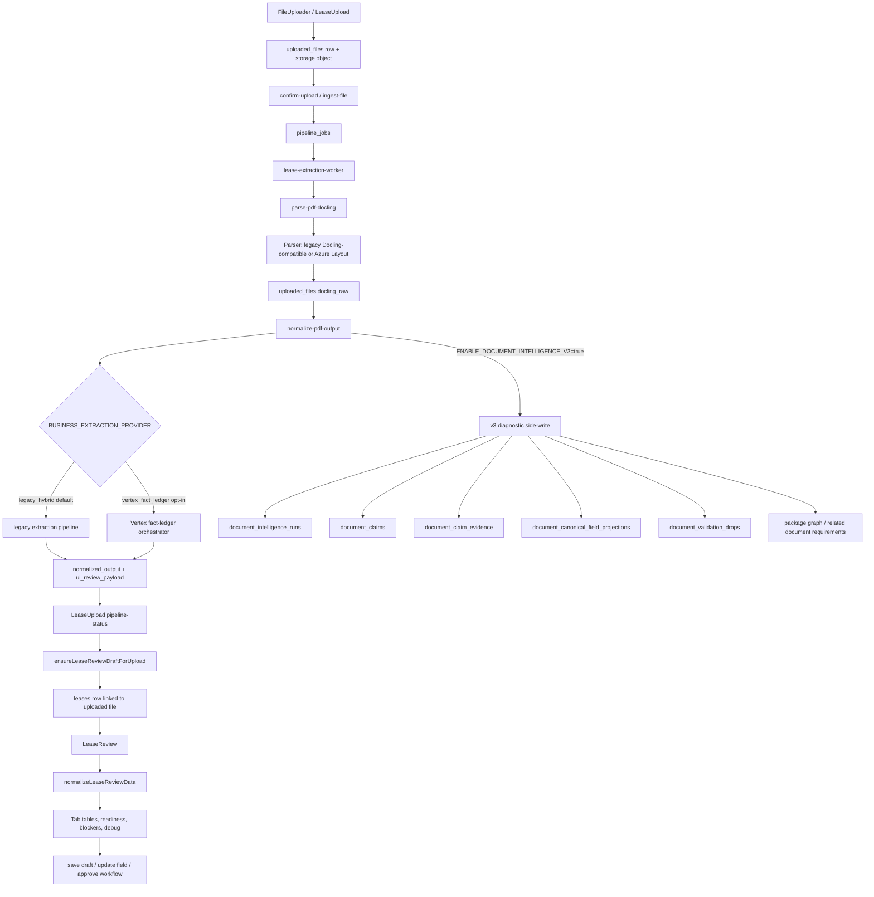

# Document Intelligence Architecture Readiness Audit

Date: 2026-07-15  
Scope: bounded discovery and verification only  
Recommendation: No Gate  
Final classification: ready with conditions

This audit inspected the current upload, parse, normalize, Lease Review, v3 diagnostics, schema, service, and test surfaces for the CRE Document Intelligence architecture. No providers were called. No extraction was rerun. No remote reads or writes were performed. No runtime source code was changed as part of this audit.

## Executive Summary

The current system is connected enough for a controlled local or staging upload test, but it is not ready for production acceptance, approval gating, or a provider-backed v3 claim-ledger rollout.

The current path is functional in shape:

1. Upload creates or confirms an `uploaded_files` row.
2. `ingest-file` queues or invokes the lease extraction worker.
3. `lease-extraction-worker` calls `parse-pdf-docling` and `normalize-pdf-output`.
4. `normalize-pdf-output` writes `normalized_output` and `ui_review_payload` back to `uploaded_files`.
5. `LeaseUpload` uses `pipeline-status` and the server-owned prepare/review flow to open Lease Review.
6. `LeaseReview` normalizes uploaded/lease payloads through `normalizeLeaseReviewData` and renders Excel-style tabular review rows.
7. Reviewer edits are persisted through edge functions, primarily into `leases.extraction_data` and related workflow endpoints.

The v3 path is intentionally diagnostic and advisory today. `ENABLE_DOCUMENT_INTELLIGENCE_V3` enables side-write behavior only. Claims, evidence, canonical projections, validation drops, package graph rows, and related-document rows are diagnostic tables. v3 is not the authoritative Lease Review business-row source, and it is not an approval gate.

## Architecture Diagram

## Component Inventory

| Layer | Component | Role | Connection status | Notes |
| --- | --- | --- | --- | --- |
| Frontend upload | `src/pages/LeaseUpload.jsx` | Upload status, retry, view document, open Lease Review | Connected with risks | Uses `pipeline-status`, fallback `uploaded_files`, and `ensureLeaseReviewDraftForUpload`. Stale `failed_step=parse` is debug-only when status is review-ready. |
| Upload action contract | `src/lib/leaseUploadReviewAction.js` | Find-or-create Lease Review draft | Connected | Resolves existing lease id, searches by source file, then calls server prepare flow. |
| Frontend review | `src/pages/LeaseReview.jsx` | Loads lease/upload payload and renders review workflow | Connected with risks | Uses lease row plus uploaded file JSON payload. Auto-link fallback can search same-org uploads when source link is missing. |
| Frontend normalizer | `src/lib/leaseReviewFieldNormalizer.js` | Single frontend union/normalization layer | Connected | Correct architectural center for UI rows. Includes profile-aware readiness, fallback rows, and clause filtering. |
| Current review policy | `src/lib/leaseReviewCurrentPolicy.js` | Profile-aware requiredness for current review path | Connected | Prevents assignment documents from inheriting base-lease blockers. |
| Schema contract | `src/lib/leaseReviewSchema.js` | Field/tabs/status/aliases contract | Connected | Base-lease required fields still live here; profile policy narrows for non-base profiles. |
| Backend ingest | `supabase/functions/ingest-file/index.ts` | Starts pipeline and queues worker | Connected | Uses worker dispatch and pipeline jobs. |
| Worker | `supabase/functions/lease-extraction-worker/index.ts` | Runs parse then normalize | Connected | Reconciles timeouts and durable output. |
| Parser | `supabase/functions/parse-pdf-docling/index.ts` | Produces `docling_raw` | Connected | Parser/layout provider is separate from business extraction provider. |
| Parser provider selector | `supabase/functions/_shared/extraction/extraction-provider.ts` | Controls legacy/Azure layout mode | Connected | `EXTRACTION_PROVIDER` is parser/layout only. |
| Normalizer edge | `supabase/functions/normalize-pdf-output/index.ts` | Produces business output and optional v3 side-write | Connected with conditions | `BUSINESS_EXTRACTION_PROVIDER` selects legacy vs vertex fact ledger. Internal debug override exists. |
| Legacy pipeline | `supabase/functions/_shared/extraction/pipeline.ts` | Current production extraction path | Connected | Keeps upload to Lease Review working. |
| Vertex fact ledger | `supabase/functions/_shared/extraction/vertex-fact-ledger/orchestrator.ts` | Provider-backed claim/evidence path | Partially connected | Shape exists, but no verified completed provider-backed real run. |
| v3 side-write | `supabase/functions/_shared/extraction/document-intelligence-v3/side-write.ts` | Diagnostic durable run/claim/evidence/projection write | Connected behind flag | Advisory only. Failure should not break legacy normalize. |
| v3 fact mapper | `supabase/functions/_shared/extraction/document-intelligence-v3/fact-mapper.ts` | Maps extraction debug metadata to v3 rows | Connected with limitation | Does not fabricate claims for legacy-only runs. |
| Approval workflow | `src/services/leaseApprovalWorkflowService.js`, `supabase/functions/approve-lease-workflow` | Approves current Lease Review workflow | Connected but not v3-gated | Correct for No Gate. |
| Phase 52 diagnostic | `supabase/functions/phase52-vertex-diagnostic/index.ts` | Single-request diagnostic wrapper | Diagnostic only | No DB access. Recent live attempt ended with HTTP 502; no retry approved. |

## End-to-End Runtime Flow Assessment

### Upload to Parse

Current shape is strong enough for controlled testing. `FileUploader` and `LeaseUpload` treat `uploaded_files` as the source-of-truth session row. `ingest-file` owns the pipeline job and worker dispatch, and `lease-extraction-worker` owns parse-normalize sequencing.

Readiness: ready with conditions.

Conditions:

- Use one approved document in local/staging.
- Confirm the expected Supabase function version is actually deployed before hosted testing.
- Confirm `pipeline-status` is available and does not fall back to a stale browser query for critical status fields.
- Do not rely on `failed_step` when `status` or `processing_status` is `review_required`.

### Parse to Normalize

The parser path is separated from business extraction. `EXTRACTION_PROVIDER` is for parser/layout behavior such as Azure Document Intelligence. `BUSINESS_EXTRACTION_PROVIDER` is for business extraction such as `vertex_fact_ledger`.

Readiness: ready with conditions.

Conditions:

- Keep default business provider unchanged unless a scoped test explicitly overrides it.
- Keep Azure/parser changes separate from business extraction changes.
- Do not treat a successful parse as proof of durable v3 claims.

### Normalize to Lease Review

The current UI is connected through `normalized_output`, `ui_review_payload`, and `leases.extraction_data`. The frontend normalizer is the correct single projection point for Lease Review rows. The upload-to-review handoff has a good find-or-create contract, but source-file linkage is still a critical operational risk.

Readiness: ready with conditions.

Conditions:

- `leases.extraction_data.source_file_id` must be populated reliably.
- Lease Review should not need to auto-discover unrelated same-org uploads to recover source linkage except as a temporary rescue path.
- A controlled upload test must prove `Open Lease Review` creates or finds the correct lease row and navigates to `/LeaseReview?id=<lease.id>`.

### Lease Review to Human Review

The tabular UI and current policy layer are architecturally aligned. Assignment documents no longer inherit full base-lease blockers. Base leases preserve requiredness. Unknown documents avoid false base-lease blockers.

Readiness: ready with conditions.

Conditions:

- Reviewer decisions are still primarily persisted in `leases.extraction_data.field_reviews`, not a separate authoritative review table.
- `lease_field_reviews` exists but is not the active authoritative state path in the current frontend.
- Evidence viewing for table rows should be verified in browser because some source actions appear to be local anchor based rather than a full page-level document viewer.

### Human Review to Approval

Approval remains current-path only and is not v3-gated. That is correct for No Gate, but it means the architecture is not ready for evidence-based approval gating.

Readiness: not ready for gated approval.

Conditions before any future gate:

- Reviewer decisions need a durable authoritative model or a clearly documented JSONB authority.
- Every approval-critical populated value needs evidence status and provenance.
- v3 advisory findings need business signoff before they influence approval.

## v3 Architecture Assessment

| v3 Capability | Current status | Readiness |
| --- | --- | --- |
| Durable run scaffold | Implemented | Ready with conditions |
| v3 side-write behind flag | Implemented | Ready with conditions |
| Readiness diagnostics | Implemented | Advisory-ready |
| Admin debug surfacing | Implemented | Advisory-ready |
| Canonical Azure layout model | Implemented | Ready with conditions |
| Canonical layout into evidence indexing | Implemented | Ready with conditions |
| Evidence anchors persisted | Implemented | Ready with conditions |
| Profile-aware current review policy | Implemented | Ready with conditions |
| Assignment false base-lease blocker fix | Implemented | Ready with conditions |
| Durable provider-backed v3 claims from real run | Not verified | Not ready |
| v3-driven Lease Review business rows | Not implemented by design | Not ready |
| Server-side profile-aware approval gate | Not implemented by design | Not ready |
| Full document package graph and supersession | Partial diagnostic | Not ready |
| Missing related document graph | Partial diagnostic | Advisory-only |

## Schema and Storage Assessment

Strong points:

- `document_intelligence_runs` is scoped by `org_id`, `uploaded_file_id`, and optional `lease_id`.
- v3 tables use RLS SELECT policies through org membership.
- v3 side-write is idempotent by `(org_id, idempotency_key)` when an idempotency key is present.
- Claims cascade to evidence through `document_claim_evidence.claim_id`.
- Canonical projections are unique by `(run_id, field_key)`.
- v3 diagnostic failures do not break the legacy normalize result.

Storage risks:

| Risk | Why it matters | Severity |
| --- | --- | --- |
| `document_canonical_field_projections.source_claim_ids` is a UUID array, not FK constrained | Projections can point to non-existent claims without database enforcement | Medium |
| `document_claim_evidence.uploaded_file_id` can become null on upload delete | Evidence traceability weakens if source upload is deleted | Medium |
| Multiple null idempotency keys are possible | Side-write uses a key, but schema does not prevent duplicate null-key runs | Low |
| Reviewer decisions primarily live in `leases.extraction_data.field_reviews` | Harder to audit, diff, query, and enforce than row-level review state | High |
| Lease source linkage is mostly in JSONB `leases.extraction_data.source_file_id` | Less enforceable than a top-level FK, and current code must search JSONB paths | High |
| v3 package graph is diagnostic only | It cannot yet enforce related-document requirements or current-truth gaps | Medium |

## RLS and Security Assessment

| Area | Assessment | Notes |
| --- | --- | --- |
| v3 diagnostics tables | Mostly safe for read-only org-scoped access | RLS SELECT policies are present. Writes are server-side. |
| Upload/lease frontend reads | Connected through user auth and org headers | Needs live RLS testing in staging. |
| Worker/internal functions | Correctly use internal auth boundaries | `WORKER_INTERNAL_SECRET` must remain server-side only. |
| Provider credentials | Server-side only by design | Do not expose Vertex, Google, Azure, or worker secrets in frontend env. |
| Debug panels | Admin-only in frontend | Browser verification still needed to confirm no non-admin route leak. |
| Phase 52 diagnostic | Internal-only and no-DB by design | Recent live attempt returned 502; no retry approved. |

## Field Contract and Producer Assessment

The frontend now has the right shape: a field contract mirror, one normalizer, and Excel-style tabular rows. The remaining question is whether each business row has a verified backend producer.

| Field/row family | Current producer status | Readiness |
| --- | --- | --- |
| Base lease standard fields | Legacy extraction plus frontend aliases/fallbacks | Ready with conditions |
| Assignment essentials | Profile policy supports them | Ready with conditions |
| CAM and expense rules | Workflow output plus no-provider fallbacks | Ready with conditions, not durable v3-backed |
| Rent schedule rows | Fallback extraction from structured payload/source text | Ready with conditions, not authoritative scalar proof |
| Security deposit | Fallback projection exists for known cases | Ready with conditions |
| Clause Records | Noise filtering improved | Ready with conditions |
| Budget Preview | Read-only projection/reference | Ready with conditions |
| v3 canonical projections | Diagnostic side-write only | Not ready as UI source |
| Evidence anchors | Present in v3 diagnostic path and UI source text/page columns | Needs browser and real-run validation |

Frontend fields that should be treated as not fully backend-producer-verified yet include detailed CAM caps/gross-up fields, management fee basis, rent schedule scalars, security deposit addendum details, assignment assumption language, amendment extension terms, consent details, insurance/legal nuanced fields, and related-document/current-truth gaps.

## Duplicate and Legacy Paths

| Duplicate path | Current situation | Recommended authority |
| --- | --- | --- |
| Parser/layout | Legacy parser, Azure layout, shadow/fallback modes | `EXTRACTION_PROVIDER` only for parser/layout. Keep separate from business provider. |
| Business extraction | `legacy_hybrid` and `vertex_fact_ledger` | `legacy_hybrid` remains default until a controlled provider run succeeds. |
| Lease Review rows | `ui_review_payload`, `normalized_output`, `leases.extraction_data`, frontend fallbacks | Current authority remains `ui_review_payload`/`normalized_output` projected by `normalizeLeaseReviewData`. |
| v3 rows | Diagnostic claims/evidence/projections | Advisory only until promoted explicitly. |
| Reviewer state | JSONB `leases.extraction_data.field_reviews` and `lease_field_reviews` table | Pick one authority before audit-grade approvals. Current app uses JSONB map. |
| Expense/CAM | `workflow_output.expense_rules`, lease expense rules tables, frontend fallbacks | Current UI should prefer persisted/structured rules, then workflow/fallback rows as needs_review. |
| Clause records | Lease clause tables, payload clause summaries, fallback paragraphs | Retain only distinct legal summaries, not duplicates of row facts. |
| Source linkage | JSONB source IDs and possible top-level source fields | Prefer one enforced source-file link with FK semantics where possible. |

## Configuration Matrix

| Config | Purpose | Expected location | Audit status |
| --- | --- | --- | --- |
| `VITE_SUPABASE_URL` | Frontend Supabase URL | Frontend env | Required for hosted UI. Not verified in this audit. |
| `VITE_SUPABASE_ANON_KEY` | Frontend anon auth | Frontend env | Required for hosted UI. Do not confuse with service role. |
| `WORKER_INTERNAL_SECRET` | Internal function auth | Server/Supabase secrets or local env | Required for worker and diagnostic internal calls. Value not inspected. |
| `EXTRACTION_PROVIDER` | Parser/layout provider | Server env | Parser/layout only. Do not use for Vertex business extraction. |
| `BUSINESS_EXTRACTION_PROVIDER` | Business extraction provider | Server env | Must not be globally set to `vertex_fact_ledger` without approval. |
| `ENABLE_DOCUMENT_INTELLIGENCE_V3` | v3 side-write/canonical layout diagnostics | Server env | Enables diagnostics, not approval gating. |
| `VERTEX_PROJECT_ID` / `GOOGLE_PROJECT_ID` | Vertex project | Server env | Required for provider-backed tests. Presence not rechecked here. |
| `VERTEX_LOCATION` | Vertex region | Server env | Supported and may default, but explicit is safer. |
| `GOOGLE_SERVICE_ACCOUNT_KEY` | Google service account JSON | Server env | Must never be printed or committed. |
| `GOOGLE_CLIENT_EMAIL` + `GOOGLE_PRIVATE_KEY` | Split Google credentials | Server env | Must never be printed or committed. |
| Azure credentials | Azure Document Intelligence parser | Server env | Required only for Azure parser mode. Not used in this audit. |

## Vertex AI Role Assessment

Vertex is appropriate for claim extraction, evidence synthesis, profile classification, and high-value advisory diagnostics. It is not yet appropriate as an approval authority.

Current gaps:

- No completed provider-backed v3 run has been verified for the approved documents.
- The full `vertex_fact_ledger` orchestrator can involve classification, extraction, chunking, and retries, so it is not equivalent to the one-call Phase 52 diagnostic wrapper.
- The current UI does not consume durable v3 claims/projections as the business-row authority.
- Provider output quality for CAM-heavy leases, rent schedules, security deposits, and related-document gaps still needs real-data proof.
- Recent diagnostic invocation reached the handler but returned HTTP 502; provider outcome is indeterminate and should not be retried without approval.

Recommended role for Vertex right now: advisory diagnostic extraction only, one approved document at a time, behind explicit scoped runtime controls.

## Test Coverage Matrix

| Surface | Existing coverage signal | Gap |
| --- | --- | --- |
| Lease Review normalizer | Unit tests for field normalizer, schema, clause records, dynamic findings, tab contracts | Needs browser verification and real uploaded-file fixtures in staging. |
| Profile-aware policy | Unit tests for current policy and readiness behavior | Needs live assignment/base lease comparison after upload. |
| Upload review handoff | Unit tests for lease upload review action | Needs end-to-end test proving prepare/create/link/navigate for a fresh upload. |
| Expense/CAM fallback rows | Focused tests exist for expense rules and fallback behavior | Needs staged CAM-heavy upload with persisted source linkage. |
| v3 side-write | Deno tests for scaffold, readiness, evidence sufficiency, side-write, package graph | Needs real provider-backed run with durable rows. |
| Phase 52 diagnostic | Tests for no-DB, internal auth, timeouts, one request | Live call still failed with 502; no retry approved. |
| Approval workflow | Edge/function tests exist | Not v3-gated by design. Needs no-gate preservation tests. |
| RLS/security | Schema policies exist | Needs staging auth/RLS verification with real user roles. |
| Full E2E | Some integration-style tests exist | No confirmed real upload-to-review-to-approve browser E2E in this audit. |

## Exact Blockers Before a Real Upload Acceptance Test

These must be resolved or explicitly accepted before calling a controlled upload acceptance test successful:

1. Confirm target environment and function versions: hosted or local functions must match the code inspected in this audit.
2. Confirm frontend env points to the intended Supabase project.
3. Confirm `pipeline-status` works for the test org and upload.
4. Confirm `ingest-file`, `lease-extraction-worker`, `parse-pdf-docling`, and `normalize-pdf-output` are available in the target runtime.
5. Confirm parser provider mode intentionally: legacy, Azure, fallback, or shadow compare.
6. Confirm business provider mode intentionally: default `legacy_hybrid` unless a scoped provider test is approved.
7. Confirm `ENABLE_DOCUMENT_INTELLIGENCE_V3` state intentionally: off for legacy-only, on for diagnostic side-write only.
8. Confirm the upload creates `uploaded_files.docling_raw`, `normalized_output`, and `ui_review_payload`.
9. Confirm `Open Lease Review` creates or finds a correct lease row and links it to the uploaded file.
10. Confirm Lease Review loads from the linked source file, not from a same-org auto-link guess.
11. Confirm reviewer actions persist and reload correctly.
12. Confirm no v3 advisory result blocks approval.
13. Confirm admin-only debug panels are hidden for non-admin users.
14. Confirm no provider keys or internal secrets are visible in browser logs or docs.

## Exact Blockers Before Controlled Production Readiness

1. A real provider-backed v3 run must complete successfully for at least one approved document if v3 is part of the production story.
2. Durable claims, evidence, projections, validation drops, and package graph rows must be validated against real business expectations.
3. The authoritative source for reviewer decisions must be documented and ideally normalized into row-level audit state.
4. Source-file linkage should be enforceable and queryable without same-org heuristic discovery.
5. Browser E2E must prove upload to review to save draft to reload to approval handoff.
6. Evidence view must open the correct document page or source region for reviewed fields.
7. Assignment, base lease, CAM-heavy base lease, and unknown document behaviors must be covered in staging with real payloads.
8. RLS must be verified for normal user, admin, and super admin roles.
9. Provider failure modes must return bounded sanitized errors and never hang the worker or Edge isolate.
10. QA recommendation must remain No Gate until business users sign off on v3 stricter behavior.

## Top Ten Risks

| Rank | Risk | Severity | Mitigation |
| --- | --- | --- | --- |
| 1 | No verified completed provider-backed v3 run | High | Run one approved non-production provider test only after bounded diagnostic safety is approved. |
| 2 | Lease Review business rows still come from legacy JSON, not durable claims | High | Keep v3 advisory; later build explicit v3 UI projection phase. |
| 3 | Source-file link can be missing and recovered by same-org heuristic | High | Enforce reliable uploaded_file to lease linkage during prepare/create. |
| 4 | Reviewer decisions are JSONB-map authoritative | High | Decide whether `lease_field_reviews` becomes authoritative. |
| 5 | Runtime env/deploy alignment not verified | High | Gate manual testing on exact branch, function version, and Supabase project. |
| 6 | Fallback rows can be useful but not provider-confirmed | Medium | Mark fallback facts as needs_review and evidence-honest. |
| 7 | View Source behavior may not fully navigate to source document page | Medium | Browser verify each tab's source action. |
| 8 | v3 schemas are diagnostic with some weak referential enforcement | Medium | Add stronger constraints only after data model stabilizes. |
| 9 | Duplicate legacy/v3 paths can confuse product expectations | Medium | Keep one explicit current authority per phase. |
| 10 | Approval workflow is not evidence-gated | Medium | Correct for No Gate, but not ready for automated approval enforcement. |

## Recommended Next Steps

Immediate next step: run a controlled upload acceptance test in local or staging, not production, with one approved document and explicit flags. The goal should be runtime proof of the current path, not v3 promotion.

Acceptance checklist:

1. Upload a single approved document.
2. Confirm `uploaded_files` row is created and linked to a pipeline job.
3. Confirm parse completes and `docling_raw` is populated.
4. Confirm normalize completes and `normalized_output` plus `ui_review_payload` are populated.
5. Confirm `LeaseUpload` status transitions to review-ready without stale `failed_step` blocking.
6. Click `Open Lease Review`.
7. Confirm the app navigates to `/LeaseReview?id=<lease.id>`.
8. Confirm the lease row is linked to the upload through source-file linkage.
9. Confirm Lease Review fields, expenses, CAM, rent, security deposit, and clause records match the document profile.
10. Save one reviewer change and reload.
11. Confirm no v3 advisory result blocks approval.
12. Stop before production deploy or global provider change.

Estimated follow-up:

| Phase | Goal | Estimated effort |
| --- | --- | --- |
| Runtime alignment check | Verify local/staging env, function versions, and frontend Supabase project | 2 to 4 hours |
| Controlled upload test | Prove one full current-path upload-to-review flow | 4 to 8 hours |
| Source-link hardening | Make uploaded file to lease linkage explicit and enforceable | 1 to 2 days |
| Reviewer-state authority | Choose JSONB vs `lease_field_reviews` as authority and simplify | 1 to 3 days |
| Evidence-view verification | Make every View Source action open the correct document/page | 1 to 2 days |
| Provider-backed v3 one-doc test | Run one bounded Vertex fact-ledger test after approval | 1 to 2 days after credentials/runtime are ready |
| v3 UI projection design | Decide how durable claims/projections become Lease Review rows | 3 to 5 days design plus implementation |

## Final Classification

Classification: ready with conditions.

Meaning:

- Ready for a controlled local/staging upload test of the current legacy-to-Lease Review path.
- Not ready for production approval gating.
- Not ready to make v3 advisory a hard gate.
- Not ready to globally enable `vertex_fact_ledger`.
- Recommendation remains No Gate.

## Verification Performed

- Source inspection only.
- Schema inspection only.
- Test inventory inspection only.
- No runtime endpoint invocation.
- No provider call.
- No database read or write.
- No deploy.
- No extraction rerun.
- JSON report parse validation performed separately.
