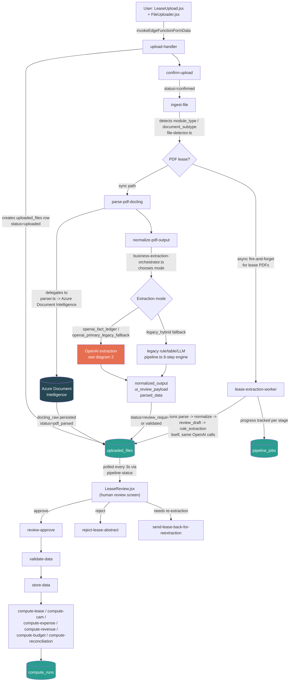
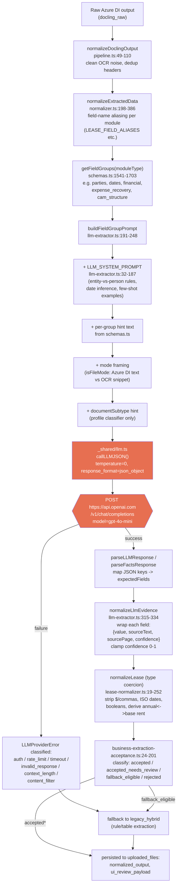
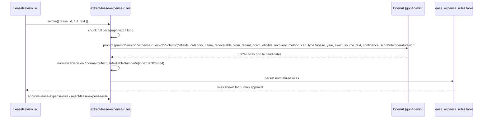
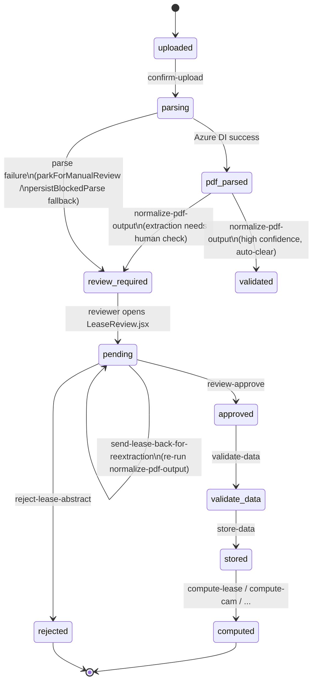
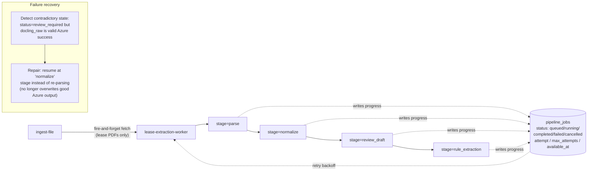

# Extraction Pipeline Architecture (as currently running)

This documents what the code actually executes today, not what filenames imply.
Two naming carryovers to keep in mind while reading the diagrams:

- **"Vertex" / "Gemini" names still exist in the codebase** (`vertex-ai.ts`, `vertex-fact-ledger/*`), but nothing in the live pipeline calls Vertex AI anymore. `phase52-vertex-diagnostic` returns HTTP 410: *"Vertex AI is no longer used. OpenAI is used instead."* The live LLM provider is **OpenAI (`gpt-4o-mini`)** via `supabase/functions/_shared/llm.ts`.
- **"Docling" is now just a legacy type name** (`DoclingOutput`). Actual parsing is done by **Azure Document Intelligence**, adapted back into the old Docling shape for compatibility (`_shared/extraction/azure-layout-adapter.ts`).

---

## 1. End-to-end request flow (upload → compute)

---

## 2. Inside one OpenAI extraction call (normalize → schema → prompt → response)

---

## 3. `extract-lease-expense-rules` (separate standalone extractor)

Used specifically for CAM/expense recovery clauses, not part of the field-group pipeline above.

---

## 4. Review status state machine

---

## 5. Job orchestration (`pipeline_jobs`)

No cron — jobs are dispatched via direct `fetch` calls between edge functions, tracked durably in `pipeline_jobs` for retry/resume.

---

## Quick reference: which file does what

| Stage | Edge function / module | Provider called |
|---|---|---|
| Intake | `upload-handler`, `confirm-upload` | — |
| Route | `ingest-file`, `_shared/file-detector.ts` | — |
| Parse | `parse-pdf-docling` → `_shared/extraction/parser.ts` | **Azure Document Intelligence** |
| Normalize (text cleanup) | `_shared/extraction/pipeline.ts` (`normalizeDoclingOutput`) | — |
| Normalize (field aliasing) | `_shared/normalizer.ts` | — |
| Normalize (type coercion) | `_shared/lease-normalizer.ts` | — |
| Field/fact extraction | `normalize-pdf-output` → `business-extraction-orchestrator.ts` → `llm-extractor.ts` / `vertex-fact-ledger/fact-ledger-extractor.ts` | **OpenAI `gpt-4o-mini`** (via `_shared/llm.ts`) |
| Expense-rule extraction | `extract-lease-expense-rules` | **OpenAI `gpt-4o-mini`** |
| Background durable worker | `lease-extraction-worker` + `pipeline_jobs` | Azure DI + OpenAI |
| Human review | `LeaseReview.jsx`, `review-approve`, `reject-lease-abstract`, `send-lease-back-for-reextraction` | — |
| Validate/store | `validate-data`, `store-data` | — |
| Compute | `compute-lease`, `compute-cam`, `compute-expense`, `compute-revenue`, `compute-budget`, `compute-reconciliation` | deterministic, no LLM |

**Dormant/legacy code, not on the live path:** `_shared/vertex-ai.ts` (Gemini client), `phase52-vertex-diagnostic` (HTTP 410), `extract-document-fields` (HTTP 410, deprecated).
