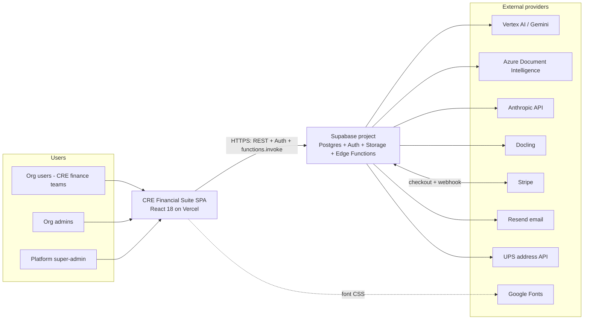
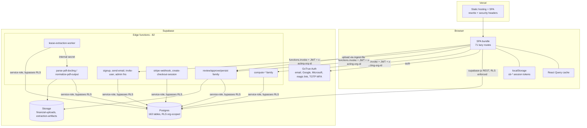
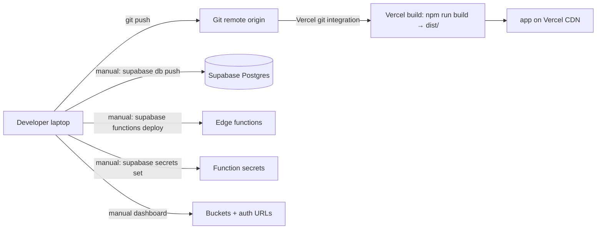
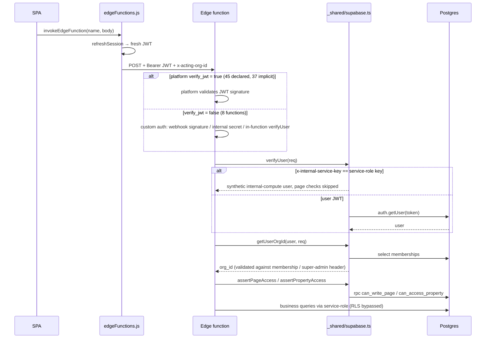
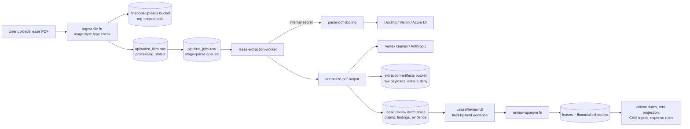
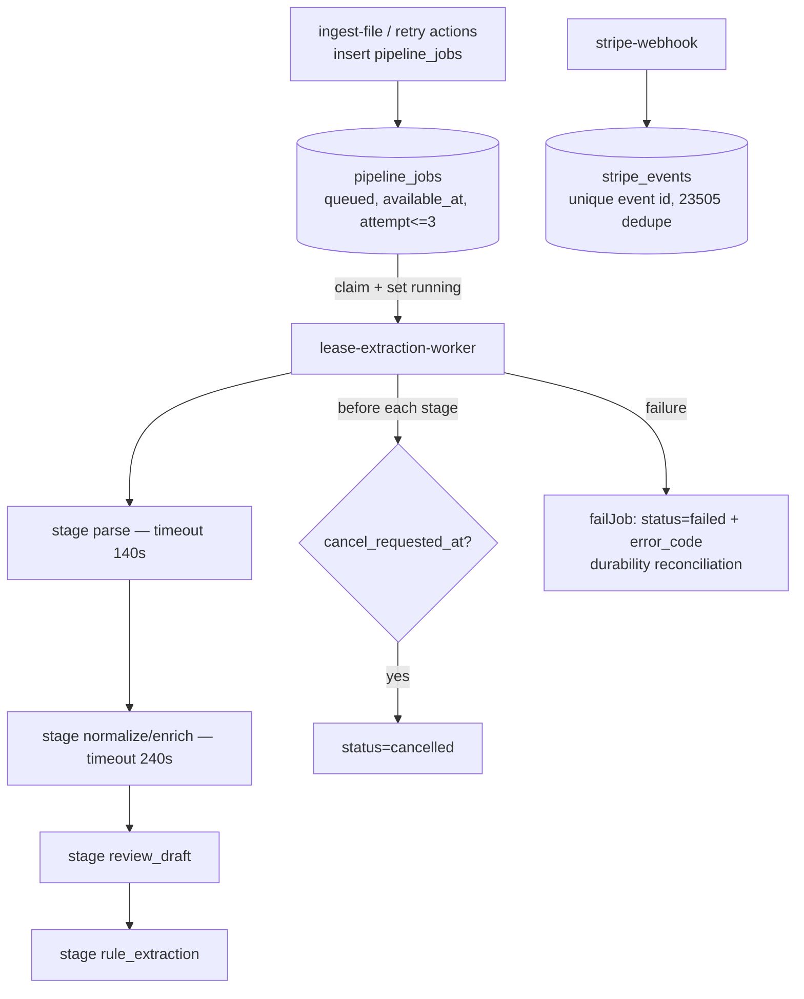
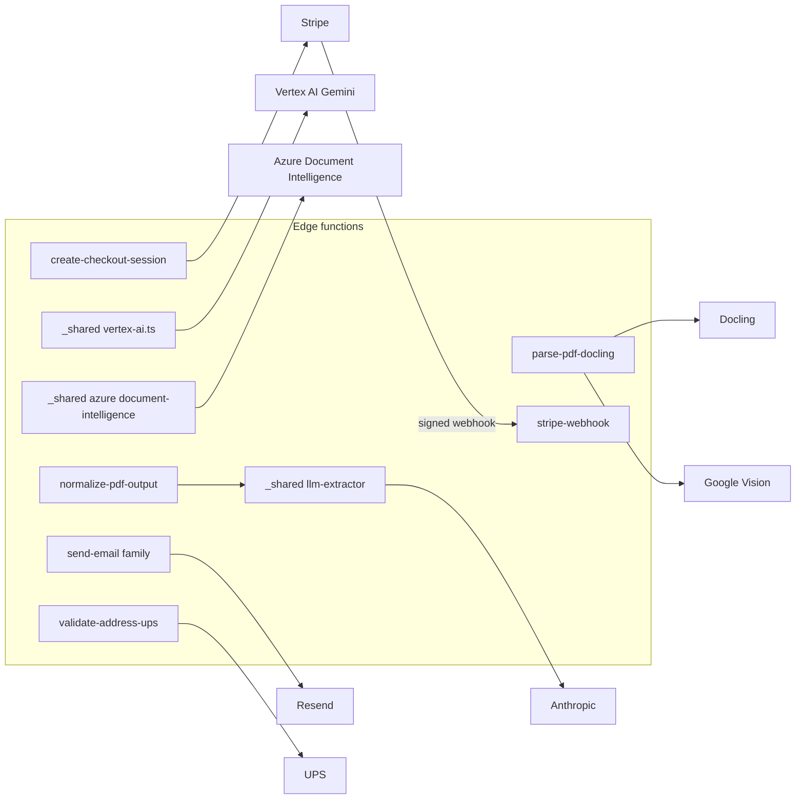
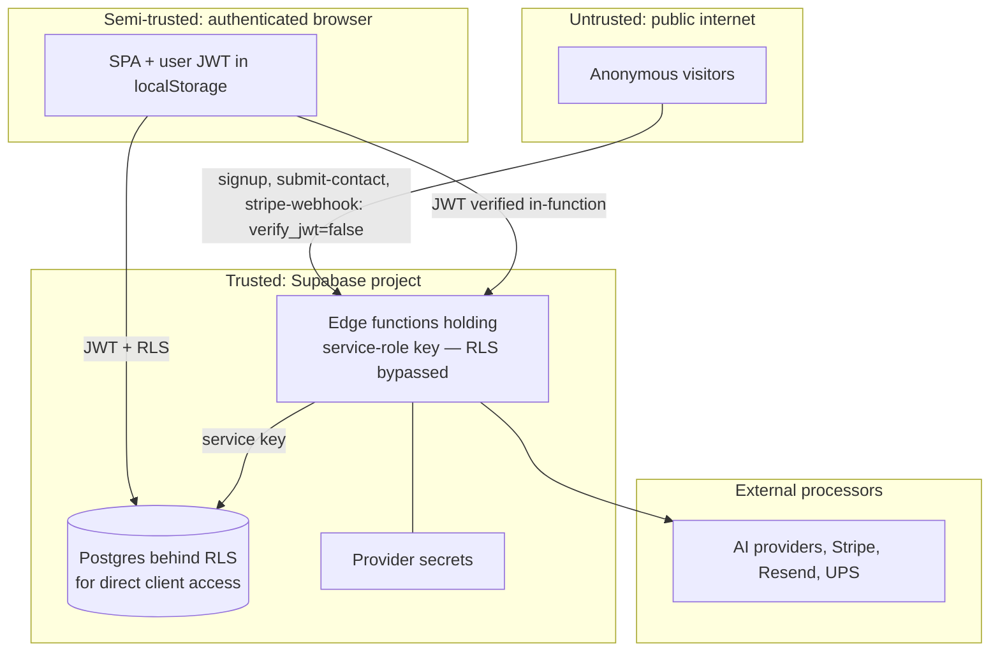

# 02 — Current-State Architecture

> Generated: 2026-07-20 · Repository revision: `34563cfaff4271b72d00b0841353dc2792f2f16a` (branch `feature/lease-intelligence-enterprise-p1-p8`) · Part of the [Project Audit](README.md)

This document describes the architecture **that exists at the frozen commit** — not a target state. Each diagram states what is code-confirmed vs inferred vs missing. Finding IDs → [findings register](findings-register.md). Evidence EV-xx → [evidence index](evidence-index.md).

**Architecture in one paragraph:** a single-page React application (Vercel-hosted) talks directly to a Supabase project — Postgres with org-scoped RLS, Supabase Auth (email/OAuth/TOTP MFA), Storage, and 82 Deno edge functions that hold the business logic for an AI lease-extraction pipeline, CAM/budget/expense computation, Stripe billing, and admin workflows. There is no separate API gateway, no queue infrastructure (a durable `pipeline_jobs` table + a worker function substitute), no cache tier, and no observability stack.

---

## 1. System context



- **Code-confirmed:** every edge shown (EV-02…EV-20; Google Fonts observed at runtime, SEC-007).
- **Inferred:** nothing material.
- **Missing:** any gateway/WAF between SPA and Supabase; any monitoring consumer.
- **Risks:** the Supabase project is a single blast-radius unit (12); provider keys concentrate in function secrets (11).

## 2. Container diagram



- **Code-confirmed:** dual data path — the SPA reads/writes Postgres **directly** via supabase-js (RLS applies, `src/services/api.js`) *and* through edge functions (service-role, RLS bypassed) (EV-02, EV-25).
- **Inferred:** exact split of which entities go direct vs via functions varies per service module ([06](06-frontend-backend-integration.md) maps it).
- **Missing:** server-side cache; rate limiting; API gateway.
- **Risks:** two write paths to the same tables with different authorization models is the central architectural tension ([SEC-001](findings-register.md#sec-001)).

## 3. Deployment diagram



- **Code-confirmed:** `vercel.json`, `.vercel/project.json`, DEPLOY.md manual steps (EV-21).
- **Missing:** CI ([OPS-001](findings-register.md#ops-001)); any record of what has actually been deployed ([OPS-005](findings-register.md#ops-005) — remote state UNVERIFIED); staging environment (none found — single linked project).
- **Risks:** four independent manual deploy surfaces (DB, functions, secrets, dashboard) with no ordering enforcement; drift already happened once ([TEN-001](findings-register.md#ten-001)).

## 4. Main request lifecycle (entity read/write from the SPA)

```mermaid
sequenceDiagram
    participant P as Page component
    participant Q as React Query
    participant A as api.js entity layer
    participant C as supabase-js client
    participant PG as Postgres + RLS
    P->>Q: useOrgQuery(entity, filters)
    Q->>A: Entity.filter / get / create
    A->>A: resolve table via ENTITIES map<br/>inject org_id scope; check cache
    A->>C: from(table).select/insert/update
    C->>PG: REST with user JWT
    PG->>PG: RLS: org_id IN get_my_org_ids()
    PG-->>C: rows (tenant-filtered)
    C-->>A: data
    A->>A: audit log hook, cache set
    A-->>Q: results → render
```

- **Code-confirmed:** api.js org scoping + audit + cache; RLS policy shape (EV-07, EV-25).
- **Inferred:** per-entity cache TTL behavior (not exhaustively traced).
- **Missing:** pagination as a uniform contract; optimistic-update conventions ([06](06-frontend-backend-integration.md)).
- **Risk:** in-memory fallback substitutes seed data when the client is null ([WKF-002](findings-register.md#wkf-002)).

## 5. Authentication & authorization sequence (edge-function path)



- **Code-confirmed:** all steps (EV-03…EV-06, EV-12; config.toml verify_jwt list).
- **Missing:** rate limiting, request size limits, correlation IDs at this layer ([07](07-api-and-gateway-architecture.md)).
- **Risks:** internal-secret path skips page checks by design ([SEC-003](findings-register.md#sec-003)); 37 functions rely on implicit platform default ([SEC-002](findings-register.md#sec-002)).

## 6. Tenant-resolution sequence

```mermaid
sequenceDiagram
    participant U as User session
    participant FE as Frontend actingOrg.js / orgUtils.js
    participant FN as Edge function
    participant DB as memberships table

    U->>FE: sign-in → load memberships
    FE->>FE: store acting org id (single org: implicit;<br/>multi-org / super-admin: explicit selection)
    FE->>FN: every call carries x-acting-org-id
    FN->>DB: getUserOrgId: fetch memberships for user
    alt super_admin
      FN->>FN: REQUIRE x-acting-org-id; verify org exists
    else member of named org
      FN->>FN: accept if active membership matches header
    else single active org
      FN->>FN: use it
    else multiple orgs, no header
      FN-->>U: error — must select organization
    end
```

- **Code-confirmed:** EV-05 (including the in-code note that the old silent first-org fallback was an audit finding, now fixed — [TEN-003](findings-register.md#ten-003)).
- **Risk:** client-side RLS path (diagram 4) and function path (diagram 6) resolve tenancy differently — DB policies vs header+membership logic. Consistency depends on both being right ([10](10-multi-tenant-saas-readiness.md) is canonical for isolation mechanics).

## 7. Data-flow diagram (lease document lifecycle — the flagship flow)



- **Code-confirmed:** every hop exists in code (EV-16/17/19/20; `src/components/lease-review/`).
- **Unverified at runtime:** end-to-end execution (e2e fails at seeding — [OPS-003](findings-register.md#ops-003); external AI calls prohibited to this audit).
- **Risks:** long synchronous chains inside function time limits; PII concentration in artifacts bucket retention ([SEC-006](findings-register.md#sec-006)).

## 8. Background-job & event flow



- **Code-confirmed:** EV-16/17/18.
- **Missing:** a scheduler — nothing polls `pipeline_jobs` automatically (no pg_cron; worker is invoked, not cron-driven). How the worker gets triggered in production is `INFERRED` (frontend/pipeline actions invoke it) and flagged in [12](12-reliability-scalability-and-operations.md); queue-depth monitoring absent.
- **Risks:** stuck `queued` jobs have no reaper; retries capped at 3 with no dead-letter visibility.

## 9. External integration map



- **Code-confirmed:** EV-18/19 + shared modules; provider selection via `EXTRACTION_PROVIDER` / `BUSINESS_EXTRACTION_PROVIDER`; kill-switch `DISABLE_EXTERNAL_PROVIDER_CALLS` exists.
- **Missing:** circuit breakers; per-provider spend metering; webhook endpoints other than Stripe.

## 10. Trust-boundary diagram



- **Code-confirmed:** boundary placements (EV-02/03; config.toml).
- **Key boundary facts:** (1) the *real* tenant boundary for function traffic is **application code**, not the database ([SEC-001](findings-register.md#sec-001)); (2) `verify_jwt=false` functions are internet-reachable and each carries its own auth (Stripe signature, internal secret, or public-by-design like `signup`/`submit-contact` — the latter two are unauthenticated endpoints that write to the DB and send email → abuse surface, see [07](07-api-and-gateway-architecture.md)); (3) lease PII crosses TB3 to AI providers by design — a DPA/subprocessor story is required for enterprise ([11](11-security-privacy-and-compliance.md)).

---

## Architecture decision summary (observed, not documented as ADRs)

| Decision evident in code | Likely rationale | Benefits | Costs / scaling limits | Verdict |
|---|---|---|---|---|
| Supabase as the entire backend (after Base44 exit, EV-24) | Speed for a small team; integrated auth/DB/storage/functions | Massive delivery velocity (163 tables, 82 fns) | Single project blast radius; vendor coupling; no staging story visible | Retain now; formalize an ADR + env strategy |
| Dual data path: direct RLS reads + service-role functions | CRUD simplicity + heavy compute in functions | Right tool per job | Two authorization models to keep consistent ([SEC-001](findings-register.md#sec-001)) | Reconsider: push high-risk paths to user-scoped clients |
| Business logic split between huge client services and edge functions | Iterative migration from client-heavy origins | Working product | 174 KB client engines duplicate server concerns; contract drift risk | Reconsider incrementally; document canonical owner per domain |
| Durable job table instead of a queue | Avoid infra; Supabase has no native queue | Simple, inspectable, cancel/retry modeled | No scheduler/reaper; throughput ceilings; no fan-out | Retain at current scale; ADR + reaper needed |
| File-based page registry (71 pages, generated `pages.config.js`) | Convention over configuration | Trivial page addition | Route-level auth must stay in sync via rbac maps | Retain; add route-guard test |
| Client-supplied `x-acting-org-id` validated server-side | Multi-org + super-admin support | Explicit tenancy, audited | Header is part of the security surface; must never be trusted alone (it isn't — EV-05) | Retain; document invariant |
| In-repo self-audits & phase journals (~70 docs) | Solo-dev discipline | Exceptional context preservation | Stale docs read as current state ([PRD-001](findings-register.md#prd-001)) | Retain with "historical" banners |

**Decisions that should become formal ADRs:** tenancy enforcement model (RLS vs app-level), job/queue strategy, environment topology (dev/staging/prod), AI-provider abstraction & data-sharing policy, session storage model.

Related: [07 — API & Gateway](07-api-and-gateway-architecture.md) · [08 — Database](08-database-schema-and-ui-gap-analysis.md) · [10 — Multi-tenancy](10-multi-tenant-saas-readiness.md) · [12 — Reliability & Ops](12-reliability-scalability-and-operations.md)
