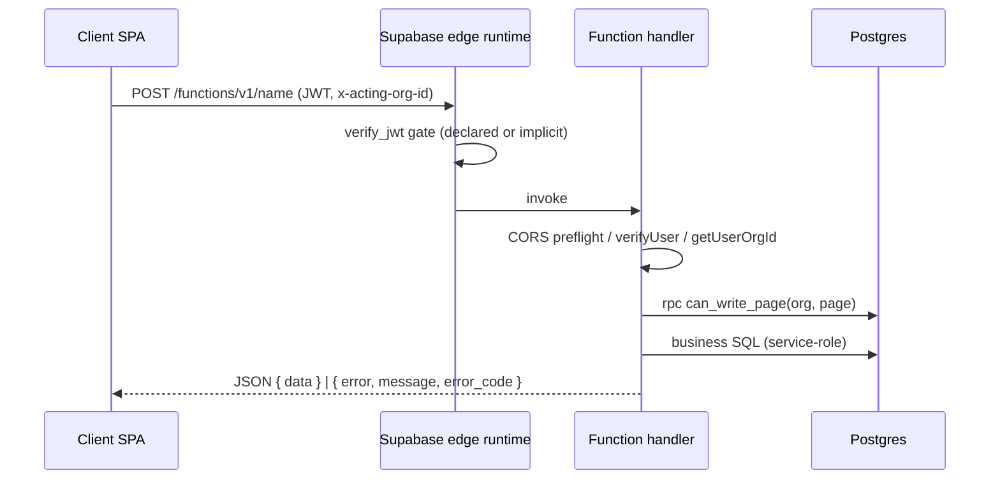

# 07 — API & Gateway Architecture

> Generated: 2026-07-20 · Repository revision: `34563cfaff4271b72d00b0841353dc2792f2f16a` (branch `feature/lease-intelligence-enterprise-p1-p8`) · Part of the [Project Audit](README.md)

**Canonical owner for API-control topics** (auth modes, validation, rate limiting, versioning). Tenancy mechanics → [10](10-multi-tenant-saas-readiness.md); vulnerabilities → [11](11-security-privacy-and-compliance.md).

---

## 1. API styles in use

| Style | What | Evidence | Status |
|---|---|---|---|
| Auto-generated REST (PostgREST) | Direct table CRUD from the SPA via supabase-js, RLS-enforced | `src/services/api.js` | `CONFIRMED` |
| RPC-over-HTTP edge functions | 82 Deno functions, JSON bodies, invoked via `supabase.functions.invoke` or raw `fetch` (multipart) | `src/services/edgeFunctions.js:34-102` | `CONFIRMED` |
| Webhook | `stripe-webhook` (signature-verified) | EV-18 | `CONFIRMED` |
| GraphQL / gRPC / OpenAPI | — | — | `MISSING` (no spec files of any kind) |

There is **no gateway or BFF layer**: the browser calls Supabase directly. Vercel serves static assets only (plus security headers in [vercel.json](../../vercel.json): HSTS, X-Frame-Options DENY, nosniff, Referrer-Policy, Permissions-Policy — but **no Content-Security-Policy**, [SEC-004](findings-register.md#sec-004)).

## 2. Edge-function inventory (82)

Grouped by family; **bold** = `verify_jwt=false` (custom auth); ⚠ = not declared in `config.toml` (implicit platform JWT check, [SEC-002](findings-register.md#sec-002)).

| Family | Functions | Auth mode |
|---|---|---|
| Auth & onboarding | **`signup`**, `first-login`, `complete-onboarding`, `save-security-questions`, `reset-mfa`, `accept-invite` | signup public by design; rest JWT |
| Invitations & approvals | `invite-user`, `invite-client`, `send-invite`, `approve-request`, `approve-organization` | JWT + role checks in-handler |
| Ingestion & pipeline | `ingest-file`, `upload-handler`, `parse-file`, ⚠`confirm-upload`, ⚠`cancel-upload`, ⚠`delete-uploaded-file`, **`lease-extraction-worker`**, **`parse-pdf-docling`**, **`normalize-pdf-output`**, ⚠`ocr-vision-extract`, `pipeline-status`, `pipeline-health-check` | worker/parse/normalize: internal secret ([SEC-003](findings-register.md#sec-003)); rest JWT |
| Extraction & review | **`extract-document-fields`**, `extract-with-custom-fields`, `extract-lease-expense-rules`, `save-lease-review-draft`⚠, `update-lease-extraction-field`⚠, `update-lease-field-and-columns`⚠, `persist-lease-extraction-merge`⚠, `review-approve`, `reject-lease-abstract`⚠, `send-lease-back-for-reextraction`⚠, `backfill-lease-evidence`⚠, `get-extraction-artifact`⚠ | mostly JWT; extract-document-fields public (**flag**: unauthenticated extraction endpoint — abuse/cost surface) |
| Document-intelligence v3 | ⚠`document-intelligence-v3-{readiness,approval-advisory,advisory-audit,advisory-audit-batch}`, ⚠`phase52-vertex-diagnostic` | JWT (implicit) |
| Lease domain | `compute-lease`, `save-lease-config`⚠, `manage-lease-critical-date`⚠, `link-lease-space-assignment`⚠, `delete-lease-cascade`⚠, `approve-lease-workflow` | JWT |
| Expense domain | `compute-expense`, `create-expense-workflow`⚠, `bulk-create-expenses`⚠, `delete-expenses`⚠, `update-expense-amount`⚠, `update-expense-details`⚠, `persist-expense-classification`⚠, `review-expense-classification`⚠, `manual-override-expense-classification`⚠, `send-expense-classification-to-cam` | JWT |
| Lease-expense rules | `save-lease-expense-rule-set`⚠, `update-lease-expense-rule`⚠, `update-lease-expense-rule-amount`⚠, `update-lease-expense-rule-set-status`⚠, `approve-lease-expense-rule`, `reject-lease-expense-rule`, `mark-lease-expense-rule-not-applicable`, `publish-lease-expense-rule-to-cam`, `save-lease-rule-amount-cam-input`⚠ | JWT |
| CAM | `compute-cam`, `save-cam-profile`⚠, `approve-cam-profile`⚠, `save-property-cam-config`⚠ | JWT |
| Budget / revenue / recon | `compute-budget`, `generate-budget`, `compute-revenue`, `compute-reconciliation` | JWT |
| Billing | `create-checkout-session`, **`stripe-webhook`** | JWT; Stripe signature |
| Data platform | `store-data`, `validate-data`, `export-data`, `custom-fields` | JWT |
| Comms & misc | **`send-email`**, **`submit-contact`**, `validate-address-ups` | send-email/submit-contact public (**flag**: spam/abuse surface — no rate limit or captcha found) |

## 3. Cross-cutting API controls

| Control | Current state | Evidence | Label |
|---|---|---|---|
| Authentication | Platform JWT (45 declared + 37 implicit) or in-function `verifyUser` (3 header forms) | EV-03/04 | `CONFIRMED`, inconsistent declaration |
| Authorization | In-handler: `getUserOrgId` + `assertPageAccess`/`assertPropertyAccess` RPCs; role checks in admin handlers | EV-05/06 | `CONFIRMED`; per-function discipline, no middleware |
| Tenant resolution | `x-acting-org-id` validated against memberships; internal calls may set `x-internal-org-id` | EV-05 | `CONFIRMED` |
| Input validation | Ad-hoc per function (UUID regex, shape checks); no shared schema validation (no zod on the Deno side) | `_shared/supabase.ts:88` | `PARTIAL` |
| Error model | Shared JSON envelopes with `error_code`/`retryable` in pipeline family (`_shared/error-handler.ts`); other functions return ad-hoc `{ error, message }` | EV-17 | `PARTIAL` — two conventions |
| CORS | Per-function preflight handling (copy-pasted headers) | function sources | `PARTIAL` — no central policy |
| Rate limiting | None anywhere (functions, auth endpoints, public endpoints) | grep | `MISSING` |
| Request size limits | Platform defaults only; artifacts bucket has 50 MB cap | EV-20 | `PARTIAL` |
| Timeouts | Explicit per-stage timeouts in worker (140/240 s); elsewhere platform defaults | EV-17 | `PARTIAL` |
| Retries | Worker `max_attempts 3` + `retryable` classification; client-side: none systematic | EV-16/17 | `PARTIAL` |
| Idempotency | Stripe events deduped (`23505`); extraction idempotency migration (`20260820000000`); mutation functions generally **not** idempotent | EV-18 | `PARTIAL` |
| Circuit breakers / bulkheads | None; only kill-switch env `DISABLE_EXTERNAL_PROVIDER_CALLS` | grep | `MISSING` |
| API keys / service auth | Service-role key doubles as internal API password | [SEC-003](findings-register.md#sec-003) | `CONFIRMED` weakness |
| Versioning / deprecation | None — function names are the contract (`document-intelligence-v3-*` is name-versioning) | inventory | `MISSING` |
| Correlation IDs | `request_id` column on `audit_logs`; no cross-function propagation convention | migration `20260602004050` | `PARTIAL` |
| API documentation | None (no OpenAPI; README lists families) | — | `MISSING` |
| Abuse/bot/DDoS | Nothing app-level; Vercel/Supabase platform mitigations only | — | `MISSING` |

## 4. Route ownership & dependency picture

- **Owner:** single deploy unit (one Supabase project); no per-team ownership (solo maintainer, `INFERRED`).
- **Internal call graph (confirmed):** `lease-extraction-worker` → `parse-pdf-docling` → providers; worker → `normalize-pdf-output` → LLM extractor → Anthropic/Vertex; `ingest-file` → storage + `pipeline_jobs`. `docs/` contains a historical call-graph reference (context only).
- **Consumers:** SPA (via `edgeFunctions.js`, 60+ names referenced), Stripe (webhook), worker (internal). No third-party/public API consumers — **the API surface is private in practice but not in posture** (public functions above).

## 5. Readiness assessment

| Scenario | Ready? | Blocking gaps |
|---|---|---|
| Multiple frontend clients | `PARTIAL` | No API docs/contracts; error model inconsistent |
| Mobile clients | `PARTIAL` | Same + token storage strategy revisit |
| Partner integrations / public API | **No** | No API keys, no rate limits, no versioning, no docs |
| High request volume | **No** | No rate limiting, no cache tier, unbounded public endpoints |
| Regional deployment | **No** | Single Supabase project; no residency options |
| Zero-downtime API evolution | `PARTIAL` | Name-based versioning only; no deprecation process |

## 6. Future-state gateway (RECOMMENDED — target state, not current)

1. **Near term (no new infra):** declare all 82 functions in `config.toml` with explicit `verify_jwt` + justification comment; unify error envelope + CORS via `_shared`; add per-function zod-style input validation; propagate a `x-request-id` end-to-end; add captcha + rate limiting (e.g., Upstash/ KV counter) on `signup`, `submit-contact`, `send-email`, `extract-document-fields`.
2. **Medium term:** a thin BFF/gateway (Vercel Edge Middleware or Supabase API Gateway pattern) owning authN, rate limits, request IDs, and an OpenAPI-described public surface; internal functions become non-routable (require internal secret) — separates public contract from internal RPC.
3. **Enterprise term:** API keys + per-tenant quotas/metering, versioned `/v1` public API, webhook subscriptions outbound, partner sandbox.

Related: [02 — Architecture](02-current-state-architecture.md) · [10 — Multi-tenancy](10-multi-tenant-saas-readiness.md) · [11 — Security](11-security-privacy-and-compliance.md)
