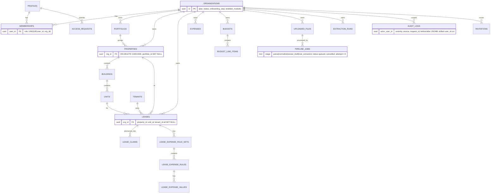

# 08 — Database Schema & UI Gap Analysis

> Generated: 2026-07-20 · Repository revision: `34563cfaff4271b72d00b0841353dc2792f2f16a` (branch `feature/lease-intelligence-enterprise-p1-p8`) · Part of the [Project Audit](README.md)

**Canonical owner for schema-structure topics.** Isolation mechanics → [10](10-multi-tenant-saas-readiness.md); vulnerabilities → [11](11-security-privacy-and-compliance.md). All statements verified at the frozen commit unless labeled.

---

## 1. Shape of the schema

- **163 distinct tables** across `schema.sql` (foundation) + **216 migrations** spanning `20260321…`–`20260854…` (~5 months of continuous evolution).
- **Domain clusters:** identity/tenancy (`profiles`, `organizations`, `memberships`, `invitations`, `access_requests`); portfolio hierarchy (`portfolios` → `properties` → `buildings` → `units`); CRE domain (`leases`, `tenants` ⚠ *lease occupants, not SaaS tenants*, `vendors`); financials (`expenses`, `budgets`, `budget_line_items`, `revenues`, `actuals`, `billings`, `cam_*`); ingestion (`uploaded_files`, `pipeline_jobs`, `pipeline_logs`, `extraction_runs`, `extraction_artifacts`); a very large **lease-intelligence** subsystem (`lease_claims*`, `lease_document_*`, `lease_financial_*`, `lease_base_rent_*`, `lease_package_*`, `document_intelligence_runs`); permissions (`member_page_permissions`, `member_property_access`, `member_portfolio_access`, `member_signing_authority`, `role_definitions`, `user_roles`); ops (`audit_logs`, `stripe_events`, `computation_snapshots`, `compute_runs`).
- **Money:** `NUMERIC` used for monetary columns (e.g. `properties.total_sqft`, lease/budget amounts) — `CONFIRMED` on sampled tables; no float-money misuse observed in samples (`PARTIAL` — not all 163 audited).
- **Timestamps:** `TIMESTAMPTZ DEFAULT now()` convention throughout samples; org timezone stored at `organizations.timezone` (default `America/New_York`).

## 2. Core ER diagram (verified subset)

Legend: only code-verified relations shown; the lease-intelligence subsystem (~40+ tables) is summarized by `LEASE_CLAIMS`. Cardinality from FK definitions (`CONFIRMED` on sampled CREATE statements).

## 3. Ownership, lifecycle, audit & constraint findings

| Aspect | State | Evidence / label |
|---|---|---|
| Tenant ownership | `org_id UUID NOT NULL REFERENCES organizations ON DELETE CASCADE` on 157 migration files' worth of tables; exhaustive scan → only 3 org-scoped business tables lack it ([TEN-002](findings-register.md#ten-002)) | `CONFIRMED` |
| User ownership | `profiles(id)` FK; roles ONLY in `memberships` (schema comment) + later `role_definitions`/`user_roles` add a second system ([contradictions](contradictions-and-drift.md)) | `CONFIRMED` / `CONTRADICTORY` |
| Lifecycle/status fields | Rich: org `status onboarding→active`, `uploaded_files.processing_status`, `pipeline_jobs.status` CHECK-constrained, lease-rule `approval_status`/`review_status`/`published_to_cam` | `CONFIRMED` |
| Soft deletion | **Not systematic** — deletes are real deletes (CASCADE); no `deleted_at` convention found in samples | `MISSING` (grep sample) |
| Audit fields | `created_at`/`updated_at` conventions; `audit_logs` hardened (severity, source, request_id, before/after JSONB, restrictive insert policy) | `CONFIRMED` (EV-14/15) |
| History/versioning | Registry snapshot tables (`*_registry_versions`, `computation_snapshots`, `extraction_runs` provenance) for the intelligence domain; **no optimistic locking / row versioning** on core CRUD tables | `PARTIAL` |
| Uniqueness | Good domain keys where sampled (e.g. `uq_lease_expense_rules_lease_rule_key`, `memberships UNIQUE(user_id, org_id)`, `stripe_events` unique event id) | `CONFIRMED` sampled |
| Indexes | Purposeful (queue-drain index on `pipeline_jobs`, scope/approval indexes on rules) | `CONFIRMED` sampled; full index audit `UNVERIFIED` |
| Cascades | `ON DELETE CASCADE` from organizations → everything; business FKs mostly `SET NULL` (leases keep rows when property/unit/tenant deleted → orphan-ish rows possible by design) | `CONFIRMED`; product intent `INFERRED` |
| Transactions | Migrations transactional; multi-table writes inside edge functions not systematically transactional (sampled) | `PARTIAL` — deep dive in modules |
| Retention/TTL | None found for `extraction_artifacts` (raw PII payloads), `audit_logs`, `pipeline_logs` | `MISSING` ([SEC-006](findings-register.md#sec-006)) |
| Encryption at rest | Supabase platform default (AES-256) — platform property, not repo-verifiable | `UNVERIFIED` |
| PII locations | `profiles` (emails, names), `tenants`/`vendors` (business contacts), lease documents + extraction artifacts (full lease text), `audit_logs` (user_email, ip_address) | `CONFIRMED` columns exist |

## 4. RLS coverage analysis

- **156 literal `ENABLE ROW LEVEL SECURITY`** statements + **dynamic enables** via `DO/EXECUTE format()` loops (e.g. `20260401000000_add_missing_business_tables.sql`, `20260322_add_core_tables.sql`) — static grep alone under-counts; the dynamic style makes RLS auditing error-prone (**method finding**, recorded in [contradictions](contradictions-and-drift.md)).
- **0 `FORCE ROW LEVEL SECURITY`** → service-role traffic (all 82 edge functions) bypasses every policy ([SEC-001](findings-register.md#sec-001)).
- **Policy evolution:** early blanket `FOR ALL` policies → later per-command policies gated by `can_write_page` / `can_access_property`; remote-only permissive policies had to be dropped by corrective migrations ([TEN-001](findings-register.md#ten-001)).
- **267 SECURITY DEFINER** occurrences in 108 files — helper functions (EV-07) are the pattern; 3 lacked explicit `search_path` per the prior self-audit (F-021, historical; re-verification tracked in [11](11-security-privacy-and-compliance.md)).

## 5. Confirmed drift (repo vs remote)

| Drift | Detail | Finding |
|---|---|---|
| `audit_logs.user_id` | Exists remotely, created by no migration; captured after the fact | [TEN-001](findings-register.md#ten-001) / EV-14 |
| `audit_logs_insert_all` | Remote-only `WITH CHECK (true)` for `authenticated, anon` — defeated the restrictive insert policy; dropped by `20260708020000` | EV-15 |
| Blanket `<table>_all` policies | Remote-only on 8 core tables; bypassed page/property gating; dropped by `20260709020000` | EV-15 |
| `documents` bucket | Referenced in migration comments as a manual dashboard step — not migration-managed | `PARTIAL` (EV-20) |

## 6. UI ↔ schema gap table

(UI side from Phase 0 probes + component inventory; workflow-level verification continues in [05](05-end-to-end-workflows.md)/[06](06-frontend-backend-integration.md).)

| UI capability | Required data | Existing schema support | Gap / issue | Migration impact | Risk | Priority | Evidence |
|---|---|---|---|---|---|---|---|
| Lease review with per-field evidence & blockers | claims, findings, evidence, draft state | `lease_claims*`, extraction draft tables, `extraction_runs` | None structural — richest part of schema | — | Low | — | EV-16/19, `src/components/lease-review/` |
| Org switcher / super-admin acting-org | memberships, acting org | `memberships`; acting org **client-state only** (localStorage via `actingOrg.js`) — no server-side "last acting org" | Acceptable; audit trail of acting-org usage only via function logs | none | Low | P3 | EV-05/12 |
| Audit Log page (filter by user/action/entity) | queryable audit trail | `audit_logs` hardened columns | Drifted `user_id` unused by code; dual actor columns (`user_email` legacy vs `actor_user_id`) confuse queries | reconcile columns | Medium | P2 | EV-14 |
| Budget dashboards (variance, YoY) | budgets, actuals, computed variance | `budgets`, `budget_line_items`, `actuals`, `computation_snapshots` | Prior audit: fallback fake numbers + hardcoded 2027 ([DATA-001](findings-register.md#data-001)) — needs re-verification | logic fix, not schema | High if present | P1 | F-007/F-012 historical |
| Billing page (plan, invoices) | subscription state | `organizations.plan`, `billings`, `stripe_events` | No `subscriptions` mirror table found — plan state granularity vs Stripe source-of-truth `INFERRED` thin | possible new table | Medium | P2 | EV-18 |
| User management (roles, page perms, property access) | fine-grained grants | `member_page_permissions`, `member_property_access`, `member_portfolio_access`, `role_definitions` | Two permission systems (memberships.role + role_definitions/user_roles) — duplication of truth | consolidation | Medium | P2 | [contradictions](contradictions-and-drift.md) |
| File history & pipeline status | job/stage/status per upload | `uploaded_files.processing_status` + `pipeline_jobs` + `pipeline_logs` | None structural; stuck-job reaping missing (ops, not schema) | — | Low | — | EV-16 |
| Notifications page | persisted notifications | `notifications` table exists (migrations) | Delivery pipeline beyond email `UNVERIFIED`; legacy Base44 triggers (expiry alerts) were not visibly re-implemented | verify | Medium | P2 | [ARC-002](findings-register.md#arc-002) |
| Reports/exports | cross-entity queries | `export-data` function + xlsx client-side | No materialized/reporting layer; heavy reports run as live queries | perf later | Low now | P3 | inventory |
| Soft delete / undo anywhere in UI | `deleted_at` columns | — | Hard deletes only; `delete-lease-cascade` is destructive with no recovery | additive columns | Medium | P2 | §3 |
| Multi-currency | per-entity currency | `organizations.currency` only (org-level) | Leases/expenses have no currency column in sampled defs — single-currency per org assumption | additive | Low (US CRE) | P3 | schema.sql:77 |

## 7. Specific checks requested

- **Data only in frontend state:** acting-org selection (localStorage); in-memory seed mode datasets ([WKF-002](findings-register.md#wkf-002)). `CONFIRMED`.
- **Unstructured JSONB that should be modeled:** `pipeline_jobs.input/counts/metadata`, `audit_logs.before/after` are appropriate as JSONB; extraction payloads live in storage (good). No egregious misuse found in samples.
- **Duplicated sources of truth:** roles (memberships.role vs role_definitions/user_roles); plan state (organizations.plan vs Stripe); legacy vs hardened audit_logs actor columns. `CONFIRMED` → [contradictions](contradictions-and-drift.md).
- **Missing tenant identifiers:** exactly 3 business tables ([TEN-002](findings-register.md#ten-002)).
- **Cross-tenant query risk:** service-role paths ([SEC-001](findings-register.md#sec-001)); policy subquery chains on the rules family.
- **N+1 risk:** entity-per-call CRUD layer + React Query per-hook fetching implies list+detail patterns; not measured (`UNVERIFIED` — no runtime profiling possible in audit scope).
- **Monetary precision:** NUMERIC — OK. **Timezone:** TIMESTAMPTZ + org timezone — OK; UI date handling uses both `date-fns` and `moment` (dual libs, minor).
- **Optimistic locking:** `MISSING` on core CRUD (no version columns) — concurrent edits last-write-wins.

## 8. Future-state schema recommendations (RECOMMENDED — not current state)

1. Denormalize `org_id` onto `lease_expense_rules`/`_values`/`_clauses` + direct policies ([TEN-002](findings-register.md#ten-002)).
2. Reconcile remote drift, then lock: migration-only DDL, scheduled `db diff` check in CI ([TEN-001](findings-register.md#ten-001), [OPS-001](findings-register.md#ops-001)).
3. Introduce `deleted_at` soft-delete + retention policies for `audit_logs`, `pipeline_logs`, `extraction_artifacts` (GDPR groundwork).
4. Add `updated_at` triggers + `version` (optimistic locking) on collaboratively-edited tables (leases, budgets, rules).
5. Consolidate the two role systems into `role_definitions` with a migration path.
6. Add a `subscriptions` mirror (Stripe as source of truth, local cache for entitlement checks).
7. Migration sequence: additive columns → backfill → dual-write window → policy switch → cleanup. **No existing migrations were modified by this audit.**

Related: [10 — Multi-tenancy](10-multi-tenant-saas-readiness.md) · [06 — Integration](06-frontend-backend-integration.md) · [11 — Security](11-security-privacy-and-compliance.md)
