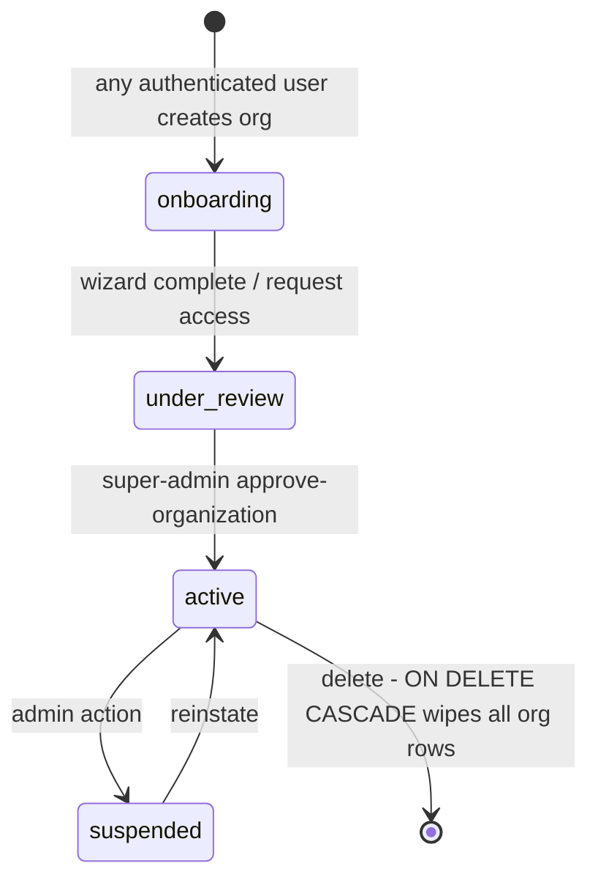

# 10 — Multi-Tenant SaaS Readiness

> Generated: 2026-07-20 · Repository revision: `34563cfaff4271b72d00b0841353dc2792f2f16a` (branch `feature/lease-intelligence-enterprise-p1-p8`) · Part of the [Project Audit](README.md)

**Canonical owner for tenant-isolation mechanics.** Vulnerability framing → [11](11-security-privacy-and-compliance.md); schema detail → [08](08-database-schema-and-ui-gap-analysis.md).

**Terminology guard:** the SaaS tenant is the **organization** (`organizations` + `memberships`). The `tenants` table is a CRE domain entity (lease occupants) — unrelated to isolation.

## 1. Verdict up front

The product **is genuinely multi-tenant by design**: 157 migration files carry `org_id` columns; an exhaustive block scan found only 3 org-scoped business tables without a direct `org_id` (all RLS-protected via one-hop parent policies, [TEN-002](findings-register.md#ten-002)); tenant resolution is centralized and was explicitly hardened after an internal audit ([TEN-003](findings-register.md#ten-003)). The structural weakness is **enforcement asymmetry**: browser traffic is database-enforced (RLS), while all 82 edge functions run service-role with RLS bypassed ([SEC-001](findings-register.md#sec-001)) — so half the system's isolation rests on application discipline. **No concrete cross-tenant leak was found** (static analysis; runtime isolation testing was not possible in this audit's environment — see [evidence-index capability matrix](evidence-index.md)).

## 2. Tenant model — `CONFIRMED`

- **Tenant entity:** `organizations` (plan, status lifecycle `onboarding|under_review|active|suspended`, `enabled_modules`, timezone/currency) — schema.sql:71-85.
- **Membership:** `memberships` UNIQUE(user_id, org_id), roles `super_admin|org_admin|manager|editor|viewer`; fine-grained overlays: `member_page_permissions`, `member_property_access`, `member_portfolio_access`, `member_signing_authority`.
- **Resolution:** DB path — `get_my_org_ids()` in every policy (EV-07). Function path — `getUserOrgId()` (EV-05): super-admin must name tenant via `x-acting-org-id`; multi-org users must select; membership validated server-side.

## 3. Tenant lifecycle

- `CONFIRMED`: states on `organizations.status`; approval fn; CASCADE deletion from organizations FK graph.
- `MISSING`: tenant **export** before deletion; deletion workflow UI (delete appears DB-level only — no offboarding function found); suspension enforcement at request time (`UNVERIFIED` — no middleware checks `status='suspended'` on data paths in samples).

## 4. Tenant request sequence

See [02 §5–6](02-current-state-architecture.md) for the full sequences. Isolation-relevant facts: client-supplied org context is always validated against memberships (non-admin) or existence+role (super-admin); internal service calls may set `x-internal-org-id` **without membership validation** (trusted context, `_shared/supabase.ts:98-104`) — correct only while the internal secret stays secret ([SEC-003](findings-register.md#sec-003)).

## 5. Tenant data-isolation matrix

| Layer | Mechanism | Enforced by | Gaps | Label |
|---|---|---|---|---|
| Postgres (browser traffic) | RLS: `org_id IN get_my_org_ids()` + per-command policies + page/property RPC gates | Database | Dynamic-DO enable style hampers auditing; drift precedent ([TEN-001](findings-register.md#ten-001)) | `CONFIRMED` |
| Postgres (function traffic) | `getUserOrgId()` + per-function `.eq('org_id', …)` discipline | Application | No FORCE RLS backstop ([SEC-001](findings-register.md#sec-001)) | `CONFIRMED` risk |
| Storage `financial-uploads` | org-folder path + storage.objects RLS keyed on folder | Database | — | `CONFIRMED` |
| Storage `extraction-artifacts` | default-deny; service-role-only reader + authorization RPC + audit row | Application (audited) | retention `MISSING` ([SEC-006](findings-register.md#sec-006)) | `CONFIRMED` |
| Client cache | React Query keys include orgId | Application (frontend) | — | `CONFIRMED` (positive) |
| Jobs/events | `pipeline_jobs` rows carry org context in input JSONB; worker resolves per-job | Application | no per-tenant queue fairness (noisy neighbor) | `PARTIAL` |
| Logging | `audit_logs.org_id` (nullable per `20260531000000`) | Application | function `console` logs are not tenant-partitioned | `PARTIAL` |
| Search indexes / caches (server) | none exist | — | n/a | — |
| Billing | Stripe customer per org (`INFERRED` from checkout flow); `stripe_events` global table (no org_id — platform-level, acceptable) | Application | mapping not deeply traced (`UNVERIFIED`) | `PARTIAL` |
| Analytics | none exist ([OPS-002](findings-register.md#ops-002)) | — | — | `MISSING` |

## 6. Cross-tenant leakage paths examined

1. **Service-role queries missing org filters** — the systematic risk class ([SEC-001](findings-register.md#sec-001)). Mitigations present: centralized `getUserOrgId` + `assertPageAccess`/`assertPropertyAccess`; sampled functions filter correctly. Exhaustive per-function audit of all 82 remains **the** follow-up ([prioritized-action-register](prioritized-action-register.md)).
2. **Historical remote blanket policies** — real past exposure class, corrected in-repo; remote state `UNVERIFIED` ([TEN-001](findings-register.md#ten-001)).
3. **Indirect-scoped rules tables** — policies exist; refactor fragility ([TEN-002](findings-register.md#ten-002)).
4. **Super-admin acting-org misuse** — hardened (must name tenant; audited) ([TEN-003](findings-register.md#ten-003)).
5. **`x-internal-org-id` with leaked internal secret** — full cross-tenant compute; key-rotation + secret separation recommended ([SEC-003](findings-register.md#sec-003)).
6. **`ORG_EXEMPT_TABLES` client list** (`src/types/index.js`) — platform tables intentionally unscoped; membership of that list should be reviewed each release (process gap, no defect found).

## 7. Threat model (tenancy slice)

| Threat | Vector | Current control | Residual risk |
|---|---|---|---|
| Tenant A reads Tenant B data via API | missing org filter in a function | code discipline + review | Medium — no DB backstop, no automated cross-tenant tests |
| Tenant A reads B via direct PostgREST | RLS policy defect | RLS + per-command policies | Low–Medium — drift precedent; needs policy tests |
| Compromised internal secret | `x-internal-service-key` / worker secret | secret storage in Supabase | High impact / low likelihood; rotate + scope |
| Malicious org admin escalation | role manipulation | roles only in memberships; RLS on memberships | Low–Medium (dual role systems complicate review) |
| Super-admin mistake hits wrong tenant | acting-org header | mandatory explicit header + validation + logs | Low (hardened) |
| Noisy neighbor (pipeline hogging) | many jobs from one org | none (no per-tenant quotas/rate limits) | Medium at scale |

## 8. Enterprise multi-tenancy gap analysis

`MISSING` capabilities enterprises ask about: per-tenant rate limits & usage metering; tenant export/import; tenant deletion workflow with evidence; per-tenant encryption keys; residency options; per-tenant feature flags beyond `enabled_modules`; admin impersonation with consent trail (super-admin acting-org is close but not a consent-logged impersonation feature); support-access controls. `PARTIAL`: tenant-level config (timezone/currency/modules exist).

## 9. Recommended tenancy model (RECOMMENDED — target state)

**Stay shared-database / shared-schema.** Rationale grounded in the product: mid-market CRE org counts (hundreds–low thousands), heavy cross-table computation per tenant, one-team operations — schema-per-tenant or DB-per-tenant would multiply the 216-migration burden with no compensating requirement (no residency/regulatory driver in evidence). Close the enforcement asymmetry instead:

1. Per-function tenancy audit of all 82 functions (checklist + sign-off) — S/M effort.
2. Automated cross-tenant regression tests (two seeded orgs; assert 0 leakage on every endpoint) — the single most valuable missing test class.
3. Evaluate `FORCE RLS` + `request.jwt` claims or a dedicated low-privilege role for function DB access on read paths ([SEC-001](findings-register.md#sec-001)).
4. Per-tenant metering (AI spend per org first — it's also the COGS story, [12](12-reliability-scalability-and-operations.md)).
5. Reserve DB-per-tenant only as a future premium/residency SKU if enterprise demand materializes (MARKET-VALIDATION-REQUIRED).

Related: [08 — Database](08-database-schema-and-ui-gap-analysis.md) · [11 — Security](11-security-privacy-and-compliance.md) · [15 — Enterprise gaps](15-enterprise-readiness-gap-analysis.md)
