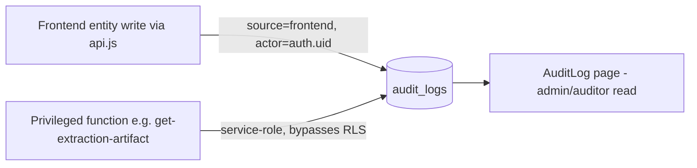

# Module: Audit Logging (Tier 1)

> Generated: 2026-07-20 · Revision: `34563cfaff4271b72d00b0841353dc2792f2f16a` · Canonical score **2.4 / 5**, criticality **11 (High)** — [03](../03-module-catalog-and-maturity.md) · Index: [04](../04-module-deep-dives.md)

## Functional view
- **Problem:** provide a trustworthy record of who-did-what for security review, compliance, and dispute resolution. **Users:** org admins/auditors (readers), the whole system (writer).
- **Inputs:** every audited mutation (entity CRUD via `api.js`, admin actions, artifact reads). **Outputs:** queryable `audit_logs` rows; the `AuditLog` page.

## Technical view
- **Schema evolution (the module's defining story):** created minimally (`org_id, entity_type, entity_id, action, field_changed, old_value, new_value, user_email, user_name, …` — no `user_id`) in `20260322_add_core_tables.sql:25-46`, then **hardened** in `20260602004050_audit_logging_hardening.sql` (adds `actor_user_id`, `actor_email`, `actor_role`, `target_user_id`, `severity` CHECK, `source` CHECK, `request_id`, `user_agent`, `before/after/metadata` JSONB, restrictive insert policy `actor_user_id = auth.uid() AND source='frontend' AND severity != 'critical'`).
- **Confirmed drift:** remote had a `user_id` column no migration created (captured after the fact, `20260708000000`) and a remote-only permissive `audit_logs_insert_all` policy (`WITH CHECK (true)` for anon+authenticated) that **defeated the restrictive policy above** — dropped by `20260708020000`. This is the module's central finding: [TEN-001](../findings-register.md#ten-001).
- **Writers:** `api.js` entity layer (client-initiated writes, restricted by the `source='frontend'` policy); server-side writes from privileged functions (e.g., `get-extraction-artifact`'s authorization RPC) presumably use service-role, bypassing the restrictive policy by design (`INFERRED` — service-role bypasses RLS universally, [SEC-001](../findings-register.md#sec-001)).
- **Tests:** none found specific to audit logging.

## Workflow view

**Failure path:** a write whose `severity='critical'` from the frontend is **rejected by policy** (by design — critical events must come from a trusted server path); if no server path actually writes critical-severity rows, critical events could go unlogged (`UNVERIFIED` — not traced to a specific writer). **Data lifecycle:** append-only, no retention/TTL, no partitioning — will grow unbounded ([08 §3](../08-database-schema-and-ui-gap-analysis.md)).

## Assessment
**Strengths:** the hardened schema (severity, source, before/after, request_id) is genuinely well-designed for its purpose; the in-code comments documenting *why* each corrective migration exists show real security-review discipline.
**Weaknesses:** the module's own history is the evidence of prior schema drift — the exact failure mode an audit trail exists to catch; dual actor-identity shape (legacy `user_email`/`user_name` vs hardened `actor_user_id`/`actor_email`) complicates queries and UI; no retention policy; unclear which server paths emit `critical` severity.
**Recommended:** reconcile/deprecate legacy actor columns explicitly (S, P2); document + test which paths write `critical` severity (S, P1 — closes a real trust gap); retention/partitioning policy (M, P3); add this module's own change history to the standard "what changed and why" security-review artifact.
