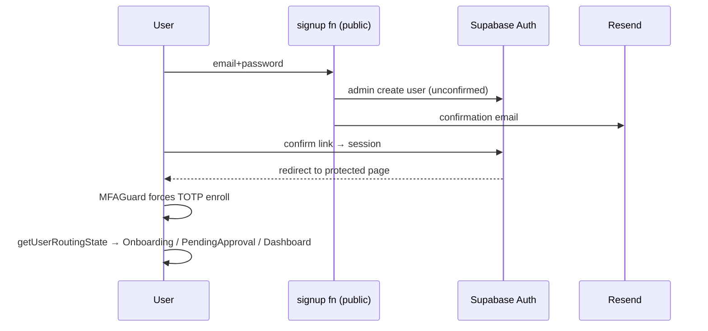

# Module: Authentication & MFA (Tier 1)

> Generated: 2026-07-20 · Revision: `34563cfaff4271b72d00b0841353dc2792f2f16a` · Canonical score **3.3 / 5**, criticality **17 (Critical)** — [03](../03-module-catalog-and-maturity.md) · Index: [04](../04-module-deep-dives.md)

## Functional view
- **Problem:** secure identity for a multi-tenant financial product. **Users:** all personas.
- **Inputs:** email/password, Google/Microsoft OAuth, magic links, TOTP codes, security questions. **Outputs:** Supabase session (JWT), profile row, routed landing state.
- **Rules:** confirmation email required (Resend-sent); **TOTP enrollment forced** post-confirmation (MFAGuard; `config.toml [auth.mfa.totp]`); routing via `getUserRoutingState` (App.jsx:141) by profile/org/membership state; `PUBLIC_PAGES`/`MFA_BYPASS_PAGES`/`MANDATORY_SETUP_PAGES` lists in [rbac.js:136-145](../../../src/lib/rbac.js#L136).
- **Edge cases handled:** expired/used OTP links intercepted (App.jsx:39-63); stale-session refresh before every function call (EV-12); HMR-safe client singleton (EV-11).

## Technical view
- **Components:** `src/lib/AuthContext.jsx` (200 ln), `src/services/auth.js`, `MFAGuard.jsx`, `useMfaStatus`, `src/services/supabaseClient.js`; functions `signup` (public), `first-login`, `save-security-questions`, `reset-mfa`; DB `profiles` + `handle_new_user()` trigger (schema.sql:296-326).
- **Interfaces:** Supabase Auth API; `signup` fn contract `{email,password,full_name,onboarding_type?}` / `{email,action:"resend"}`.
- **Security checks:** server `verifyUser` on every function (EV-04); tokens in localStorage ([SEC-004](../findings-register.md#sec-004)); signup public & unthrottled ([SEC-008](../findings-register.md#sec-008)).
- **Tenant checks:** none at auth layer (pre-tenancy); org resolution downstream (EV-05). **Logging:** verifyUser logs email to function logs. **Tests:** lib units only; no auth e2e ([13 §2](../13-testing-and-quality-engineering.md)).

## Workflow view

**Failure paths (static):** Resend down → confirmation never arrives, resend action exists, no alerting ([12 §2](../12-reliability-scalability-and-operations.md)); OTP expiry → intercepted, re-request; MFA device loss → `reset-mfa` (admin) + security questions. **States:** unconfirmed → confirmed → MFA-enrolled → routed(active|pending). **Manual interventions:** MFA resets; org approval.

## 14-dimension scores (group-consistent with [03](../03-module-catalog-and-maturity.md))
PC 4 · UX 4 · BE 4 · API 4 · DM 4 · SEC 3 · TI 3 · REL 3 · SCA 3 · TST 2 · OBS 1 · OPS 2 · DOC 3 · ENT 2 → weighted **3.3**. To reach 4 on SEC: CSP + rate limits + session-storage review; on TST: auth e2e journey; on ENT: SSO/SAML ([15](../15-enterprise-readiness-gap-analysis.md)).

## Assessment
**Strengths:** forced MFA (rare at this stage), layered guards E1-verified, OTP-error UX, clean singleton/session engineering.
**Weaknesses/risks:** [SEC-004](../findings-register.md#sec-004) (Med), [SEC-008](../findings-register.md#sec-008) (Med), no SSO (enterprise blocker), untested flows, no auth telemetry (lockouts invisible).
**Recommended:** rate-limit signup (S, P1); auth e2e (M, P1); CSP (S, P2); SSO when pipeline demands (M, P1*).
