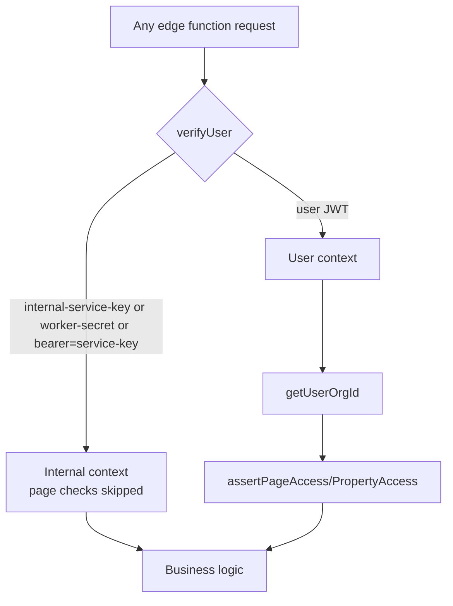

# Module: Platform & Background-Job Infrastructure (Tier 1)

> Generated: 2026-07-20 · Revision: `34563cfaff4271b72d00b0841353dc2792f2f16a` · Canonical score **2.7 / 5**, criticality **14 (Critical)** — [03](../03-module-catalog-and-maturity.md) · Index: [04](../04-module-deep-dives.md)

## Functional view
- **Problem:** the shared plumbing every other module depends on — auth verification, tenant resolution, page/property authorization, internal service-to-service trust, and durable job processing. **Users:** every other module (this is infrastructure, not a user-facing feature).
- **Inputs:** every edge-function invocation. **Outputs:** a verified `{user, org, isInternal}` context and, for the extraction pipeline, job lifecycle management.

## Technical view
- **Components:** `supabase/functions/_shared/{supabase.ts, internal-auth.ts, error-handler.ts, logger.ts, vertex-ai.ts, azure/, extraction/}`; `lease-extraction-worker`; `pipeline_jobs` table; `pipeline-status`/`pipeline-health-check` functions.
- **The three service-to-service auth patterns** (all accepted): `x-internal-service-key == SUPABASE_SERVICE_ROLE_KEY` (`_shared/supabase.ts:30-38`), `x-worker-secret == WORKER_INTERNAL_SECRET`, and `Authorization: Bearer <service-role-key>` (`_shared/internal-auth.ts`) — three ways to authenticate as "the system," two of which reuse the database master key as an API password ([SEC-003](../findings-register.md#sec-003)).
- **Job model:** `pipeline_jobs` (stage/status CHECK-constrained, `max_attempts 3`, `available_at`, queue-drain index) is a durable table, not a message queue — no visibility timeout, no fan-out, no priority. Adequate at current volume; will not scale to high-concurrency multi-tenant load without a scheduler.
- **No pg_cron anywhere** in 216 migrations — confirmed by grep. The worker's trigger mechanism is invocation from application actions, not a schedule (`INFERRED` — no scheduled-invocation evidence found), which is the direct cause of [OPS-006](../findings-register.md#ops-006) (stuck jobs have no reaper).
- **Versioning:** mixed `@supabase/supabase-js` versions across functions ([ARC-004](../findings-register.md#arc-004)) — this shared layer is exactly where a single pinned version matters most, since every function depends on it.

## Workflow view

**Failure path:** any of the three internal-secret checks failing falls through to user-JWT verification, which then fails cleanly with "Missing Authorization header" — no silent internal-auth bypass on failure (good). **Recovery for stuck jobs:** currently manual only (no reaper).

## Assessment
**Strengths:** the shared auth/tenancy helpers (`verifyUser`, `getUserOrgId`, `assertPageAccess`) are used consistently across the 82 functions sampled, which is why the tenancy story holds together despite RLS bypass — this module *is* the tenant boundary for server traffic, and it's implemented with real care (EV-05's in-code audit-fix comment is the clearest evidence of a working internal security-review loop in the whole codebase).
**Weaknesses:** three redundant internal-auth mechanisms, two reusing the service-role key ([SEC-003](../findings-register.md#sec-003)); no job scheduler/reaper ([OPS-006](../findings-register.md#ops-006)); mixed dependency versions across the very layer meant to be shared and consistent ([ARC-004](../findings-register.md#arc-004)); zero observability into this layer specifically (function logs only).
**Recommended:** collapse to one internal secret, never the service-role key (M, P1 — this is the module underpinning every other module's tenant safety); scheduled worker invocation + reaper (M, P1); pin `supabase-js` via import map (S, P2); this module is the highest-leverage place to add correlation-ID propagation for the whole platform (M, P2).
