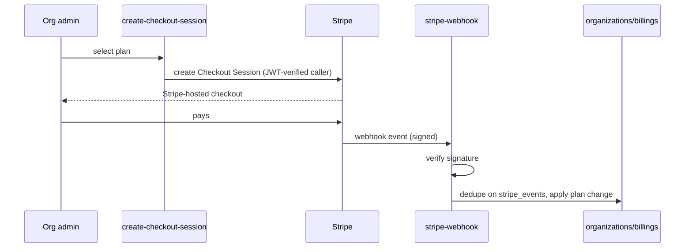

# Module: Billing & Subscriptions (Tier 1)

> Generated: 2026-07-20 · Revision: `34563cfaff4271b72d00b0841353dc2792f2f16a` · Canonical score **2.7 / 5**, criticality **13 (High)** — [03](../03-module-catalog-and-maturity.md) · Index: [04](../04-module-deep-dives.md)

## Functional view
- **Problem:** convert an active org into a paying subscription. **Users:** org admins (buyers), super-admin (oversight).
- **Inputs:** plan selection, Stripe Checkout session. **Outputs:** `organizations.plan` state, `billings` records, `stripe_events`.
- **Rules:** `Pricing`/`Billing` pages initiate checkout; webhook is the source of truth for plan state changes (correct pattern — never trust client-reported success).

## Technical view
- **Components:** `create-checkout-session` (JWT-required), `stripe-webhook` (`verify_jwt=false`, signature-verified), `src/services/billingEngine.js`, `@stripe/react-stripe-js` on the client.
- **DB:** `organizations.plan` (`starter|professional|enterprise`), `billings`, `stripe_events` (unique event id, `23505`-based idempotency).
- **Entitlement enforcement:** `organizations.enabled_modules` array is what the frontend actually gates on (`src/lib/userPermissions.js:262-263`), read from `activeOrg`. **No traced code path updates `enabled_modules` from `organizations.plan` or from the Stripe webhook** — the two lists (billing plan vs. enabled feature modules) appear to be **independently set**, most plausibly by an admin/super-admin action rather than automatically from the subscription tier. This is a real gap, not an inference from absence alone: the webhook handler's job (from EV-18) is plan/event bookkeeping, and `enabled_modules` is mutated through org settings, not billing.
- **Idempotency:** `stripe_events` correctly dedupes (EV-18) — the one clearly enterprise-grade pattern in this module.
- **Tests:** **none found** at any level (unit, integration, or e2e) for checkout, webhook, or plan-state transitions — the highest-risk untested surface in the product ([13 §3](../13-testing-and-quality-engineering.md), R13).

## Workflow view

**Failure path:** signature mismatch → 4xx, event not applied (correct); duplicate delivery → `23505` caught, no double-apply (correct); **but no automated test proves either of these branches actually behaves as designed** — this is asserted from reading the code, not from execution. **Missing entirely:** self-serve plan change/cancellation (no Stripe Customer Portal integration found) — W15 in [05](../05-end-to-end-workflows.md) is "thin."

## Assessment
**Strengths:** correct idempotency pattern; correct "webhook is truth" architecture; signature verification present and appropriately public (`verify_jwt=false` is *right* here, unlike the other public endpoints).
**Weaknesses:** zero test coverage on the revenue path; entitlement linkage from plan → `enabled_modules` is unverified/likely manual; no self-serve subscription management; no usage-based billing hooks (pairs with [OPS-007](../findings-register.md#ops-007)).
**Recommended:** webhook + checkout tests incl. signature-failure and duplicate-delivery cases (M, P1); explicit plan→entitlement mapping function, test it (M, P1); Stripe Customer Portal for self-serve change/cancel (M, P2).
