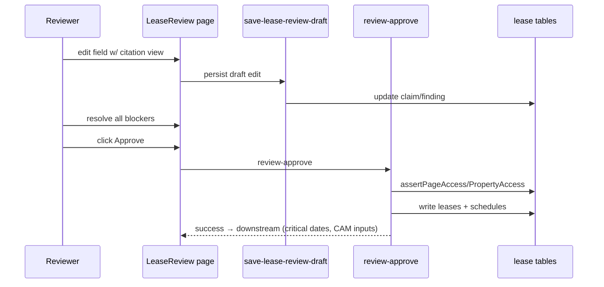

# Module: Lease Review & Approval (Tier 1)

> Generated: 2026-07-20 · Revision: `34563cfaff4271b72d00b0841353dc2792f2f16a` · Canonical score **3.3 / 5** (highest-scoring module), criticality **16 (Critical)** — [03](../03-module-catalog-and-maturity.md) · Index: [04](../04-module-deep-dives.md)

## Functional view
- **Problem:** let a human verify/correct AI-extracted lease data field-by-field, with source evidence, before it becomes trusted financial data. **Users:** analysts (editors), managers/admins (approvers).
- **Inputs:** extraction draft (claims, findings, evidence spans), reviewer edits. **Outputs:** approved lease record + financial schedules; audit trail of what changed and why.
- **Business rules:** `ApprovalBlockersPanel` gates approval on unresolved required fields; `LeaseReviewReadinessSummary` aggregates completeness; edits validated against `leaseFieldContract.js`/`leaseReviewSchema.js` (69 KB) before persist.
- **Edge cases:** conflicting AI findings across providers (`DynamicFindings`), low-confidence fields flagged, re-extraction requests, reload-persistence of in-progress edits (explicitly e2e-tested).

## Technical view
- **Components:** `src/components/lease-review/` — `ExtractionDebugPanel`, `FieldReviewTable`/`FieldReviewRow`, `FieldDetailDrawer`, `DynamicFindings`, `ApprovalBlockersPanel`, `LeaseReviewReadinessSummary`, `SpecializedTables`, `CamExpenseRulesPanel`; validation stack `leaseFieldContract.js`, `leaseReviewSchema.js`, `leaseReviewFieldNormalizer.js` (73 KB), `leaseFieldResolver.js` (45 KB).
- **Backend:** `save-lease-review-draft`⚠, `update-lease-extraction-field`⚠, `update-lease-field-and-columns`⚠, `persist-lease-extraction-merge`⚠, `review-approve`, `reject-lease-abstract`⚠, `send-lease-back-for-reextraction`⚠, `backfill-lease-evidence`⚠ (⚠ = undeclared in config.toml, [SEC-002](../findings-register.md#sec-002)).
- **DB:** `lease_claims*` family, evidence/provenance tables, resulting `leases` + financial-schedule tables.
- **Security/tenant:** `assertPageAccess`/`assertPropertyAccess` on write functions (EV-06); RLS via `get_my_org_ids()` chain.
- **Tests:** the best-covered area of the product — heaviest concentration of the 62 unit files + the one real e2e spec targets exactly this flow.

## Workflow view

**Failure path:** blocked approval surfaces the specific missing/low-confidence fields (`ApprovalBlockersPanel`); server-side revalidation on `review-approve` (not just trusting client state) — `INFERRED` from function existence, exact re-validation depth `UNVERIFIED`. **State model:** draft → in-review → blocked/ready → approved/rejected. **Recovery:** `send-lease-back-for-reextraction` restarts the pipeline; `reject-lease-abstract` terminal-rejects.

## Assessment
**Strengths:** the product's clearest expression of "AI + human-in-the-loop done carefully" — evidence citations, blockers, readiness summary, heavy test investment. This is the most defensible, hardest-to-copy part of the product.
**Weaknesses:** 7 of 8 backend functions undeclared in config.toml ([SEC-002](../findings-register.md#sec-002)); no e2e proof it currently works (blocked by [OPS-003](../findings-register.md#ops-003)); client validation duplicates server validation with no shared contract ([06 §2](../06-frontend-backend-integration.md)).
**Recommended:** declare functions explicitly (S, P1); restore e2e verification (S, P1); shared validation contract exploration (L, P3 — architecture change).
