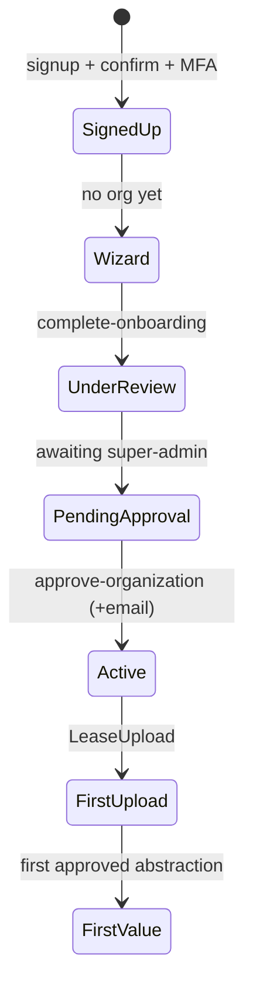

# Module: Onboarding & Access Requests (Tier 1)

> Generated: 2026-07-20 · Revision: `34563cfaff4271b72d00b0841353dc2792f2f16a` · Canonical score **2.6 / 5**, criticality **13 (High)** — [03](../03-module-catalog-and-maturity.md) · Full assessment: [09](../09-onboarding-assessment.md) (canonical for onboarding product analysis) · Index: [04](../04-module-deep-dives.md)

## Functional view
- **Problem:** get a new org from signup to first approved lease. **Users:** prospective admins, invited members, platform super-admin (approver).
- **Inputs:** signup data, org wizard steps, access/demo requests. **Outputs:** active org with members, configured modules, first data.
- **Rules:** wizard step persisted (sessionStorage + URL + `organizations.onboarding_step`); activation requires **super-admin approval**; forced MFA precedes value; `MANDATORY_SETUP_PAGES` routing (rbac.js:139).
- **Failure conditions:** email delivery failure blocks confirm/invites; approval delay stalls activation; extraction secrets unconfigured blocks first value.

## Technical view
- **Components:** pages `Onboarding` (multi-step), `Welcome`, `WelcomeAboard`, `PendingApproval`, `RequestAccess`, `RequestDemo`, `PaymentSuccess`; functions `signup`, `first-login`, `complete-onboarding`, `approve-organization`, `approve-request`, `submit-contact`; tables `organizations` (status/onboarding_step), `access_requests`, `demo_requests`, `invitations`.
- **Security:** org self-creation open ([SEC-005](../findings-register.md#sec-005)) gated by approval; public `submit-contact` unthrottled ([SEC-008](../findings-register.md#sec-008)).
- **Observability:** none — funnel invisible ([OPS-002](../findings-register.md#ops-002)). **Tests:** partial units; no journey test.

## Workflow view

**Failure/recovery:** wizard resumable at any step; abandoned orgs remain `status='onboarding'` rows (no cleanup job); rejection path exists (`reject-*` on requests) — terminal-state comms `UNVERIFIED`. **Manual interventions:** every activation (approval is human).

## 14-dimension scores
PC 3 · UX 3 · BE 3 · API 3 · DM 3 · SEC 3 · TI 3 · REL 2.5 · SCA 2.5 · TST 2 · OBS 1 · OPS 2 · DOC 2 · ENT 2 → weighted **2.6**. To advance: funnel telemetry (OBS→3 impossible until [OPS-002](../findings-register.md#ops-002) fixed, but events can be stored in-DB now); onboarding e2e; approval SLA surfacing.

## Assessment
**Strengths:** resumable wizard with DB-backed step; approval gate prevents junk tenants; demo mode as pre-sales asset.
**Weaknesses:** zero funnel measurement; human approval bottlenecks PLG; first-value path depends on 4+ provider secrets being right with no in-product preflight check.
**Recommended:** environment/secret preflight surfaced to admin (S, P1); funnel events (S, P1); auto-approve rules for invited domains (S, P2); orphan-org cleanup (S, P3).
