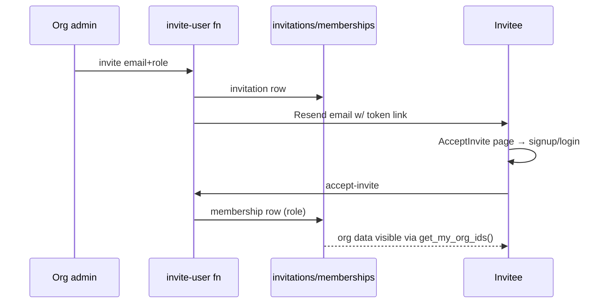

# Module: Organizations, Memberships, RBAC & User Management (Tier 1)

> Generated: 2026-07-20 · Revision: `34563cfaff4271b72d00b0841353dc2792f2f16a` · Canonical score **3.1 / 5**, criticality **17 (Critical)** — [03](../03-module-catalog-and-maturity.md) · Index: [04](../04-module-deep-dives.md)

## Functional view
- **Problem:** tenancy container + who-can-do-what. **Users:** org admins, super-admin, all members (subjects).
- **Inputs:** org profile, member invitations, role assignments, page/property/portfolio grants, acting-org selection. **Outputs:** enforced access on every read/write; filtered nav.
- **Rules:** roles `super_admin|org_admin|manager|editor|viewer` (+`auditor`, +14 legacy aliases) live in `memberships` (UNIQUE(user_id,org_id)); page access via `ROLE_PAGES` client-side and `member_page_permissions`/`can_write_page` server-side; property/portfolio scoping via `member_property_access`/`member_portfolio_access`; org lifecycle `onboarding→under_review→active→suspended`.
- **Edge cases:** multi-org users must select acting org; super-admin must name tenant explicitly (EV-05, [TEN-003](../findings-register.md#ten-003)).

## Technical view
- **Components:** DB (schema.sql:71-199 + permission tables + `role_definitions`/`user_roles`); helpers `is_super_admin`/`get_my_org_ids`/`is_org_admin`/`can_write_org_data` (SECURITY DEFINER, EV-07); frontend `rbac.js` (319 ln), `RbacGuard`, `actingOrg.js`, `orgUtils.js`, `useOrgId/useOrgQuery`, UserManagement + OrgSettings pages; functions `invite-user`, `send-invite`, `accept-invite`, `approve-organization`.
- **Security/tenant checks:** RLS on `organizations`/`memberships` with recursion-safe policy set (schema.sql:185-197); any authenticated user can create an org ([SEC-005](../findings-register.md#sec-005)).
- **Concurrency:** last-write-wins on grants (no versioning — [08 §7](../08-database-schema-and-ui-gap-analysis.md)). **Tests:** rbac lib units; no invitation/role e2e.

## Workflow view

**Failure paths:** duplicate membership blocked by UNIQUE; expired invitation handling `UNVERIFIED` (expiry semantics not traced); email failure silent ([12 §2](../12-reliability-scalability-and-operations.md)). **Manual interventions:** org approval; role disputes via super-admin.

## 14-dimension scores
PC 3.5 · UX 3.5 · BE 4 · API 4 · DM 4 · SEC 3 · TI 3 · REL 3 · SCA 3 · TST 2.5 · OBS 1 · OPS 2 · DOC 3 · ENT 2 → weighted **3.1**. To advance: consolidate the **two role systems** (memberships.role vs role_definitions/user_roles — [contradictions](../contradictions-and-drift.md)); generate client `ROLE_PAGES` from DB truth (kills drift risk R15); cross-tenant tests.

## Assessment
**Strengths:** real tenancy backbone; hardened acting-org; fine-grained overlays beyond typical stage; recursion-safe policies.
**Weaknesses/risks:** dual role sources; client/server RBAC parallel maintenance ([06 §5](../06-frontend-backend-integration.md)); open org creation; invitation lifecycle unverified.
**Recommended:** role-system consolidation (M, P2); RBAC-generation from single source (M, P2); invitation e2e (S, P1); org-creation quota (S, P3).
